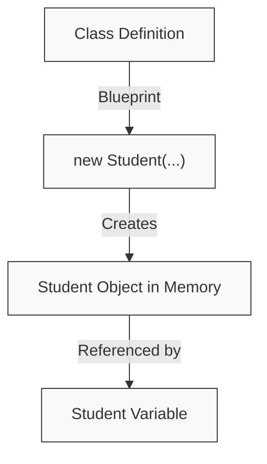
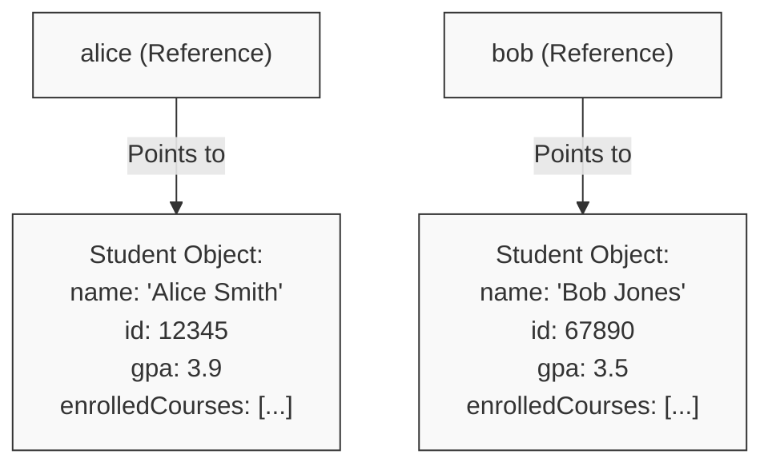
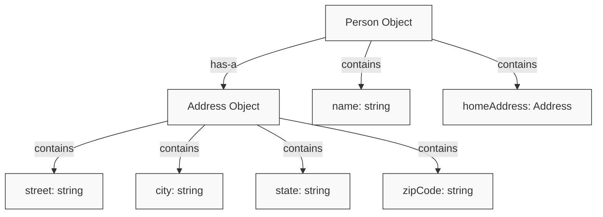

# Chapter 5: Defining State and Behavior: Classes and Objects

## Introduction

While primitive types and data structures let us represent and organize data, they fall short when modeling entities with both **state** (data) and **behavior** (operations). Until now, we've worked with predefined types and kept functions separate from the data they manipulate. Real-world modeling, however, often requires a more integrated approach where data and operations belong together as a cohesive unit.

In this chapter we will:

1. Define classes as blueprints for creating objects with integrated state and behavior
2. Create custom types that combine data (fields) with operations (methods)
3. Instantiate and work with objects as dynamic entities in memory
4. Apply encapsulation principles to protect object state and implementation details
5. Distinguish between value semantics (as seen in structs) and reference semantics (used by classes)

This chapter builds directly on our understanding of variables, types, and scope from earlier chapters. While arrays and linked lists helped us organize collections of data, classes will let us define entirely new types that better model concepts we want to represent in our programs, with clearly defined state and behavior.

---

## Defining Our Terms

> [!abstract] Class
> 
> > [!Definition]
> > 
> > A class is a user-defined type that serves as a blueprint for creating objects, specifying both the data (fields) and operations (methods) that characterize all objects of that type.
> 
> A class defines what an object knows (its state) and what an object can do (its behavior). It combines data representation with the operations that manipulate that data.
> 
> **Why it matters:** Classes are fundamental to object-oriented programming because they allow us to model real-world entities in code. By defining our own types, we bridge the gap between how we think about problems conceptually and how we implement solutions in code. Without classes, we would be limited to primitive types and would struggle to represent complex entities effectively.
> 
> > [!example]
> > 
> > ```csharp
> > // A class that represents a student
> > class Student {
> >    // Fields - define the state
> >    string name;
> >    int id;
> >    double gpa;
> >    
> >    // Methods - define the behavior
> >    void EnrollInCourse(string course) {
> >        Console.WriteLine(name + " enrolled in " + course);
> >    }
> >    
> >    double GetGPA() {
> >        return gpa;
> >    }
> > }
> > ```
> 
> >[!important] 
> >Try It Yourself Look at the Student class above. What aspects of a student's state are represented? What behaviors can a Student object perform?
> 
> State: name (string), id (int), gpa (double) Behaviors: EnrollInCourse(string), GetGPA()

> [!abstract] Object
> 
> > [!Definition]
> > 
> > An object is a specific instance of a class that exists in memory during program execution, with its own unique state and the ability to perform the behaviors defined by its class.
> 
> Objects are the dynamic entities created from class blueprints. Multiple objects of the same class type can exist simultaneously, each with its own independent state.
> 
> **Why it matters:** While a class is just a blueprint, objects are the actual entities that do work in your program. Understanding the distinction between classes and objects is essential for designing effective programs. Just as a house blueprint isn't a house, a class isn't an object - you need to create instances to use them in your code. This concept lets you create multiple independent entities (like multiple students or accounts) from a single definition.
> 
> > [!example]
> > 
> > ```csharp
> > // Creating (instantiating) two distinct Student objects
> > Student alice = new Student();
> > alice.name = "Alice Smith";
> > alice.id = 12345;
> > alice.gpa = 3.9;
> > 
> > Student bob = new Student();
> > bob.name = "Bob Jones";
> > bob.id = 67890;
> > bob.gpa = 3.5;
> > 
> > // Using the objects
> > alice.EnrollInCourse("Computer Science 101");
> > bob.EnrollInCourse("Data Structures");
> > ```
> 
> [!important] Try It Yourself How many Student objects exist in the example above? How would you create a third Student object named "Charlie"?
> 
> Answer: There are two Student objects (alice and bob). To create a third object:
> 
> ```csharp
> Student charlie = new Student();
> charlie.name = "Charlie Brown";
> charlie.id = 13579;
> charlie.gpa = 3.7;
> ```

> [!abstract] Encapsulation
> 
> > [!Definition]
> > 
> > Encapsulation is the principle of bundling data and the methods that operate on that data within a single unit, and restricting direct access to some of the object's components.
> 
> Encapsulation is a fundamental principle of object-oriented design that supports information hiding, data protection, and abstraction.
> 
> **Why it matters:** Encapsulation protects the integrity of your objects by preventing invalid operations. Think of it like the dashboard of a car - you interact with the car through a well-designed interface (steering wheel, pedals) without needing to directly manipulate the engine components. This makes systems safer, more maintainable, and easier to understand, as the internal implementation can change without affecting code that uses the class.
> 
> > [!example]
> > 
> > ```csharp
> > class BankAccount {
> >    // Private fields - hidden from outside access
> >    private string accountNumber;
> >    private decimal balance;
> >    
> >    // Public methods - the interface through which the object is used
> >    public void Deposit(decimal amount) {
> >        if (amount > 0) {
> >            balance += amount;
> >        }
> >    }
> >    
> >    public bool Withdraw(decimal amount) {
> >        if (amount > 0 && amount <= balance) {
> >            balance -= amount;
> >            return true;
> >        }
> >        return false;
> >    }
> >    
> >    public decimal GetBalance() {
> >        return balance;
> >    }
> > }
> > ```

With these core terms defined, we can now explore how classes and objects provide a powerful mechanism for modeling complex entities by combining state and behavior into cohesive units.

---

## Classes: Blueprints for State and Behavior

### The Problem with Separate Data and Functions

To understand why classes are necessary, let's consider the limitations of using separate variables and functions to model a real-world entity.

> [!example] Managing Student Data Without Classes
> 
> ```csharp
> // Using separate variables and arrays (from Chapters 8-9)
> string[] studentNames = new string[100];
> int[] studentIds = new int[100];
> double[] studentGpas = new double[100];
> 
> // Function to enroll a student in a course
> void EnrollStudentInCourse(int studentIndex, string course) {
>    if (studentIndex >= 0 && studentIndex < studentNames.Length) {
>        Console.WriteLine(studentNames[studentIndex] + " enrolled in " + course);
>    }
> }
> 
> // Add a student
> int newStudentIndex = 0;
> studentNames[newStudentIndex] = "Alice Smith";
> studentIds[newStudentIndex] = 12345;
> studentGpas[newStudentIndex] = 3.9;
> 
> // Enroll the student
> EnrollStudentInCourse(newStudentIndex, "Computer Science 101");
> ```

This approach has several significant drawbacks:

1. **Data Fragmentation**: Related information about a student is scattered across multiple arrays
2. **Error-Prone Indexing**: Using the same index across multiple arrays creates potential for misalignment
3. **No Cohesion**: The connection between student data and student-related functions isn't explicit
4. **Poor Abstraction**: The code doesn't reflect how we naturally think about students as entities with properties and actions

### Classes: Unifying State and Behavior

Classes solve these problems by allowing us to define custom types that encapsulate both the data that represents an entity's state and the operations that define its behavior.

> [!abstract] The Class Anatomy A complete class definition typically includes:
> 
> 1. **Fields**: Variables defined within the class that store the state of each object
>     
> 2. **Constructors**: Special methods that initialize new objects when they are created
>     
> 3. **Methods**: Functions defined within the class that implement the behavior of objects
>     
> 4. **Access Modifiers**: Keywords like `public` and `private` that control visibility (similar to how scope works in functions)
>     
> 
> > [!info] Connection to Previous Concepts 
> > 
> > Classes build directly on several concepts we've already learned:
> > 
> > - **Types**: A class defines a new user-defined type (similar to how we've used built-in types)
> > - **Variables**: Fields are variables that belong to objects (using the same variable rules we've learned)
> > - **Arrays**: Classes often use arrays internally to store collections (as we'll see in examples)
> > - **Scope**: Access modifiers create scope boundaries similar to what we saw with code blocks

Let's see how a well-designed class brings together all these elements:

> [!example] Complete Student Class
> 
> ```csharp
> public class Student {
>    // Fields - the object's state (private for encapsulation)
>    private string name;        // Student's full name
>    private int id;             // Unique identifier
>    private double gpa;         // Grade Point Average
>    private string[] enrolledCourses;  // Array of course names (from Chapter 8)
>    private int courseCount;    // Tracks how many courses enrolled
>    
>    // Constructor - initializes a new Student object with required data
>    public Student(string studentName, int studentId) {
>        name = studentName;     // Set name from constructor parameter
>        id = studentId;         // Set ID from constructor parameter
>        gpa = 0.0;              // Initialize GPA to zero
>        enrolledCourses = new string[10];  // Allow up to 10 courses
>        courseCount = 0;        // Start with zero courses
>    }
>    
>    // Getter methods
>    public string GetName() {
>        return name;
>    }
>    
>    public int GetId() {
>        return id;
>    }
>    
>    public double GetGPA() {
>        return gpa;
>    }
>    
>    // Methods - the object's behavior
>    public void EnrollInCourse(string course) {
>        // Check if there's room for another course
>        if (courseCount < enrolledCourses.Length) {
>            enrolledCourses[courseCount] = course;  // Add course to array
>            courseCount++;      // Increment count of enrolled courses
>            Console.WriteLine(name + " enrolled in " + course);
>        } else {
>            Console.WriteLine("Cannot enroll in more courses.");
>        }
>    }
>    
>    public void UpdateGPA(double[] grades) {
>        // Calculate new GPA as average of provided grades
>        if (grades.Length > 0) {
>            double sum = 0;
>            // Using foreach loop from Chapter 7
>            foreach (double grade in grades) {
>                sum += grade;   // Add up all grades
>            }
>            gpa = sum / grades.Length;  // Calculate average
>        }
>    }
>    
>    // Returns formatted student information
>    public string GetStudentInfo() {
>        return "Student: " + name + " (ID: " + id + "), GPA: " + gpa;
>    }
>    
>    // Returns a copy of enrolled courses (not the original array)
>    public string[] GetEnrolledCourses() {
>        // Create a new array of the exact size needed (array copying from Chapter 8)
>        string[] coursesCopy = new string[courseCount];
>        // Copy only the enrolled courses (not empty slots)
>        for (int i = 0; i < courseCount; i++) {
>            coursesCopy[i] = enrolledCourses[i];
>        }
>        return coursesCopy;  // Return the copy, protecting our internal data
>    }
> }
> ```

This class definition illustrates how the `Student` type encapsulates:

1. The **state** of a student (name, ID, GPA, enrolled courses)
2. The **behavior** a student can exhibit (enrolling in courses, updating GPA)
3. **Access control** to ensure data is manipulated only in valid ways (private fields, public methods)

> [!important] Key Insight 
> 
> Notice how the Student class above uses an array internally (`enrolledCourses`) to store multiple course names. This shows how classes can incorporate previously learned concepts like arrays as implementation details. The class hides this implementation behind methods that manage the array properly.

> [!exercise] Practice: Designing a Class Design a `Rectangle` class that:
> 
> 1. Has private fields for width and height
> 2. Has a constructor that initializes these values
> 3. Has methods to calculate area and perimeter
> 4. Has a method to determine if the rectangle is a square
> 
> ```csharp
> class Rectangle {
>    // Your implementation here
>    private double width;
>    private double height;
>    
>    public Rectangle(double width, double height) {
>        this.width = width > 0 ? width : 1.0;
>        this.height = height > 0 ? height : 1.0;
>    }
>    
>    public double GetWidth() {
>        return width;
>    }
>    
>    public double GetHeight() {
>        return height;
>    }
>    
>    public double CalculateArea() {
>        return width * height;
>    }
>    
>    public double CalculatePerimeter() {
>        return 2 * (width + height);
>    }
>    
>    public bool IsSquare() {
>        return width == height;
>    }
> }
> ```

### Creating and Using Objects

Once we've defined a class, we can create objects (instances) of that class and work with them:

> [!example] Working with Student Objects
> 
> ```csharp
> // Creating Student objects
> Student alice = new Student("Alice Smith", 12345);
> Student bob = new Student("Bob Jones", 67890);
> 
> // Using the objects' behavior
> alice.EnrollInCourse("Computer Science 101");
> alice.EnrollInCourse("Calculus I");
> 
> bob.EnrollInCourse("Data Structures");
> bob.EnrollInCourse("Discrete Mathematics");
> 
> // Updating student grades
> alice.UpdateGPA(new double[] { 3.8, 4.0, 3.9 });
> bob.UpdateGPA(new double[] { 3.3, 3.7, 3.5 });
> 
> // Retrieving information using getters
> Console.WriteLine(alice.GetStudentInfo());
> Console.WriteLine(bob.GetStudentInfo());
> Console.WriteLine("Alice's GPA: " + alice.GetGPA());
> 
> // Displaying enrolled courses
> string[] aliceCourses = alice.GetEnrolledCourses();
> Console.WriteLine("Alice is enrolled in:");
> foreach (string course in aliceCourses) {
>    Console.WriteLine("- " + course);
> }
> ```

When we create an object using the `new` keyword, several things happen:

1. Memory is allocated for the object
2. The constructor is called to initialize the object's state
3. A reference to the object is returned and stored in the variable



> [!important] Key Insight 
> 
> The class defines what all Student objects have in common (their structure and behavior), while each object maintains its own independent state. This is why Alice and Bob can have different names, IDs, and be enrolled in different courses, despite being objects of the same class type. Think of a class as a cookie cutter and objects as the individual cookies - all cookies share the same shape (methods), but each can have different decorations (field values).

---

## Reference Semantics: Understanding Objects in Memory

One of the most important aspects of working with classes is understanding that class types use reference semantics, which behave differently from the value semantics used by primitive types.

### References vs. Values

> [!Notation] NOTATION
> 
> - Value Types: Variables directly contain their data (e.g., `int x = 5;`)
> - Reference Types: Variables contain references (memory addresses) to data (e.g., `Student s = new Student();`)
> 
> **Analogy for References:** Think of a reference variable like a TV remote. The remote (variable) isn't the TV (object) itself; it's a controller that points to and interacts with the TV. If you give someone your remote (copy the reference), you're both controlling the same TV (object). If they change the channel (modify the object), it changes for you too because there's only one actual TV being controlled by multiple remotes.

When we create a class object, the object itself is stored in the heap (a region of memory), and the variable holds a reference to that object:



This distinction leads to important behaviors when assigning objects or passing them to methods:

> [!example] Reference Semantics Demonstration
> 
> ```csharp
> // Create a Student object
> Student alice = new Student("Alice Smith", 12345);
> alice.EnrollInCourse("Computer Science 101");
> 
> // Assignment creates a second reference to the SAME object
> Student aliceReference = alice;
> 
> // Changes through aliceReference affect the original object
> aliceReference.EnrollInCourse("Data Structures");
> 
> // Both variables see the same state
> Console.WriteLine(alice.GetStudentInfo());
> string[] courses = alice.GetEnrolledCourses();
> // Will show both "Computer Science 101" and "Data Structures"
> ```

> [!stateTable] State Table for Reference Variables
> 
> |Statement|alice points to|aliceReference points to|Enrolled Courses|
> |---|---|---|---|
> |`Student alice = new Student("Alice Smith", 12345);`|New Student object|(not created yet)|[]|
> |`alice.EnrollInCourse("Computer Science 101");`|Same Student object|(not created yet)|["Computer Science 101"]|
> |`Student aliceReference = alice;`|Student object|SAME Student object|["Computer Science 101"]|
> |`aliceReference.EnrollInCourse("Data Structures");`|Student object|SAME Student object|["Computer Science 101", "Data Structures"]|

> [!important] Key Insight 
> 
> When you assign an object to another variable or pass it to a method, you're sharing a reference to the same object, not creating a copy. Changes made through any reference affect the single shared object. This is fundamentally different from how value types like int, double, or bool behave!

The distinction between object identity (being the same object) and object state equality (having the same field values) is crucial:

> [!example] Identity vs. Equality
> 
> ```csharp
> // Create two Student objects with identical state
> Student student1 = new Student("Alice Smith", 12345);
> Student student2 = new Student("Alice Smith", 12345);
> 
> // Create a reference to the first object
> Student reference1 = student1;
> 
> // Identity comparison (are they the same object?)
> bool sameObject1 = (student1 == reference1); // true - same object
> bool sameObject2 = (student1 == student2);   // false - different objects with same values
> ```

> [!warning] Common Mistake 
> 
> A common error is confusing object references with the objects themselves. Remember that variables of class types store references, not the objects directly.
> 
> ```csharp
> Student s1 = new Student("Alice", 12345);
> Student s2 = s1;  // s2 points to the SAME object as s1
> s2.UpdateGPA(new double[] { 4.0 });  // This affects the object that both s1 and s2 point to
> 
> // Both will show the updated GPA
> Console.WriteLine(s1.GetStudentInfo());
> Console.WriteLine(s2.GetStudentInfo());
> ```

---

## Encapsulation: Protecting State and Implementation

Encapsulation is the principle of bundling data with the methods that operate on that data and restricting direct access to some of an object's components. It's one of the fundamental principles of object-oriented programming.

### Access Modifiers and Information Hiding

Access modifiers (like `private` and `public`) control the visibility of class members:

> [!abstract] Access Modifiers
> 
> - `private`: Only accessible within the class itself
>     
> - `public`: Accessible from any code
>     
> - `protected`: Accessible within the class and its subclasses (covered later)
>     
> - `internal`: Accessible within the same assembly (advanced topic)
>     
> 
> > [!seealso] Connection to Scope 
> > 
> > Access modifiers define a kind of scope for class members, similar to how variables have scope within code blocks. The difference is that access modifiers are about restricting access based on location in code rather than execution time.

Encapsulation typically involves making fields private and providing controlled access through public methods:

> [!example] Encapsulation Through Getters and Setters
> 
> ```csharp
> public class BankAccount {
>    // Private fields - hidden implementation details
>    private string accountNumber;
>    private decimal balance;
>    private string ownerName;
>    
>    // Public constructor - controlled initialization
>    public BankAccount(string number, string owner) {
>        accountNumber = number;
>        ownerName = owner;
>        balance = 0;
>    }
>    
>    // Getter method - provides read access to private field
>    public decimal GetBalance() {
>        return balance;
>    }
>    
>    // No direct setter for balance - controlled modification through methods
>    public void Deposit(decimal amount) {
>        if (amount > 0) {
>            balance += amount;
>        }
>    }
>    
>    public bool Withdraw(decimal amount) {
>        if (amount > 0 && amount <= balance) {
>            balance -= amount;
>            return true;
>        }
>        return false;
>    }
>    
>    public string GetAccountNumber() {
>        return accountNumber;
>    }
>    
>    public string GetOwnerName() {
>        return ownerName;
>    }
>    
>    public void SetOwnerName(string newName) {
>        if (!string.IsNullOrEmpty(newName)) {
>            ownerName = newName;
>        }
>    }
>    
>    public string GetAccountSummary() {
>        return $"Account {accountNumber} owned by {ownerName}, Balance: {balance:C}";
>    }
> }
> ```

This approach has several advantages:

1. **Data Protection**: Prevents invalid values (e.g., negative deposit amounts)
2. **Implementation Hiding**: Internal details can be changed without affecting code that uses the class
3. **Controlled Access**: Provides a clear, well-defined interface for interacting with objects
4. **Invariant Preservation**: Ensures objects maintain a valid state at all times

> [!seealso] INSIGHT 
> 
> Encapsulation is about more than just making fields private. It's about designing a clear boundary between an object's internal implementation and its external interface, making code more maintainable and robust.

### Getter and Setter Methods

Getter and setter methods are a fundamental technique for implementing encapsulation:

> [!abstract] Getters and Setters
> 
> > [!Definition]
> > 
> > **Getter methods** provide controlled read access to private fields, while **setter methods** provide controlled write access to private fields.
> 
> These methods follow naming conventions:
> 
> - Getters typically start with "Get" followed by the field name (e.g., `GetBalance()`)
> - Setters typically start with "Set" followed by the field name (e.g., `SetName(string name)`)
> 
> **Why they matter:** Getter and setter methods allow a class to control access to its fields. They can enforce validation rules, perform calculations, or trigger side effects when a field is read or modified. This protects the object's state and allows implementation details to change without affecting the public interface.

> [!example] Getter and Setter Implementation
> 
> ```csharp
> public class Person {
>    // Private fields
>    private string name;
>    private int age;
>    private double height; // in meters
>    
>    // Constructor
>    public Person(string name, int age, double height) {
>        this.name = name;
>        SetAge(age);      // Use setter for validation
>        SetHeight(height); // Use setter for validation
>    }
>    
>    // Getter for name
>    public string GetName() {
>        return name;
>    }
>    
>    // Setter for name
>    public void SetName(string newName) {
>        if (!string.IsNullOrEmpty(newName)) {
>            name = newName;
>        }
>    }
>    
>    // Getter for age
>    public int GetAge() {
>        return age;
>    }
>    
>    // Setter for age with validation
>    public void SetAge(int newAge) {
>        if (newAge >= 0 && newAge <= 120) {
>            age = newAge;
>        }
>    }
>    
>    // Getter for height
>    public double GetHeight() {
>        return height;
>    }
>    
>    // Getter that converts to a different unit
>    public double GetHeightInFeet() {
>        return height * 3.28084;
>    }
>    
>    // Setter for height with validation
>    public void SetHeight(double newHeight) {
>        if (newHeight > 0 && newHeight < 3.0) {
>            height = newHeight;
>        }
>    }
> }
> ```

Using the Person class:

```csharp
Person person = new Person("Alice", 25, 1.75);

// Using getters
string name = person.GetName();
int age = person.GetAge();
double heightInMeters = person.GetHeight();
double heightInFeet = person.GetHeightInFeet();

// Using setters
person.SetName("Alicia");
person.SetAge(26);
person.SetHeight(1.78);
```

> [!important] When to Use Getters and Setters
> 
> Not every field needs both a getter and a setter:
> 
> - Use getters for fields that should be readable by outside code
> - Use setters only for fields that should be modifiable by outside code
> - Some fields may need only a getter (read-only)
> - Some fields may not need either (completely private implementation detail)
> - Some getters may provide calculated values that don't directly match a field

> [!exercise] Practice: Implementing Getters and Setters 
> 
> Modify the Rectangle class you created earlier to ensure width and height are always positive:
> 
> 1. Update the setters to validate that width and height are positive values
> 2. Update the constructor to use these setters for initialization
> 
> ```csharp
> public class Rectangle {
>    private double width;
>    private double height;
>    
>    public Rectangle(double width, double height) {
>        // Use setters for validation
>        SetWidth(width);
>        SetHeight(height);
>    }
>    
>    public double GetWidth() {
>        return width;
>    }
>    
>    public void SetWidth(double newWidth) {
>        // Ensure width is positive
>        if (newWidth > 0) {
>            width = newWidth;
>        } else {
>            width = 1.0; // Default value if invalid
>        }
>    }
>    
>    public double GetHeight() {
>        return height;
>    }
>    
>    public void SetHeight(double newHeight) {
>        // Ensure height is positive
>        if (newHeight > 0) {
>            height = newHeight;
>        } else {
>            height = 1.0; // Default value if invalid
>        }
>    }
>    
>    public double CalculateArea() {
>        return width * height;
>    }
>    
>    public double CalculatePerimeter() {
>        return 2 * (width + height);
>    }
>    
>    public bool IsSquare() {
>        return width == height;
>    }
> }
> ```

---

## Method Design and Implementation

Methods define the behavior of objects and are a crucial part of class design.

### Method Components

A method declaration includes:

1. Access modifier (`public`, `private`, etc.)
2. Return type (`void` or a specific type)
3. Method name (typically a verb or verb phrase)
4. Parameter list (inputs required)
5. Method body (implementation)

> [!example] Method Variations
> 
> ```csharp
> class Calculator {
>    // Method with no parameters and no return value
>    public void Clear() {
>        // Implementation
>    }
>    
>    // Method with parameters and a return value
>    public int Add(int a, int b) {
>        return a + b;
>    }
>    
>    // Method with parameters and no return value
>    public void DisplayResult(string operation, int result) {
>        Console.WriteLine($"{operation} result: {result}");
>    }
>    
>    // Method with a return value but no parameters
>    public string GetVersion() {
>        return "Calculator v1.0";
>    }
> }
> ```

### Constructors: Initializing Objects

Constructors are special methods called when an object is created:

> [!abstract] Constructor
> 
> > [!Definition]
> > 
> > A constructor is a special method that has the same name as the class and is executed when a new object is created. Its purpose is to initialize the object's state.
> 
> Constructors have no return type and can be overloaded to provide different initialization options.
> 
> **Why it matters:** Constructors ensure objects start life in a valid, consistent state. Without constructors, you would need to remember to initialize every object after creation, which is error-prone. Constructors are like birth certificates and initial setup for objects - they establish identity and prepare the object for use, ensuring it begins in a proper state.

> [!example] Constructor Overloading
> 
> ```csharp
> class Car {
>    private string make;
>    private string model;
>    private int year;
>    private double fuelLevel;
>    
>    // Default constructor
>    public Car() {
>        make = "Unknown";
>        model = "Unknown";
>        year = DateTime.Now.Year;
>        fuelLevel = 0;
>    }
>    
>    // Constructor with parameters
>    public Car(string make, string model, int year) {
>        this.make = make;
>        this.model = model;
>        this.year = year;
>        fuelLevel = 0;
>    }
>    
>    // Constructor with all parameters
>    public Car(string make, string model, int year, double initialFuel) {
>        this.make = make;
>        this.model = model;
>        this.year = year;
>        fuelLevel = initialFuel > 0 ? initialFuel : 0;
>    }
>    
>    // Method
>    public string GetDescription() {
>        return $"{year} {make} {model}, Fuel: {fuelLevel:F1} gallons";
>    }
> }
> ```

Using different constructors:

```csharp
Car car1 = new Car();                         // Uses default constructor
Car car2 = new Car("Honda", "Civic", 2023);   // Uses second constructor
Car car3 = new Car("Toyota", "Corolla", 2022, 12.5);  // Uses third constructor

Console.WriteLine(car1.GetDescription());
Console.WriteLine(car2.GetDescription());
Console.WriteLine(car3.GetDescription());
```

> [!important] Key Insight If you don't define any constructors, the compiler provides a default parameter-less constructor. However, if you define any constructor, the compiler will not generate a default one, so you need to define it explicitly if needed.

---

## Object Relationships and Interactions

Classes and objects don't exist in isolation. They often work together to model complex systems.

### Object Composition

Object composition is when one class contains fields that are instances of other classes:

> [!example] Object Composition
> 
> ```csharp
> public class Address {
>    private string street;
>    private string city;
>    private string state;
>    private string zipCode;
>    
>    public Address(string street, string city, string state, string zip) {
>        this.street = street;
>        this.city = city;
>        this.state = state;
>        this.zipCode = zip;
>    }
>    
>    // Getters
>    public string GetStreet() { return street; }
>    public string GetCity() { return city; }
>    public string GetState() { return state; }
>    public string GetZipCode() { return zipCode; }
>    
>    // Setters
>    public void SetStreet(string street) { this.street = street; }
>    public void SetCity(string city) { this.city = city; }
>    public void SetState(string state) { this.state = state; }
>    public void SetZipCode(string zipCode) { this.zipCode = zipCode; }
>    
>    public string GetFullAddress() {
>        return $"{street}, {city}, {state} {zipCode}";
>    }
> }
> 
> public class Person {
>    private string name;
>    private Address homeAddress;  // Object composition
>    
>    public Person(string name, Address address) {
>        this.name = name;
>        this.homeAddress = address;
>    }
>    
>    // Getters and setters
>    public string GetName() { return name; }
>    public void SetName(string name) { this.name = name; }
>    public Address GetHomeAddress() { return homeAddress; }
>    public void SetHomeAddress(Address address) { homeAddress = address; }
>    
>    public string GetContactInfo() {
>        return $"{name}\n{homeAddress.GetFullAddress()}";
>    }
> }
> ```



Using these composed objects:

```csharp
Address aliceAddress = new Address("123 Main St", "Anytown", "CA", "12345");
Person alice = new Person("Alice Smith", aliceAddress);

Console.WriteLine(alice.GetContactInfo());

// Changing the address
aliceAddress.SetStreet("456 Oak Ave");
Console.WriteLine(alice.GetContactInfo());  // Will show updated address

// Getting the address to modify it
Address address = alice.GetHomeAddress();
address.SetCity("Newtown");
Console.WriteLine(alice.GetContactInfo());  // Will show updated city
```

> [!warning] Returning Internal References 
> In the example above, `GetHomeAddress()` returns a reference to the internal `Address` object. This allows the caller to modify the address directly, which could potentially bypass validation logic. For stronger encapsulation, consider returning a copy of the object or providing more specific methods that control how the object can be modified.

### Collections of Objects

We often need to work with collections of objects. This allows us to:

1. Manage related objects together
2. Perform operations on multiple objects
3. Model relationships between different types of objects

> [!example] Collections of Objects
> 
> ```csharp
> public class School {
>    private string name;
>    private Student[] students;  // Array of Student objects
>    private int studentCount;
>    
>    public School(string name, int maxStudents) {
>        this.name = name;
>        students = new Student[maxStudents]; // From Chapter 8: Arrays
>        studentCount = 0;
>    }
>    
>    public string GetName() {
>        return name;
>    }
>    
>    public void EnrollStudent(Student student) {
>        if (studentCount < students.Length) {
>            students[studentCount] = student;
>            studentCount++;
>        }
>    }
>    
>    public int GetStudentCount() {
>        return studentCount;
>    }
>    
>    public Student GetStudent(int index) {
>        if (index >= 0 && index < studentCount) {
>            return students[index];
>        }
>        return null;
>    }
>    
>    public void ListAllStudents() {
>        Console.WriteLine($"Students enrolled at {name}:");
>        for (int i = 0; i < studentCount; i++) {
>            Console.WriteLine(students[i].GetStudentInfo());
>        }
>    }
> }
> ```

Using the School class to manage Student objects:

```csharp
School mySchool = new School("Programming Academy", 100);

Student s1 = new Student("Alice Smith", 12345);
Student s2 = new Student("Bob Jones", 67890);
Student s3 = new Student("Charlie Brown", 24680);

mySchool.EnrollStudent(s1);
mySchool.EnrollStudent(s2);
mySchool.EnrollStudent(s3);

mySchool.ListAllStudents();

// Get a specific student by index
Student student = mySchool.GetStudent(1);  // Gets Bob
Console.WriteLine(student.GetName() + " has ID: " + student.GetId());
```

> [!important] Key Insight 
> 
> The School class demonstrates how we can combine arrays (from Chapter 8) with our new understanding of classes to create more complex and useful structures. The School class uses an array internally, but it provides a much more meaningful interface than working with arrays directly.

---

## Classes vs. Structs: Value and Reference Types

Now that we understand classes, we can contrast them with structs:

|Feature|Structure (Struct)|Class|
|---|---|---|
|**Memory Model**|Value Type (stored directly in variables)|Reference Type (variables store references)|
|**Semantic Model**|Value Semantics (copied by value)|Reference Semantics (copied by reference)|
|**Default Location**|Stack (unless part of a reference type)|Heap|
|**Primary Role**|Aggregate Related Data|Encapsulate State & Behavior|
|**Identity**|No distinct identity beyond values|Distinct identity separate from state|
|**Typical Size**|Small, lightweight|Can be larger, more complex|
|**Best For**|Simple data aggregation without behavior|Modeling entities with behavior and identity|

> [!example] Struct vs Class Behavior
> 
> ```csharp
> // A struct - value type
> public struct Point {
>    private double x;
>    private double y;
>    
>    public Point(double x, double y) {
>        this.x = x;
>        this.y = y;
>    }
>    
>    // Getters and setters
>    public double GetX() { return x; }
>    public double GetY() { return y; }
>    public void SetX(double x) { this.x = x; }
>    public void SetY(double y) { this.y = y; }
>    
>    public double DistanceFromOrigin() {
>        return Math.Sqrt(x * x + y * y);
>    }
> }
> 
> // A class - reference type
> public class Circle {
>    private Point center;  // Struct inside a class
>    private double radius;
>    
>    public Circle(Point center, double radius) {
>        this.center = center;
>        this.radius = radius > 0 ? radius : 1.0;
>    }
>    
>    // Getters and setters
>    public Point GetCenter() { return center; }
>    public double GetRadius() { return radius; }
>    public void SetRadius(double radius) {
>        if (radius > 0) {
>            this.radius = radius;
>        }
>    }
>    
>    public double GetArea() {
>        return Math.PI * radius * radius;
>    }
> }
> 
> // Demonstrating different behavior
> void DemonstrateValueVsReference() {
>    // Value type behavior
>    Point p1 = new Point(3, 4);
>    Point p2 = p1;  // p2 is a COPY of p1 (value semantics)
>    p2.SetX(7);     // Modifies only p2, not p1
>    
>    Console.WriteLine($"p1: ({p1.GetX()}, {p1.GetY()})");  // Output: p1: (3, 4)
>    Console.WriteLine($"p2: ({p2.GetX()}, {p2.GetY()})");  // Output: p2: (7, 4)
>    
>    // Reference type behavior
>    Circle c1 = new Circle(p1, 5);
>    Circle c2 = c1;  // c2 is a reference to the SAME object as c1
>    c2.SetRadius(10);  // Changes affect the shared object
>    
>    Console.WriteLine($"c1 radius: {c1.GetRadius()}");  // Output: c1 radius: 10
>    Console.WriteLine($"c2 radius: {c2.GetRadius()}");  // Output: c2 radius: 10
> }
> ```

> [!stateTable] State Table for Value vs. Reference Types
> 
> |Statement|p1|p2|c1|c2|
> |---|---|---|---|---|
> |`Point p1 = new Point(3, 4);`|(3, 4)|(not created)|(not created)|(not created)|
> |`Point p2 = p1;`|(3, 4)|(3, 4) copy|(not created)|(not created)|
> |`p2.SetX(7);`|(3, 4) unchanged|(7, 4) changed|(not created)|(not created)|
> |`Circle c1 = new Circle(p1, 5);`|(3, 4)|(7, 4)|Circle with p1, r=5|(not created)|
> |`Circle c2 = c1;`|(3, 4)|(7, 4)|Circle with p1, r=5|SAME Circle object|
> |`c2.SetRadius(10);`|(3, 4)|(7, 4)|Circle with p1, r=10|SAME Circle (r=10)|

> [!important] Design Guidance
> 
> - Use **structs** for small, simple data structures that primarily act as values and don't need identity (e.g., Point, Color, Money)
> - Use **classes** for entities with behavior, identity, or when you need reference semantics (e.g., Person, BankAccount, Car)

---

## Additional Examples

### Example 1: Simple Game Character

> [!example] Game Character Class
> 
> ```csharp
> public class GameCharacter {
>    // State - private fields
>    private string name;
>    private int health;
>    private int maxHealth;
>    private int power;
>    private string[] inventory;
>    private int itemCount;
>    
>    // Constructor
>    public GameCharacter(string name, int health, int power) {
>        this.name = name;
>        this.health = health > 0 ? health : 100;
>        maxHealth = this.health;
>        this.power = power > 0 ? power : 10;
>        inventory = new string[10];
>        itemCount = 0;
>    }
>    
>    // Getters
>    public string GetName() {
>        return name;
>    }
>    
>    public int GetHealth() {
>        return health;
>    }
>    
>    public int GetMaxHealth() {
>        return maxHealth;
>    }
>    
>    public int GetPower() {
>        return power;
>    }
>    
>    // Behavior - public methods
>    public void TakeDamage(int amount) {
>        if (amount > 0) {
>            health -= amount;
>            if (health < 0) health = 0;
>            Console.WriteLine($"{name} takes {amount} damage. Health: {health}/{maxHealth}");
>        }
>    }
>    
>    public void Heal(int amount) {
>        if (amount > 0) {
>            health += amount;
>            if (health > maxHealth) health = maxHealth;
>            Console.WriteLine($"{name} heals {amount} points. Health: {health}/{maxHealth}");
>        }
>    }
>    
>    public void Attack(GameCharacter target) {
>        Console.WriteLine($"{name} attacks {target.GetName()} for {power} damage!");
>        target.TakeDamage(power);
>    }
>    
>    public bool AddItem(string item) {
>        if (itemCount < inventory.Length) {
>            inventory[itemCount] = item;
>            itemCount++;
>            Console.WriteLine($"{name} acquired {item}.");
>            return true;
>        }
>        Console.WriteLine($"{name}'s inventory is full.");
>        return false;
>    }
>    
>    public string[] GetInventory() {
>        string[] result = new string[itemCount];
>        for (int i = 0; i < itemCount; i++) {
>            result[i] = inventory[i];
>        }
>        return result;
>    }
>    
>    public void ShowStatus() {
>        Console.WriteLine($"Character: {name}");
>        Console.WriteLine($"Health: {health}/{maxHealth}");
>        Console.WriteLine($"Power: {power}");
>        Console.WriteLine("Inventory:");
>        if (itemCount == 0) {
>            Console.WriteLine("  (empty)");
>        } else {
>            for (int i = 0; i < itemCount; i++) {
>                Console.WriteLine($"  - {inventory[i]}");
>            }
>        }
>    }
> }
> ```

Demonstrating the GameCharacter class:

```csharp
GameCharacter hero = new GameCharacter("Hero", 100, 20);
GameCharacter enemy = new GameCharacter("Goblin", 50, 10);

hero.AddItem("Sword");
hero.AddItem("Health Potion");

hero.ShowStatus();
enemy.ShowStatus();

// Simulating a battle
hero.Attack(enemy);
enemy.Attack(hero);
hero.Attack(enemy);

enemy.ShowStatus();
hero.Heal(15);
hero.ShowStatus();
```

This example shows how a class can model a game character with both state (health, inventory) and behavior (attacks, healing).

### Example 2: Library Management System

Let's implement a simple library system with multiple interacting classes:

> [!example] Library System Classes
> 
> ```csharp
> public class Book {
>    private string title;
>    private string author;
>    private string isbn;
>    private bool isCheckedOut;
>    
>    public Book(string title, string author, string isbn) {
>        this.title = title;
>        this.author = author;
>        this.isbn = isbn;
>        this.isCheckedOut = false;
>    }
>    
>    // Getters
>    public string GetTitle() { return title; }
>    public string GetAuthor() { return author; }
>    public string GetISBN() { return isbn; }
>    public bool IsCheckedOut() { return isCheckedOut; }
>    
>    public bool Checkout() {
>        if (!isCheckedOut) {
>            isCheckedOut = true;
>            return true;
>        }
>        return false;
>    }
>    
>    public void Return() {
>        isCheckedOut = false;
>    }
>    
>    public bool IsAvailable() {
>        return !isCheckedOut;
>    }
>    
>    public string GetDetails() {
>        string status = isCheckedOut ? "Checked Out" : "Available";
>        return $"{title} by {author} (ISBN: {isbn}) - {status}";
>    }
> }
> 
> public class Library {
>    private string name;
>    private Book[] books;
>    private int bookCount;
>    
>    public Library(string name, int capacity) {
>        this.name = name;
>        books = new Book[capacity];
>        bookCount = 0;
>    }
>    
>    public string GetName() { return name; }
>    
>    public void AddBook(Book book) {
>        if (bookCount < books.Length) {
>            books[bookCount] = book;
>            bookCount++;
>            Console.WriteLine($"Added book: {book.GetTitle()}");
>        } else {
>            Console.WriteLine("Library is at full capacity. Cannot add more books.");
>        }
>    }
>    
>    public Book FindBook(string title) {
>        for (int i = 0; i < bookCount; i++) {
>            if (books[i].GetTitle().Equals(title, StringComparison.OrdinalIgnoreCase)) {
>                return books[i];
>            }
>        }
>        return null;
>    }
>    
>    public void DisplayAllBooks() {
>        Console.WriteLine($"\n{name} Library Catalog:");
>        Console.WriteLine("-------------------------");
>        if (bookCount == 0) {
>            Console.WriteLine("No books in the library.");
>        } else {
>            for (int i = 0; i < bookCount; i++) {
>                Console.WriteLine(books[i].GetDetails());
>            }
>        }
>    }
> }
> 
> public class Patron {
>    private string name;
>    private int id;
>    private Book[] checkedOutBooks;
>    private int bookCount;
>    
>    public Patron(string name, int id) {
>        this.name = name;
>        this.id = id;
>        checkedOutBooks = new Book[5];
>        bookCount = 0;
>    }
>    
>    public string GetName() { return name; }
>    public int GetID() { return id; }
>    
>    public bool CheckoutBook(Book book) {
>        if (bookCount < checkedOutBooks.Length && book.Checkout()) {
>            checkedOutBooks[bookCount] = book;
>            bookCount++;
>            Console.WriteLine($"{name} checked out: {book.GetTitle()}");
>            return true;
>        }
>        Console.WriteLine($"Could not check out {book.GetTitle()}");
>        return false;
>    }
>    
>    public bool ReturnBook(Book book) {
>        for (int i = 0; i < bookCount; i++) {
>            if (checkedOutBooks[i] == book) {
>                book.Return();
>                
>                // Shift remaining books (array manipulation from Chapter 8)
>                for (int j = i; j < bookCount - 1; j++) {
>                    checkedOutBooks[j] = checkedOutBooks[j + 1];
>                }
>                checkedOutBooks[bookCount - 1] = null;
>                bookCount--;
>                
>                Console.WriteLine($"{name} returned: {book.GetTitle()}");
>                return true;
>            }
>        }
>        Console.WriteLine($"{name} does not have this book");
>        return false;
>    }
>    
>    public void DisplayCheckedOutBooks() {
>        Console.WriteLine($"\n{name}'s Checked Out Books:");
>        Console.WriteLine("-------------------------");
>        if (bookCount == 0) {
>            Console.WriteLine("No books checked out.");
>        } else {
>            for (int i = 0; i < bookCount; i++) {
>                Console.WriteLine(checkedOutBooks[i].GetDetails());
>            }
>        }
>    }
> }
> ```

Using these classes together:

```csharp
// Create a library
Library publicLibrary = new Library("Central Public Library", 1000);

// Add some books
Book book1 = new Book("The Great Gatsby", "F. Scott Fitzgerald", "9780743273565");
Book book2 = new Book("To Kill a Mockingbird", "Harper Lee", "9780060935467");
Book book3 = new Book("1984", "George Orwell", "9780451524935");

publicLibrary.AddBook(book1);
publicLibrary.AddBook(book2);
publicLibrary.AddBook(book3);

// Display the catalog
publicLibrary.DisplayAllBooks();

// Create a patron
Patron alice = new Patron("Alice Smith", 12345);

// Check out some books
alice.CheckoutBook(book1);
alice.CheckoutBook(book3);

// Display checked out books
alice.DisplayCheckedOutBooks();

// Display the updated catalog
publicLibrary.DisplayAllBooks();

// Return a book
alice.ReturnBook(book1);

// Display updated states
alice.DisplayCheckedOutBooks();
publicLibrary.DisplayAllBooks();
```

This example demonstrates object composition (Library contains Books, Patron has checked-out Books) and a more complete object-oriented system.

---

## Comprehensive Exercises

> [!example]- Exercises - Basic (5 problems) 
> 
> **1. Class Definition** Create a `Circle` class with a radius field, constructor, and methods to calculate area and circumference.
> 
> ```csharp
> public class Circle {
>    private double radius;
>    
>    public Circle(double radius) {
>        SetRadius(radius);
>    }
>    
>    public double GetRadius() {
>        return radius;
>    }
>    
>    public void SetRadius(double newRadius) {
>        if (newRadius > 0) {
>            radius = newRadius;
>        } else {
>            radius = 1.0; // Default value if invalid
>        }
>    }
>    
>    public double CalculateArea() {
>        return Math.PI * radius * radius;
>    }
>    
>    public double CalculateCircumference() {
>        return 2 * Math.PI * radius;
>    }
> }
> ```
> 
> **2. Object Creation and Manipulation**
> 
> ```csharp
> // Create multiple Circle objects with different radii
> // and display their areas and circumferences
> Circle circle1 = new Circle(2.5);
> Circle circle2 = new Circle(5.0);
> Circle circle3 = new Circle(7.5);
> 
> Console.WriteLine("Circle 1:");
> Console.WriteLine($"Radius: {circle1.GetRadius()}");
> Console.WriteLine($"Area: {circle1.CalculateArea():F2}");
> Console.WriteLine($"Circumference: {circle1.CalculateCircumference():F2}");
> 
> Console.WriteLine("\nCircle 2:");
> Console.WriteLine($"Radius: {circle2.GetRadius()}");
> Console.WriteLine($"Area: {circle2.CalculateArea():F2}");
> Console.WriteLine($"Circumference: {circle2.CalculateCircumference():F2}");
> 
> Console.WriteLine("\nCircle 3:");
> Console.WriteLine($"Radius: {circle3.GetRadius()}");
> Console.WriteLine($"Area: {circle3.CalculateArea():F2}");
> Console.WriteLine($"Circumference: {circle3.CalculateCircumference():F2}");
> ```
> 
> **3. Encapsulation Implementation** Modify the `BankAccount` class to ensure that:
> 
> - Account numbers are exactly 10 digits
> - Initial deposits can't be negative
> - Withdrawals don't exceed the available balance
> 
> ```csharp
> public class BankAccount {
>    private string accountNumber;
>    private decimal balance;
>    private string ownerName;
>    
>    public BankAccount(string accountNumber, string ownerName, decimal initialDeposit) {
>        if (accountNumber != null && accountNumber.Length == 10 && accountNumber.All(char.IsDigit)) {
>            this.accountNumber = accountNumber;
>        } else {
>            this.accountNumber = "0000000000"; // Default if invalid
>            Console.WriteLine("Warning: Invalid account number. Using default.");
>        }
>        
>        this.ownerName = ownerName ?? "Unknown";
>        
>        balance = 0;
>        if (initialDeposit > 0) {
>            balance = initialDeposit;
>        } else if (initialDeposit < 0) {
>            Console.WriteLine("Warning: Cannot initialize with negative balance.");
>        }
>    }
>    
>    public string GetAccountNumber() {
>        return accountNumber;
>    }
>    
>    public string GetOwnerName() {
>        return ownerName;
>    }
>    
>    public decimal GetBalance() {
>        return balance;
>    }
>    
>    public void SetOwnerName(string newName) {
>        if (!string.IsNullOrEmpty(newName)) {
>            ownerName = newName;
>        }
>    }
>    
>    public void Deposit(decimal amount) {
>        if (amount > 0) {
>            balance += amount;
>            Console.WriteLine($"Deposited {amount:C}. New balance: {balance:C}");
>        } else {
>            Console.WriteLine("Cannot deposit zero or negative amount.");
>        }
>    }
>    
>    public bool Withdraw(decimal amount) {
>        if (amount <= 0) {
>            Console.WriteLine("Cannot withdraw zero or negative amount.");
>            return false;
>        }
>        
>        if (amount > balance) {
>            Console.WriteLine("Insufficient funds.");
>            return false;
>        }
>        
>        balance -= amount;
>        Console.WriteLine($"Withdrew {amount:C}. New balance: {balance:C}");
>        return true;
>    }
>    
>    public string GetAccountInfo() {
>        return $"Account: {accountNumber}\nOwner: {ownerName}\nBalance: {balance:C}";
>    }
> }
> ```
> 
> **4. Constructor Overloading** Create a `Product` class with multiple constructors:
> 
> - Default constructor setting default values
> - Constructor accepting name and price
> - Constructor accepting name, price, and quantity
> 
> ```csharp
> public class Product {
>    private string name;
>    private decimal price;
>    private int quantity;
>    
>    // Default constructor
>    public Product() {
>        name = "Unknown Product";
>        price = 0;
>        quantity = 0;
>    }
>    
>    // Constructor with name and price
>    public Product(string name, decimal price) {
>        this.name = !string.IsNullOrEmpty(name) ? name : "Unknown Product";
>        this.price = price > 0 ? price : 0;
>        quantity = 0;
>    }
>    
>    // Constructor with name, price, and quantity
>    public Product(string name, decimal price, int quantity) {
>        this.name = !string.IsNullOrEmpty(name) ? name : "Unknown Product";
>        this.price = price > 0 ? price : 0;
>        this.quantity = quantity > 0 ? quantity : 0;
>    }
>    
>    // Getters and setters
>    public string GetName() { return name; }
>    
>    public void SetName(string name) {
>        if (!string.IsNullOrEmpty(name)) {
>            this.name = name;
>        }
>    }
>    
>    public decimal GetPrice() { return price; }
>    
>    public void SetPrice(decimal price) {
>        if (price >= 0) {
>            this.price = price;
>        }
>    }
>    
>    public int GetQuantity() { return quantity; }
>    
>    public void SetQuantity(int quantity) {
>        if (quantity >= 0) {
>            this.quantity = quantity;
>        }
>    }
>    
>    public decimal GetTotalValue() {
>        return price * quantity;
>    }
>    
>    public string GetProductInfo() {
>        return $"{name} - Price: {price:C}, Quantity: {quantity}, Total Value: {GetTotalValue():C}";
>    }
> }
> ```
> 
> **5. Object References**
> 
> ```csharp
> Student s1 = new Student("Alice", 12345);
> Student s2 = s1;
> Student s3 = new Student("Alice", 12345);
> 
> // What happens in each case?
> s2.EnrollInCourse("Math");
> string info1 = s1.GetStudentInfo();
> 
> bool test1 = (s1 == s2);
> bool test2 = (s1 == s3);
> ```
> 
> Explain what happens in each line:
> 
> 1. `s2.EnrollInCourse("Math")` - This enrolls the student in "Math". Since s2 is a reference to the same object as s1, the course is added to s1's enrolled courses as well.
>     
> 2. `string info1 = s1.GetStudentInfo()` - This gets the student info which will show "Alice" is enrolled in "Math" because s1 and s2 reference the same object.
>     
> 3. `bool test1 = (s1 == s2)` - This returns `true` because s1 and s2 reference the same object in memory.
>     
> 4. `bool test2 = (s1 == s3)` - This returns `false` because s1 and s3 reference different objects, even though both objects have the same name and ID.
>     

> [!example]- Exercises - Intermediate (3 problems) 
> 
> **1. Class Relationships** Design and implement `Customer`and `Order` classes that demonstrate a one-to-many relationship (one customer can have multiple orders).
> 
> ```csharp
> class Order {
>    private int orderNumber;
>    private string[] items;
>    private decimal totalAmount;
>    private string orderDate;
>    
>    public Order(int orderNumber, string[] items, decimal totalAmount) {
>        this.orderNumber = orderNumber;
>        this.items = items;
>        this.totalAmount = totalAmount > 0 ? totalAmount : 0;
>        this.orderDate = DateTime.Now.ToString("MM/dd/yyyy");
>    }
>    
>    public int GetOrderNumber() { return orderNumber; }
>    public string[] GetItems() { return items; }
>    public decimal GetTotalAmount() { return totalAmount; }
>    public string GetOrderDate() { return orderDate; }
>    
>    public string GetOrderDetails() {
>        string itemsList = string.Join(", ", items);
>        return $"Order #{orderNumber} - Date: {orderDate}, Total: {totalAmount:C}\nItems: {itemsList}";
>    }
> }
> 
> class Customer {
>    private string name;
>    private string email;
>    private Order[] orders;
>    private int orderCount;
>    
>    public Customer(string name, string email) {
>        this.name = name;
>        this.email = email;
>        orders = new Order[10]; // Can hold up to 10 orders
>        orderCount = 0;
>    }
>    
>    public string GetName() { return name; }
>    public string GetEmail() { return email; }
>    
>    public void AddOrder(Order order) {
>        if (orderCount < orders.Length) {
>            orders[orderCount] = order;
>            orderCount++;
>            Console.WriteLine($"Order #{order.GetOrderNumber()} added for {name}");
>        } else {
>            Console.WriteLine("Cannot add more orders (limit reached).");
>        }
>    }
>    
>    public void GetOrderHistory() {
>        Console.WriteLine($"\nOrder History for {name} ({email}):");
>        Console.WriteLine("----------------------------");
>        
>        if (orderCount == 0) {
>            Console.WriteLine("No orders found.");
>            return;
>        }
>        
>        for (int i = 0; i < orderCount; i++) {
>            Console.WriteLine(orders[i].GetOrderDetails());
>            Console.WriteLine("----------------------------");
>        }
>    }
>    
>    public decimal GetTotalSpent() {
>        decimal total = 0;
>        for (int i = 0; i < orderCount; i++) {
>            total += orders[i].GetTotalAmount();
>        }
>        return total;
>    }
>    
>    public Order GetMostRecentOrder() {
>        if (orderCount > 0) {
>            return orders[orderCount - 1];
>        }
>        return null;
>    }
> }
> ```
> 
> **2. Object Tracing**
> 
> ```csharp
> BankAccount account = new BankAccount("12345", "Alice");
> account.Deposit(1000);
> account.Withdraw(250);
> BankAccount reference = account;
> reference.Deposit(500);
> account.Withdraw(300);
> reference.Withdraw(150);
> ```
> 
> Let's trace this execution in a state table:
> 
> |Operation|account References|reference References|Balance|
> |---|---|---|---|
> |`BankAccount account = new BankAccount("12345", "Alice");`|New BankAccount|N/A|$0|
> |`account.Deposit(1000);`|Same BankAccount|N/A|$1000|
> |`account.Withdraw(250);`|Same BankAccount|N/A|$750|
> |`BankAccount reference = account;`|BankAccount|SAME BankAccount|$750|
> |`reference.Deposit(500);`|BankAccount|SAME BankAccount|$1250|
> |`account.Withdraw(300);`|BankAccount|SAME BankAccount|$950|
> |`reference.Withdraw(150);`|BankAccount|SAME BankAccount|$800|
> 
> **Final Balance: $800**
> 
> **3. Time Class Implementation** Create a `Time` class that represents time of day (hours, minutes, seconds) with methods to:
> 
> - Add seconds, minutes, or hours
> - Get the time as a formatted string
> - Calculate time difference between two Time objects
> 
> ```csharp
> class Time {
>    private int hours;
>    private int minutes;
>    private int seconds;
>    
>    // Constructor
>    public Time(int hours, int minutes, int seconds) {
>        SetTime(hours, minutes, seconds);
>    }
>    
>    public void SetTime(int hours, int minutes, int seconds) {
>        // Validate and normalize time values
>        this.hours = NormalizeHours(hours);
>        this.minutes = NormalizeMinutes(minutes);
>        this.seconds = NormalizeSeconds(seconds);
>    }
>    
>    private int NormalizeHours(int hours) {
>        return hours >= 0 && hours < 24 ? hours : hours % 24;
>    }
>    
>    private int NormalizeMinutes(int minutes) {
>        return minutes >= 0 && minutes < 60 ? minutes : minutes % 60;
>    }
>    
>    private int NormalizeSeconds(int seconds) {
>        return seconds >= 0 && seconds < 60 ? seconds : seconds % 60;
>    }
>    
>    // Getters
>    public int GetHours() { return hours; }
>    public int GetMinutes() { return minutes; }
>    public int GetSeconds() { return seconds; }
>    
>    // Add time methods
>    public void AddHours(int hoursToAdd) {
>        if (hoursToAdd > 0) {
>            hours = (hours + hoursToAdd) % 24;
>        }
>    }
>    
>    public void AddMinutes(int minutesToAdd) {
>        if (minutesToAdd <= 0) return;
>        
>        int totalMinutes = hours * 60 + minutes + minutesToAdd;
>        hours = (totalMinutes / 60) % 24;
>        minutes = totalMinutes % 60;
>    }
>    
>    public void AddSeconds(int secondsToAdd) {
>        if (secondsToAdd <= 0) return;
>        
>        int totalSeconds = (hours * 3600) + (minutes * 60) + seconds + secondsToAdd;
>        hours = (totalSeconds / 3600) % 24;
>        minutes = (totalSeconds % 3600) / 60;
>        seconds = totalSeconds % 60;
>    }
>    
>    // Format time as string
>    public string GetTimeString() {
>        return $"{hours:D2}:{minutes:D2}:{seconds:D2}";
>    }
>    
>    // Calculate difference in seconds between two Time objects
>    public int CalculateTimeDifference(Time otherTime) {
>        int thisTimeInSeconds = hours * 3600 + minutes * 60 + seconds;
>        int otherTimeInSeconds = otherTime.GetHours() * 3600 + 
>                               otherTime.GetMinutes() * 60 + 
>                               otherTime.GetSeconds();
>        
>        return Math.Abs(thisTimeInSeconds - otherTimeInSeconds);
>    }
>    
>    // Format time difference as string (HH:MM:SS)
>    public string GetTimeDifferenceString(Time otherTime) {
>        int diffInSeconds = CalculateTimeDifference(otherTime);
>        int diffHours = diffInSeconds / 3600;
>        int diffMinutes = (diffInSeconds % 3600) / 60;
>        int diffSeconds = diffInSeconds % 60;
>        
>        return $"{diffHours:D2}:{diffMinutes:D2}:{diffSeconds:D2}";
>    }
> }
> ```

> [!example]- Exercises - Advanced (2 problems) 
> 
> **1. Inventory Management System** Implement a simplified inventory system with:
> 
> - `Product` class (id, name, price, quantity)
> - `Inventory` class that manages a collection of products
> - Methods to add, remove, search, and update products
> - Reports like low stock items, total inventory value, etc.
> 
> ```csharp
> public class Product {
>    private int id;
>    private string name;
>    private decimal price;
>    private int quantity;
>    private int reorderLevel;
>    
>    public Product(int id, string name, decimal price, int quantity, int reorderLevel) {
>        this.id = id;
>        this.name = !string.IsNullOrEmpty(name) ? name : "Unknown";
>        this.price = price > 0 ? price : 0;
>        this.quantity = quantity >= 0 ? quantity : 0;
>        this.reorderLevel = reorderLevel > 0 ? reorderLevel : 5;
>    }
>    
>    // Getters
>    public int GetId() { return id; }
>    public string GetName() { return name; }
>    public decimal GetPrice() { return price; }
>    public int GetQuantity() { return quantity; }
>    public int GetReorderLevel() { return reorderLevel; }
>    
>    // Setters
>    public void SetPrice(decimal newPrice) {
>        if (newPrice >= 0) {
>            price = newPrice;
>        }
>    }
>    
>    public void SetQuantity(int newQuantity) {
>        if (newQuantity >= 0) {
>            quantity = newQuantity;
>        }
>    }
>    
>    public void SetReorderLevel(int newLevel) {
>        if (newLevel > 0) {
>            reorderLevel = newLevel;
>        }
>    }
>    
>    // Methods
>    public bool NeedsReorder() {
>        return quantity <= reorderLevel;
>    }
>    
>    public decimal GetInventoryValue() {
>        return price * quantity;
>    }
>    
>    public string GetProductInfo() {
>        string stockStatus = NeedsReorder() ? "REORDER" : "OK";
>        return $"ID: {id}, {name}, Price: {price:C}, Quantity: {quantity}, Stock Status: {stockStatus}";
>    }
> }
> 
> public class Inventory {
>    private Product[] products;
>    private int productCount;
>    
>    public Inventory(int capacity) {
>        products = new Product[capacity];
>        productCount = 0;
>    }
>    
>    public bool AddProduct(Product product) {
>        if (productCount < products.Length) {
>            // Check for duplicate ID
>            if (FindProductById(product.GetId()) != null) {
>                Console.WriteLine($"Product with ID {product.GetId()} already exists.");
>                return false;
>            }
>            
>            products[productCount] = product;
>            productCount++;
>            return true;
>        }
>        Console.WriteLine("Inventory is at maximum capacity.");
>        return false;
>    }
>    
>    public bool RemoveProduct(int id) {
>        for (int i = 0; i < productCount; i++) {
>            if (products[i].GetId() == id) {
>                // Shift all products down to remove the gap
>                for (int j = i; j < productCount - 1; j++) {
>                    products[j] = products[j + 1];
>                }
>                products[productCount - 1] = null;
>                productCount--;
>                return true;
>            }
>        }
>        return false;
>    }
>    
>    public Product FindProductById(int id) {
>        for (int i = 0; i < productCount; i++) {
>            if (products[i].GetId() == id) {
>                return products[i];
>            }
>        }
>        return null;
>    }
>    
>    public Product FindProductByName(string name) {
>        for (int i = 0; i < productCount; i++) {
>            if (products[i].GetName().Equals(name, StringComparison.OrdinalIgnoreCase)) {
>                return products[i];
>            }
>        }
>        return null;
>    }
>    
>    public bool UpdateStock(int id, int newQuantity) {
>        Product product = FindProductById(id);
>        if (product != null) {
>            product.SetQuantity(newQuantity);
>            return true;
>        }
>        return false;
>    }
>    
>    public bool UpdatePrice(int id, decimal newPrice) {
>        Product product = FindProductById(id);
>        if (product != null) {
>            product.SetPrice(newPrice);
>            return true;
>        }
>        return false;
>    }
>    
>    public Product[] GetLowStockProducts() {
>        int count = 0;
>        
>        // Count low stock products
>        for (int i = 0; i < productCount; i++) {
>            if (products[i].NeedsReorder()) {
>                count++;
>            }
>        }
>        
>        // Create array of correct size
>        Product[] lowStockProducts = new Product[count];
>        
>        // Fill array
>        int index = 0;
>        for (int i = 0; i < productCount; i++) {
>            if (products[i].NeedsReorder()) {
>                lowStockProducts[index] = products[i];
>                index++;
>            }
>        }
>        
>        return lowStockProducts;
>    }
>    
>    public decimal GetTotalInventoryValue() {
>        decimal total = 0;
>        for (int i = 0; i < productCount; i++) {
>            total += products[i].GetInventoryValue();
>        }
>        return total;
>    }
>    
>    public void DisplayAllProducts() {
>        Console.WriteLine("\nInventory Listing:");
>        Console.WriteLine("------------------");
>        
>        if (productCount == 0) {
>            Console.WriteLine("No products in inventory.");
>            return;
>        }
>        
>        for (int i = 0; i < productCount; i++) {
>            Console.WriteLine(products[i].GetProductInfo());
>        }
>        
>        Console.WriteLine($"\nTotal Inventory Value: {GetTotalInventoryValue():C}");
>        Console.WriteLine($"Total Products: {productCount}");
>    }
>    
>    public void DisplayLowStockReport() {
>        Product[] lowStock = GetLowStockProducts();
>        
>        Console.WriteLine("\nLow Stock Report:");
>        Console.WriteLine("----------------");
>        
>        if (lowStock.Length == 0) {
>            Console.WriteLine("No products need reordering.");
>            return;
>        }
>        
>        for (int i = 0; i < lowStock.Length; i++) {
>            Console.WriteLine(lowStock[i].GetProductInfo());
>        }
>        
>        Console.WriteLine($"\nTotal products to reorder: {lowStock.Length}");
>    }
> }
> ```
> 
> **2. Shape Hierarchy Design** Design a system to represent geometric shapes:
> 
> - Create a `Point` struct for coordinates
> - Create classes for `Circle`, `Rectangle`, and `Triangle`
> - Implement methods to calculate area, perimeter, and other properties
> - Create a `Drawing` class that can contain multiple shapes
> 
> ```csharp
> // Point as a struct (value type) since it's a simple coordinate pair
> public struct Point {
>    private double x;
>    private double y;
>    
>    public Point(double x, double y) {
>        this.x = x;
>        this.y = y;
>    }
>    
>    public double GetX() { return x; }
>    public double GetY() { return y; }
>    
>    public double DistanceTo(Point other) {
>        double dx = x - other.x;
>        double dy = y - other.y;
>        return Math.Sqrt(dx * dx + dy * dy);
>    }
>    
>    public override string ToString() {
>        return $"({x}, {y})";
>    }
> }
> 
> // Shape classes
> public class Circle {
>    private Point center;
>    private double radius;
>    
>    public Circle(Point center, double radius) {
>        this.center = center;
>        SetRadius(radius);
>    }
>    
>    public Point GetCenter() { return center; }
>    public double GetRadius() { return radius; }
>    
>    public void SetRadius(double radius) {
>        if (radius > 0) {
>            this.radius = radius;
>        } else {
>            this.radius = 1.0; // Default value
>        }
>    }
>    
>    public double CalculateArea() {
>        return Math.PI * radius * radius;
>    }
>    
>    public double CalculatePerimeter() {
>        return 2 * Math.PI * radius;
>    }
>    
>    public bool ContainsPoint(Point p) {
>        return center.DistanceTo(p) <= radius;
>    }
>    
>    public string GetInfo() {
>        return $"Circle at {center}, radius: {radius}, Area: {CalculateArea():F2}, Perimeter: {CalculatePerimeter():F2}";
>    }
> }
> 
> public class Rectangle {
>    private Point topLeft;
>    private double width;
>    private double height;
>    
>    public Rectangle(Point topLeft, double width, double height) {
>        this.topLeft = topLeft;
>        SetWidth(width);
>        SetHeight(height);
>    }
>    
>    public Point GetTopLeft() { return topLeft; }
>    public double GetWidth() { return width; }
>    public double GetHeight() { return height; }
>    
>    public void SetWidth(double width) {
>        if (width > 0) {
>            this.width = width;
>        } else {
>            this.width = 1.0;
>        }
>    }
>    
>    public void SetHeight(double height) {
>        if (height > 0) {
>            this.height = height;
>        } else {
>            this.height = 1.0;
>        }
>    }
>    
>    public double CalculateArea() {
>        return width * height;
>    }
>    
>    public double CalculatePerimeter() {
>        return 2 * (width + height);
>    }
>    
>    public bool IsSquare() {
>        return Math.Abs(width - height) < 0.0001; // Account for floating-point imprecision
>    }
>    
>    public bool ContainsPoint(Point p) {
>        double x = p.GetX();
>        double y = p.GetY();
>        double left = topLeft.GetX();
>        double top = topLeft.GetY();
>        
>        return x >= left && x <= left + width &&
>               y >= top && y <= top + height;
>    }
>    
>    public string GetInfo() {
>        string type = IsSquare() ? "Square" : "Rectangle";
>        return $"{type} at {topLeft}, width: {width}, height: {height}, Area: {CalculateArea():F2}, Perimeter: {CalculatePerimeter():F2}";
>    }
> }
> 
> public class Triangle {
>    private Point p1;
>    private Point p2;
>    private Point p3;
>    
>    public Triangle(Point p1, Point p2, Point p3) {
>        this.p1 = p1;
>        this.p2 = p2;
>        this.p3 = p3;
>    }
>    
>    public Point GetP1() { return p1; }
>    public Point GetP2() { return p2; }
>    public Point GetP3() { return p3; }
>    
>    private double GetSideLength(Point a, Point b) {
>        return a.DistanceTo(b);
>    }
>    
>    public double CalculatePerimeter() {
>        double side1 = GetSideLength(p1, p2);
>        double side2 = GetSideLength(p2, p3);
>        double side3 = GetSideLength(p3, p1);
>        
>        return side1 + side2 + side3;
>    }
>    
>    public double CalculateArea() {
>        // Using Heron's formula
>        double side1 = GetSideLength(p1, p2);
>        double side2 = GetSideLength(p2, p3);
>        double side3 = GetSideLength(p3, p1);
>        
>        double s = (side1 + side2 + side3) / 2;
>        return Math.Sqrt(s * (s - side1) * (s - side2) * (s - side3));
>    }
>    
>    public string GetInfo() {
>        return $"Triangle with points {p1}, {p2}, {p3}, Area: {CalculateArea():F2}, Perimeter: {CalculatePerimeter():F2}";
>    }
> }
> 
> public class Drawing {
>    private Circle[] circles;
>    private Rectangle[] rectangles; 
>    private Triangle[] triangles;
>    
>    private int circleCount;
>    private int rectangleCount;
>    private int triangleCount;
>    
>    public Drawing(int maxShapes) {
>        circles = new Circle[maxShapes];
>        rectangles = new Rectangle[maxShapes];
>        triangles = new Triangle[maxShapes];
>        
>        circleCount = 0;
>        rectangleCount = 0;
>        triangleCount = 0;
>    }
>    
>    public void AddCircle(Circle circle) {
>        if (circleCount < circles.Length) {
>            circles[circleCount] = circle;
>            circleCount++;
>        }
>    }
>    
>    public void AddRectangle(Rectangle rectangle) {
>        if (rectangleCount < rectangles.Length) {
>            rectangles[rectangleCount] = rectangle;
>            rectangleCount++;
>        }
>    }
>    
>    public void AddTriangle(Triangle triangle) {
>        if (triangleCount < triangles.Length) {
>            triangles[triangleCount] = triangle;
>            triangleCount++;
>        }
>    }
>    
>    public int GetShapeCount() {
>        return circleCount + rectangleCount + triangleCount;
>    }
>    
>    public double GetTotalArea() {
>        double total = 0;
>        
>        for (int i = 0; i < circleCount; i++) {
>            total += circles[i].CalculateArea();
>        }
>        
>        for (int i = 0; i < rectangleCount; i++) {
>            total += rectangles[i].CalculateArea();
>        }
>        
>        for (int i = 0; i < triangleCount; i++) {
>            total += triangles[i].CalculateArea();
>        }
>        
>        return total;
>    }
>    
>    public void DisplayDrawingInfo() {
>        Console.WriteLine("Drawing Information:");
>        Console.WriteLine("-------------------");
>        Console.WriteLine($"Total shapes: {GetShapeCount()}");
>        Console.WriteLine($"Circles: {circleCount}");
>        Console.WriteLine($"Rectangles: {rectangleCount}");
>        Console.WriteLine($"Triangles: {triangleCount}");
>        Console.WriteLine($"Total area: {GetTotalArea():F2} square units");
>        
>        // Display info for all shapes
>        Console.WriteLine("\nShape Details:");
>        for (int i = 0; i < circleCount; i++) {
>            Console.WriteLine($"- {circles[i].GetInfo()}");
>        }
>        
>        for (int i = 0; i < rectangleCount; i++) {
>            Console.WriteLine($"- {rectangles[i].GetInfo()}");
>        }
>        
>        for (int i = 0; i < triangleCount; i++) {
>            Console.WriteLine($"- {triangles[i].GetInfo()}");
>        }
>    }
> }
> ```

---

## Common Pitfalls and Debugging

> [!warning] Common Mistake: Confusing Class and Object 
> 
> A class is the blueprint; objects are the instances created from that blueprint.
> 
> Incorrect thinking: "The Student class enrolled in a course." Correct thinking: "A Student object enrolled in a course."

> [!warning] Common Mistake: Public Fields 
> 
> Making fields public bypasses encapsulation and can lead to invalid object states.
> 
> ```csharp
> public class Account {
>    public decimal balance;  // BAD - no validation or protection
> }
> 
> // Can lead to invalid states
> Account account = new Account();
> account.balance = -5000;  // Negative balance!
> ```
> 
> Instead, use private fields with getter and setter methods:
> 
> ```csharp
> public class Account {
>    private decimal balance;
>    
>    public decimal GetBalance() {
>        return balance;
>    }
>    
>    public void Deposit(decimal amount) {
>        if (amount > 0) {
>            balance += amount;
>        }
>    }
>    
>    public bool Withdraw(decimal amount) {
>        if (amount > 0 && amount <= balance) {
>            balance -= amount;
>            return true;
>        }
>        return false;
>    }
> }
> ```

> [!danger] Critical Error: Null Reference Exception 
> 
> Attempting to call methods or access properties on a null object reference causes a runtime error.
> 
> ```csharp
> Student student = null;
> student.EnrollInCourse("Math");  // CRASH! NullReferenceException
> ```
> 
> Always check if object references are null before using them:
> 
> ```csharp
> if (student != null) {
>    student.EnrollInCourse("Math");
> }
> ```

> [!warning] Common Mistake: Reference vs. Value Semantics 
> 
> Remember that class variables hold references, while struct variables contain the actual values.
> 
> ```csharp
> // Classes use reference semantics
> Student s1 = new Student("Alice", 12345);
> Student s2 = s1;  // s2 references the SAME object as s1
> s2.UpdateGPA(new double[] { 4.0 });  // This affects the object that both s1 and s2 point to
> 
> // Both will show the updated GPA
> Console.WriteLine(s1.GetStudentInfo());
> Console.WriteLine(s2.GetStudentInfo());
> ```

---

## Conclusion

In this chapter, we've explored classes and objects as the fundamental building blocks for creating custom types that combine state and behavior. We've seen how:

- Classes define blueprints for creating objects with both data (state) and operations (behavior)
- Objects are instances of classes that exist in memory during program execution
- Encapsulation protects an object's internal state and implementation details
- Reference semantics distinguish classes from value types like structs
- Well-designed classes lead to more maintainable, intuitive code

By learning to define our own types through classes, we've taken a significant step toward more sophisticated programming. Objects allow us to model real-world entities and concepts with greater fidelity, bringing both state and behavior together in cohesive units.

---

## Reference Tables

### Class Member Access Modifiers

|Modifier|Access Level|Description|
|---|---|---|
|`private`|Class level|Accessible only within the containing class|
|`public`|Universal|Accessible from any code|
|`protected`|Class and derived classes|Accessible within the class and any classes that inherit from it|
|`internal`|Assembly level|Accessible within the same assembly (compiled unit)|
|`protected internal`|Assembly and inheritance|Combination of `protected` and `internal` access|

### Class vs. Struct Comparison

|Feature|Struct|Class|
|---|---|---|
|Semantics|Value semantics (copied by value)|Reference semantics (copied by reference)|
|Memory location|Stack (unless boxed)|Heap|
|Default value|All fields zeroed/nulled|`null`|
|Inheritance|Cannot inherit or be inherited|Can inherit and be inherited|
|Best for|Small, simple data containers|Modeling entities with behavior and identity|
|Example uses|Point, Color, Rectangle|Person, BankAccount, Vehicle|

### Common Class Member Types

|Member Type|Purpose|Example|
|---|---|---|
|Field|Stores object state|`private int count;`|
|Property|Controlled access to fields|`public int Count { get; set; }`|
|Method|Defines object behavior|`public void Increment() { count++; }`|
|Constructor|Initializes new objects|`public Counter() { count = 0; }`|
|Constant|Unchangeable value|`public const double PI = 3.14159;`|
|Event|Allows subscribers to be notified|`public event EventHandler CountChanged;`|