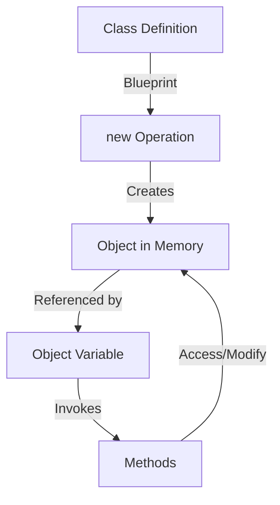
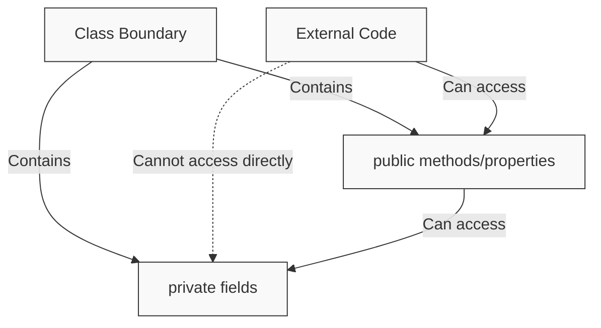
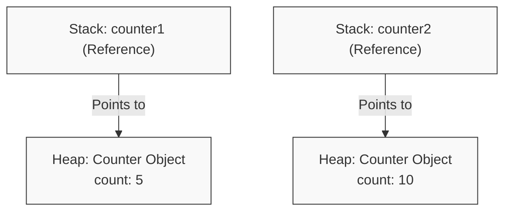

I’m making labs for my students that cover concepts in programming. These labs are their primary practice and learning spot. As such they should work to progress the knowledge and skill level of my students (depth) while also covering different skills and concepts (width). I do this by providing multiple projects where they must go through and complete the exercises, where each project is grouped by concept and skill, and the difficulty ramps in the project. I want to make a sequence of new ones which follow the same format, but working over methods and classes. I always try to have a dedicated debugging- project which is purely about debugging common errors and what they’ll see. Give them multiple reps and stuff. 

  

The others are intro, which should be wide but not super hard. Then debugging common errors, which should cover many and give them many reps, and then this time I want 2-3 more program.cs files which will take a different vertical of the kinds of problems students may solve with code. 

  There should be an emphasis on using these to model basic data, then making methods to solve problems.

Before you implement them though, can we discuss what should go in each? 

  

For reference here are the existing labs: 

  

// Welcome to Lab 4: Introduction to Loops! 

// In this lab, we'll explore how loops help us repeat tasks efficiently. 

  

using System; 

  

public class intro_loops 

{ 

    public static void Main(string[] args) 

    { 

        // --- 1. Motivation: Why Not Just Copy-Paste? --- 

        // Guiding Question: Why not copy-paste if you need to do something multiple times? 

        // Core Idea: Manual repetition is tedious, error-prone, and hard to change. 

        // Imagine you needed to print "Hello!" 5 times. You could write: 

        // Console.WriteLine("Hello!"); 

        // Console.WriteLine("Hello!"); 

        // Console.WriteLine("Hello!"); 

        // Console.WriteLine("Hello!"); 

        // Console.WriteLine("Hello!"); 

        // What if you needed to print it 100 times? Or change the message? 

        // Loops provide a way to execute a block of code multiple times: iteration. 

  

        Console.WriteLine("--- Part 1: The 'while' Loop ---"); 

  

        // --- 2. The Loop Triad: Start, Stop, Step with 'while' --- 

        // Guiding Question: Where does a loop start, when does it stop, and how does it progress? 

        // Core Idea: Every basic loop has three key parts: 

        //   a. Initialization: Setting up a starting state (e.g., a counter variable). 

        //   b. Condition: A boolean expression checked BEFORE each loop iteration. If true, the loop body runs. If false, the loop stops. 

        //   c. Iteration Step (Update): An action inside the loop that changes the state, working towards making the condition false. 

  

        // Typical Pitfall: Missing one of these parts can lead to a loop that's skipped entirely or runs forever (an infinite loop). 

  

        // Example: Printing numbers 1 to 3 

        Console.WriteLine("Example: Printing numbers 1 to 3"); 

        int counter = 1; // a. Initialization (Start) 

        while (counter <= 3) // b. Condition (Stop - or rather, continue while true) 

        { 

            Console.WriteLine(counter); 

            counter = counter + 1; // c. Iteration Step (Step) 

        } 

        Console.WriteLine("Loop finished.\n"); 

  

        // --- 3. Termination Rules --- 

        // Guiding Question: How do we ensure a loop actually finishes? 

        // Core Idea: For a loop to terminate correctly: 

        //   1. Proper Initialization: The variable(s) in the condition must be initialized correctly. 

        //   2. Progress: The loop body must do something to move closer to making the condition false. 

        //   3. Condition Must Become False: Eventually, the condition must evaluate to false. 

        // Pitfalls: Uninitialized variables, no progress (e.g., forgetting to increment a counter), or a condition that can never become false. 

  

        // --- Task 1: Accumulation (Sum of Numbers 1 to 5) --- 

        // Canonical Pattern: Accumulation (e.g., summing numbers, building a string) 

        // Problem: Write a loop that calculates the sum of numbers from 1 to 5 (i.e., 1 + 2 + 3 + 4 + 5). 

        // You'll need a variable to store the sum (the "accumulator") and initialize it correctly. 

        // You'll also need a counter variable for your loop. 

  

        Console.WriteLine("--- Task 1: Sum of Numbers 1 to 5 ---"); 

        int sum = 0; // Initialize your accumulator 

        int currentNumber = 1; // Initialize your counter (Start) 

  

        // Pre-condition for the loop: sum = 0, currentNumber = 1. 

        // We want to loop as long as currentNumber is less than or equal to 5. 

  

        // Write your 'while' loop here: 

        // Inside the loop: 

        //   - Add the 'currentNumber' to 'sum'. 

        //   - Increment 'currentNumber'. 

  

        /* Your while loop structure: 

        while (condition based on currentNumber) 

        { 

            // Add to sum 

            // Increment currentNumber 

        } 

        */ 

  

        Console.WriteLine("The sum of numbers 1 to 5 is: " + sum); // Should be 15 

        // Post-condition: sum = 15, currentNumber = 6 (or the value that made the loop condition false). 

  

        // Manual Tracing Task: 

        // Before running your code, try to trace it by hand. Fill out a table like this for each iteration: 

        // Iteration | currentNumber (before body) | sum (before body) | Condition (currentNumber <= 5) | currentNumber (after body) | sum (after body) 

        // ----------|-----------------------------|-------------------|--------------------------------|----------------------------|----------------- 

        // 1         | 1                           | 0                 | True                           | 2                          | 1 

        // 2         | 2                           | 1                 | True                           | 3                          | 3 

        // ... continue until the loop finishes ... 

  

        Console.WriteLine("\n--- Part 2: Searching and Early Exit with 'break' ---"); 

        // Sometimes, you want to stop a loop as soon as you find what you're looking for, 

        // even if the main loop condition hasn't been met yet. The 'break' statement exits the current loop immediately. 

  

        // --- Task 2: Search (First Number Divisible by 3 AND 5) --- 

        // Canonical Pattern: Search (e.g., finding an item, checking for a condition) 

        // Problem: Find the first number between 1 and 100 (inclusive) that is divisible by BOTH 3 and 5. 

        // Once you find it, print the number and exit the loop immediately using 'break'. 

        // Also, print each number you test until you find the target. 

  

        // Hint: A number 'x' is divisible by 'y' if 'x % y == 0' (the remainder of x divided by y is 0). 

        // You'll need to check for divisibility by 3 AND by 5. 

  

        Console.WriteLine("--- Task 2: Find number divisible by 3 and 5 (1-100) ---"); 

        int numberToTest = 1; 

        int foundNumber = 0; // To store the number once found 

  

        // Write your 'while' loop here. It should conceptually run as long as numberToTest <= 100. 

        // Inside the loop: 

        //   - Print "Testing: " followed by the numberToTest. 

        //   - Check if numberToTest is divisible by 3 AND divisible by 5. 

        //   - If it is: 

        //     - Set 'foundNumber' to 'numberToTest'. 

        //     - Print a message saying you found it. 

        //     - Use 'break;' to exit the loop. 

        //   - Increment 'numberToTest'. 

  

        /* Your while loop structure: 

        while (condition for numberToTest) 

        { 

            // Print testing message 

            // Check divisibility 

            // If divisible: 

            //   store it 

            //   print found message 

            //   break; 

            // Increment numberToTest 

        } 

        */ 

  

        if (foundNumber != 0) 

        { 

            Console.WriteLine("The first number divisible by both 3 and 5 is: " + foundNumber); // Should be 15 

        } 

        else 

        { 

            Console.WriteLine("No number found in the range that is divisible by both 3 and 5."); 

        } 

  

        // Reinforce the Loop Triad: Start - Stop - Step. Make sure each loop has these. 

        // Teaser: Loops are powerful! Next, we'll see how to use them for validating user input and creating more complex patterns. 

        Console.WriteLine("\nEnd of Lab 4."); 

    } 

}  

  

// Welcome to Lab 5: More Loop Patterns and the 'for' Loop! 

// We'll cover input validation, how to put loops inside other loops (nested loops), 

// and introduce the 'for' loop syntax. 

  

using System; 

  

public class loop_patterns 

{ 

    public static void Main(string[] args) 

    { 

        Console.WriteLine("--- Part 1: Input Validation Loop ---"); 

        // Canonical Pattern: Input Validation 

        // Guiding Question: How can we keep asking for input until it's correct? 

        // Core Idea: Use a loop that continues until valid input is received. 

        // We will use `int.Parse()` or `Convert.ToInt32()` to convert the user's text input to a number. 

        // IMPORTANT: If the user types something that isn't a whole number (e.g., "abc" or "1.5"), 

        // `int.Parse()` will cause an error and the program will crash. 

        // For this exercise, we are focusing on the loop structure to validate the *range* of the number 

        // assuming the user types a whole number. 

  

        // --- Task 1: Input Validation (Age) --- 

        // Problem: Write a program that keeps asking the user to enter their age 

        // until they enter a value between 0 and 120 (inclusive). 

        // Use `Console.ReadLine()` to get text input, then `int.Parse()` to convert it to an integer. 

  

        Console.WriteLine("--- Task 1: Age Input Validation (0-120) ---"); 

        int age = -1; // Initialize age to an invalid value to ensure the loop runs at least once. 

        bool isValidAgeEntered = false; 

  

        // Write your input validation loop here. 

        // The loop should continue as long as 'isValidAgeEntered' is false. 

        // Inside the loop, you need to: 

        //   1. Prompt the user to "Enter your age (0-120): ". 

        //   2. Read the user's input as a string. 

        //   3. Convert that string to an integer and store it in the 'age' variable. 

        //      (Remember the warning about int.Parse() if the input isn't a number!) 

        //   4. Check if the entered 'age' is within the valid range (0 to 120). 

        //   5. If the age is valid: 

        //        - Set 'isValidAgeEntered' to true. This will cause the loop to stop on its next check. 

        //   6. Else (if the age is out of range): 

        //        - Print an error message like "Invalid age. Please enter an age between 0 and 120." 

        // The loop will then repeat if the age was not valid. 

  

        // Your 'while' loop implementing the logic above goes here: 

        // while (!isValidAgeEntered) 

        // { 

        //     // Implement steps 1-6 here 

        // } 

  

  

        Console.WriteLine("Age accepted: " + age); 

  

  

        Console.WriteLine("\n--- Part 2: Nested Loops ---"); 

        // Advanced Construct: Nested Loops 

        // Guiding Question: What if the task itself needs to repeat for each repetition of another task? 

        // Core Idea: You can place one loop inside another. The inner loop will execute 

        // all its iterations for each single iteration of the outer loop. 

  

        Console.WriteLine("\n--- Part 3: The 'for' Loop Syntax ---"); 

        // Guiding Question: When is a 'for' loop clearer than a 'while' loop? 

        // Core Idea: The 'for' loop bundles the Loop Triad (Initialization, Condition, Iteration Step) 

        // into a single header line. It's often preferred for counter-controlled loops. 

  

        // Syntax: for (initialization; condition; iteration_step) { /* loop body */ } 

        Console.WriteLine("Example: Printing numbers 1 to 3 with a 'for' loop"); 

        for (int i = 1; i <= 3; i = i + 1) 

        { 

            Console.WriteLine(i); 

        } 

        Console.WriteLine("For loop finished.\n"); 

  

        // --- Task 2: Nested Loops (3x3 Multiplication Table) --- 

        // Problem: Print a 3x3 multiplication table. 

        // Use nested 'for' loops. The outer loop for 'row' (1 to 3), inner for 'column' (1 to 3). 

        Console.WriteLine("--- Task 2: 3x3 Multiplication Table ---"); 

        // Your nested 'for' loops go here. 

        // Remember the structure: 

        // for (outer loop setup for 'row') 

        // { 

        //     for (inner loop setup for 'col') 

        //     { 

        //         // Calculate product = row * col. 

        //         // Print the result: "row x col = product". 

        //     } 

        // } 

  

  

        // Manual Tracing Task for Nested Loops: 

        // For the first two rows of output, fill an iteration table: 

        // Outer Iteration (row) | Inner Iteration (col) | product | Output 

        // -----------------------|-----------------------|---------|-------- 

        // 1 (row=1)              | 1 (col=1)             | 1       | 1 x 1 = 1 

        // ... 

  

        Console.WriteLine("\nEnd of Lab 5."); 

    } 

}  

  

// Welcome to Lab 6: Debugging Loops! 

// Loops can be tricky. This lab presents some common loop bugs. 

// For each bug type, you'll first work through a guided example with hints, 

// then apply your understanding to fix a similar bug in an unguided task. 

// The program will not compile or run correctly until all bugs are fixed. 

// Use the compiler errors and program behavior as your guide. 

  

using System; 

  

public class debug_loops 

{ 

    public static void Main(string[] args) 

    { 

        Console.WriteLine("--- Lab 6: Debugging Loop Problems ---"); 

        Console.WriteLine("NOTE: This program contains several bugs. You will see compiler errors or incorrect behavior."); 

        Console.WriteLine("Fix each bug to make the program compile and run as described."); 

  

        // --- Bug Type 1: Off-by-One Error --- 

        // Explanation: An "off-by-one" error occurs when a loop runs one too many or one too few times. 

        // This is often due to using `<` instead of `<=` (or vice-versa) in the loop's condition, 

        // or starting/ending the loop counter at the wrong value. 

  

        // == Guided Example: Off-by-One Error == 

        Console.WriteLine("\n--- Guided Example 1: Off-by-One Error ---"); 

        // Problem: This loop is intended to calculate the sum of numbers from 1 to 5 (1+2+3+4+5 = 15). 

        // However, it's producing an incorrect sum due to an off-by-one error. 

        int sumGuided = 0; 

        // Suppose it was meant to sum 1 to 5, but the condition makes it sum 1 to 4. 

        Console.WriteLine("Guided Example: Summing 1 to 5. Current loop sums 1 to 4."); 

        for (int i = 1; i < 5; i++) // BUG: This condition causes it to sum 1,2,3,4 (stops before 5). 

                                     // To sum 1 to 5, 'i' should go up to and include 5. 

                                     // How should you change the condition `i < 5`? 

        { 

            sumGuided = sumGuided + i; 

        } 

        Console.WriteLine("Intended sum (1-5) is 15. Guided example calculated sum: " + sumGuided); 

        if (sumGuided == 15) 

        { 

            Console.WriteLine("Guided Example 1 Correct! The sum is 15."); 

        } 

        else 

        { 

            Console.WriteLine("Guided Example 1 Needs Fix! The sum is " + sumGuided + ", not 15. Adjust the loop condition."); 

        } 

  

        // == Unguided Task: Off-by-One Error == 

        Console.WriteLine("\n--- Unguided Task 1: Off-by-One Error ---"); 

        // Problem: The following loop is intended to print numbers counting DOWN from 5 to 1 

        // (i.e., it should print: 5, then 4, then 3, then 2, then 1). 

        // It has an off-by-one error in its condition. Fix it. 

        Console.WriteLine("Unguided Task: Printing numbers 5 down to 1."); 

        for (int j = 5; j > 1; j--) // BUG: This loop will not print 1. Review the condition. 

        { 

            Console.WriteLine(j); 

        } 

        Console.WriteLine("Unguided Task 1 finished. Did it print 5, 4, 3, 2, 1?"); 

  

  

        // --- Bug Type 2: Infinite Loop (Missing Update) --- 

        // Explanation: An infinite loop is a loop that never terminates because its exit condition is never met. 

        // A common cause is forgetting to update the variable(s) that control the loop's condition. 

  

        // == Guided Example: Infinite Loop (Missing Update) == 

        Console.WriteLine("\n--- Guided Example 2: Infinite Loop (Missing Update) ---"); 

        // Problem: This 'while' loop is intended to print numbers from 1 to 3. 

        // However, it will run forever because the 'counterGuided' variable is never changed inside the loop. 

        // WARNING: If you run this without fixing it, the program will hang. 

        int counterGuided = 1; 

        Console.WriteLine("Guided Example: Printing numbers 1 to 3 (currently an infinite loop)."); 

        while (counterGuided <= 3) // The condition `counterGuided <= 3` will always be true if counterGuided stays 1. 

        { 

            Console.WriteLine(counterGuided); 

            // BUG: The 'counterGuided' variable needs to be incremented here. 

            // Add the line of code that increases 'counterGuided' by 1. 

            // For example: counterGuided = counterGuided + 1; 

        } 

        Console.WriteLine("Guided Example 2 finished. (If it didn't, you still need to fix the infinite loop)."); 

  

  

        // == Unguided Task: Infinite Loop (Missing Update) == 

        Console.WriteLine("\n--- Unguided Task 2: Infinite Loop (Missing Update) ---"); 

        // Problem: This loop is intended to read user input repeatedly until the user types the exact word "exit". 

        // It should print each input back to the user. Currently, if the user types anything other than "exit" 

        // the first time, it will become an infinite loop, printing the first input forever. 

        // Fix it by ensuring new input is read inside the loop. 

        // WARNING: This can be an infinite loop. 

        string userInput = ""; 

        Console.WriteLine("Unguided Task: Enter text, or 'exit' to stop."); 

        userInput = Console.ReadLine(); // Get initial input 

  

        while (userInput != "exit") // BUG: If userInput is not "exit", this loop becomes infinite without an update. 

        { 

            Console.WriteLine("You entered: " + userInput); 

            // Consider what causes this loop to continue and what might be missing 

            // to allow it to terminate based on new user input each iteration. 

        } 

        Console.WriteLine("Unguided Task 2: Exited input loop."); 

  

  

        // --- Bug Type 3: Infinite Loop (Conditional Update Error) --- 

        // Explanation: An infinite loop can also occur if the loop control variable is only updated 

        // if a certain condition within the loop is met. If that condition is rarely or never met, 

        // the loop control variable might not change, and the loop never terminates. 

  

        // == Guided Example: Infinite Loop (Conditional Update Error) == 

        Console.WriteLine("\n--- Guided Example 3: Infinite Loop (Conditional Update Error) ---"); 

        // Problem: This loop is intended to count how many numbers from 1 to 10 are even. 

        // The variable 'iGuided' is used to iterate from 1 to 10. 

        // However, 'iGuided' is only incremented if it's an even number. 

        // If 'iGuided' starts as 1 (odd), it will never be incremented, leading to an infinite loop. 

        // WARNING: This is an infinite loop. 

        int evenCountGuided = 0; 

        int iGuided = 1; 

        Console.WriteLine("Guided Example: Counting evens from 1 to 10 (currently an infinite loop if iGuided starts odd)."); 

        while (iGuided <= 10) 

        { 

            if (iGuided % 2 == 0) 

            { 

                evenCountGuided = evenCountGuided + 1; 

                // iGuided = iGuided + 1; // BUG: 'iGuided' is only updated here. 

                                         // If iGuided is odd, this line is skipped, and iGuided never changes. 

            } 

            // The update to 'iGuided' (e.g., iGuided = iGuided + 1;) must happen on *every* iteration 

            // of the while loop, regardless of the 'if' condition, to ensure progress. 

            // Move or add the increment for 'iGuided' so it executes unconditionally within the loop. 

            // For example, place 'iGuided = iGuided + 1;' here (after the 'if' block but inside the 'while'). 

        } 

        Console.WriteLine("Guided Example: Number of even numbers (1-10) found: " + evenCountGuided); 

  

  

        // == Unguided Task: Infinite Loop (Conditional Update Error) == 

        Console.WriteLine("\n--- Unguided Task 3: Infinite Loop (Conditional Update Error) ---"); 

        // Problem: A download needs to reach 100% progress. It starts at 0%. 

        // In each cycle, it attempts to download a chunk. 

        // It gains 10% progress ONLY IF the network connection is "stable". 

        // The connection is defined as stable if the current 'cycleNumber' is odd. 

        // The variable `progressPercentage` controls when the loop should stop. 

        // BUG: `progressPercentage` (the loop control variable) is only updated if the connection is stable. 

        // If the connection is consistently unstable when progress is needed, the loop can become infinite. 

        // Your goal: Ensure the loop terminates correctly when progress reaches 100%. 

        // How can you ensure 'progressPercentage' makes progress towards exiting the loop, 

        // similar to how 'iGuided' was fixed in the guided example? 

        // WARNING: This can be an infinite loop. 

        int progressPercentage = 0; 

        int cycleNumber = 0;  

        Console.WriteLine("Unguided Task: Downloading to 100%."); 

  

        while(progressPercentage < 100) 

        { 

            cycleNumber = cycleNumber + 1; // Each cycle, the cycle number increases 

            bool connectionStable = (cycleNumber % 2 != 0); // Connection is stable on odd cycles (1, 3, 5...) 

  

            Console.WriteLine($"Cycle {cycleNumber}, Progress: {progressPercentage}%. Connection: {(connectionStable ? "Stable" : "Unstable")}"); 

  

            if(connectionStable) 

            { 

                progressPercentage = progressPercentage + 10; // BUG: Loop control variable 'progressPercentage' is updated conditionally. 

            } 

            // If 'connectionStable' is false, 'progressPercentage' does not change. 

            // If 'progressPercentage' stops increasing before it reaches 100, the loop will be infinite. 

            // Consider how the update to 'progressPercentage' relates to the loop's termination 

            // and how the guided example fixed a similar issue. 

        } 

        Console.WriteLine($"Download complete! Progress: {progressPercentage}%. Total cycles: {cycleNumber}"); 

  

  

        Console.WriteLine("\nEnd of Lab 6: Debugging Loops."); 

    } 

}  

  

AND here is the textbook chapter 

---
title: Ch. 5 - Classes and Methods
draft: false
aliases:
  - classes
  - methods
  - objects
---


## Introduction

Until now, we've stored data in variables and manipulated it with functions that existed separately from that data. While this approach works for simple programs, it becomes unwieldy when modeling real-world entities that have both characteristics (state) and capabilities (behavior). Consider how difficult it would be to track student information using separate arrays for names, IDs, and grades, or to manage multiple bank accounts without a clear connection between account balances and the operations that modify them.

In this chapter we will:

1. Define classes as blueprints that combine state and behavior into custom types
2. Create and use objects as instances of classes that exist in memory
3. Implement methods that define what objects can do
4. Apply encapsulation to protect object data and implementation details
5. Understand reference semantics and how objects differ from primitive types

This chapter builds directly on our understanding of variables, types, and scope. While arrays helped us organize collections of the same data type, classes allow us to define entirely new types that better model complex concepts with clearly defined state and behavior working together.

---

## Defining Our Terms

> [!abstract] Class
> > [!Definition]
> > 
> > A class is a user-defined type that serves as a blueprint for creating objects, specifying both the data (fields) and operations (methods) that characterize all objects of that type.
> > 
> 
> A class combines data representation with the operations that manipulate that data, defining both what an object knows (its state) and what an object can do (its behavior).
> 
> > [!example]
> > ```csharp
> > // A simple Counter class
> > class Counter {
> >    // Field - stores the state
> >    private int count;
> > 
> >    // Method - defines behavior
> >    // Type Signature: Increment: () → void
> >    public void Increment() {
> >        count++;
> >    }
> > 
> >    // Method - defines behavior
> >    // Type Signature: GetCount: () → int
> >    public int GetCount() {
> >        return count;
> >    }
> > }
> > ```
> > 
> 
> >[!important] Try It Yourself 
> >
> >Examine the Counter class above. What aspect of a counter's state is represented? What behaviors can a Counter object perform?
> > 
> >State: count (int) 
> >Behaviors: Increment() and GetCount()
> >

> [!abstract] Object
> > [!Definition]
> > 
> > An object is a specific instance of a class that exists in memory during program execution, with its own unique state and the ability to perform the behaviors defined by its class.
> > 
> 
> Objects are the dynamic entities created from class blueprints. Multiple objects of the same class type can exist simultaneously, each with its own independent state.
> 
> > [!example]
> > 
> > ```csharp
> > // Creating two distinct Counter objects
> > Counter gameScore = new Counter();
> > Counter clickCount = new Counter();
> > 
> > // Each object maintains its own independent state
> > gameScore.Increment();  // gameScore's count is now 1
> > gameScore.Increment();  // gameScore's count is now 2
> > 
> > clickCount.Increment(); // clickCount's count is now 1
> > 
> > // Accessing object state through methods
> > Console.WriteLine("Game score: " + gameScore.GetCount());   // Displays: 2
> > Console.WriteLine("Click count: " + clickCount.GetCount()); // Displays: 1
> > ```
> 
> >[!important] Try It Yourself 
> >
> >How many Counter objects exist in the example above? What would be displayed if we called gameScore.GetCount() again?
> >
> > Answer: Two Counter objects exist (gameScore and clickCount). If we called gameScore.GetCount() again, it would still display 2 since we haven't changed its state since the last increment.

> [!abstract] Method
> > [!Definition]
> > 
> > A method is a function defined within a class that performs operations related to that class, often accessing or modifying the object's fields.
> > 
> 
> Methods define the behavior of objects - what they can do. Methods can access the object's fields, accept parameters for input, and return values as output.
> 
> > [!example]
> > 
> > ```csharp
> > class Robot {
> >    // Fields - the robot's state
> >    private int xPosition;
> >    private int yPosition;
> >    private string name;
> > 
> >    // Method with no parameters or return value
> >    // Type Signature: MoveUp: () → void
> >    public void MoveUp() {
> >        yPosition++;
> >    }
> > 
> >    // Method with a parameter
> >    // Type Signature: SetName: (string) → void
> >    public void SetName(string robotName) {
> >        name = robotName;
> >    }
> > 
> >    // Method with a return value
> >    // Type Signature: GetLocation: () → string
> >    public string GetLocation() {
> >        return "(" + xPosition + ", " + yPosition + ")";
> >    }
> > 
> >    // Method with both parameters and a return value
> >    // Type Signature: CalculateDistance: (int, int) → int
> >    public int CalculateDistance(int targetX, int targetY) {
> >        int xDiff = targetX - xPosition;
> >        int yDiff = targetY - yPosition;
> >        return Math.Abs(xDiff) + Math.Abs(yDiff);
> >    }
> > }
> > ```

Methods are at the heart of what makes object-oriented programming powerful. They connect behavior directly to the data they operate on, creating a cohesive unit that mirrors how we think about real-world entities and their capabilities.

---

## Core Concept Exploration: Defining Your First Class

### The Problem with Separate Data and Functions

Consider how we might track student information without classes:

> [!example] Managing Student Data Without Classes
> 
> ```csharp
> // Using separate arrays to track student data
> string[] studentNames = new string[100];
> int[] studentIds = new int[100];
> double[] studentGpas = new double[100];
> 
> // Function to enroll a student in a course
> // Type Signature: EnrollStudentInCourse: (int, string) → void
> void EnrollStudentInCourse(int studentIndex, string course) {
>   if (studentIndex >= 0 && studentIndex < studentNames.Length) {
>       Console.WriteLine(studentNames[studentIndex] + " enrolled in " + course);
>   }
> }
> 
> // Add a student
> int newStudentIndex = 0;
> studentNames[newStudentIndex] = "Alice";
> studentIds[newStudentIndex] = 12345;
> studentGpas[newStudentIndex] = 3.9;
> 
> // Enroll the student
> EnrollStudentInCourse(newStudentIndex, "Computer Science 101");
> ```

This approach has several drawbacks:

- Data Fragmentation: Related information about a student is scattered across multiple arrays
- Error-Prone Indexing: Using the same index across arrays creates potential for misalignment
- No Cohesion: The connection between student data and student-related functions isn't explicit
- Poor Abstraction: The code doesn't reflect how we naturally think about students as entities

### Fields: Defining Object State

Fields are variables declared within a class that store the state of each object:

> [!example] Fields in a Class
> 
> ```csharp
> class Student {
>   // Fields - define the student's state
>   private string name;
>   private int id;
>   private double gpa;
>   private string[] enrolledCourses;
>   private int courseCount;
> }
> ```

Key points about fields:

- Fields use the same type system as regular variables
- The private keyword restricts access to within the class (encapsulation)
- Each object created from this class gets its own independent copy of these fields
- Fields are typically declared at the top of the class

### Methods: Defining Object Behavior

Methods are functions defined within a class that determine what objects of that class can do:

> [!example] Methods in a Class
> 
> ```csharp
> class Student {
>   // Fields from previous example
>   private string name;
>   private int id;
>   private double gpa;
>   private string[] enrolledCourses;
>   private int courseCount;
> 
>   // Methods - define the student's behavior
>   // Type Signature: EnrollInCourse: (string) → void
>   public void EnrollInCourse(string course) {
>       // Check if there's room for another course
>       if (courseCount < enrolledCourses.Length) {
>           enrolledCourses[courseCount] = course;
>           courseCount++;
>           Console.WriteLine(name + " enrolled in " + course);
>       } else {
>           Console.WriteLine("Cannot enroll in more courses.");
>       }
>   }
> 
>   // Type Signature: GetStudentInfo: () → string
>   public string GetStudentInfo() {
>       return "Student: " + name + " (ID: " + id + "), GPA: " + gpa;
>   }
> 
>   // Type Signature: GetGPA: () → double
>   public double GetGPA() {
>       return gpa;
>   }
> }
> ```

Key points about methods:

- Methods define what objects can do
- Methods can access the object's fields directly
- The public keyword makes methods accessible from outside the class
- Methods can have parameters and return values, just like regular functions
- Methods operate on the specific object they're called on

> [!important] Key Insight 
> Methods have direct access to the fields of the object they belong to. This means they can read and modify the object's state without needing to pass the state as parameters or return it as values.

### Putting State and Behavior Together

Let's examine a complete class that combines fields and methods:

> [!example] Complete Counter Class
> 
> ```csharp
> public class Counter {
>   // State - private field
>   private int count;
> 
>   // Behavior - public methods
>   // Type Signature: Increment: () → void
>   public void Increment() {
>       count++;
>   }
> 
>   // Type Signature: Add: (int) → void
>   public void Add(int amount) {
>       if (amount > 0) {  // Validation logic
>           count += amount;
>       }
>   }
> 
>   // Type Signature: GetCount: () → int
>   public int GetCount() {
>       return count;
>   }
> 
>   // Type Signature: Reset: () → void
>   public void Reset() {
>       count = 0;
>   }
> }
> ```

This class demonstrates how state and behavior are combined:

- The count field stores the current count value (state)
- Methods like Increment() and Reset() modify this state
- The GetCount() method allows reading the state
- The Add() method includes validation to ensure only positive values are added

> [!exercise] Practice: Designing a Class Design a Rectangle class that:
> 
> - Has private fields for width and height
> - Has methods to calculate area and perimeter
> - Has a method to determine if the rectangle is a square
> 
> ```csharp
> class Rectangle {
>  // Your implementation here
>  private double width;
>  private double height;
> 
>  // Type Signature: SetDimensions: (double, double) → void
>  public void SetDimensions(double width, double height) {
>      if (width > 0) this.width = width;
>      if (height > 0) this.height = height;
>  }
> 
>  // Type Signature: CalculateArea: () → double
>  public double CalculateArea() {
>      return width * height;
>  }
> 
>  // Type Signature: CalculatePerimeter: () → double
>  public double CalculatePerimeter() {
>      return 2 * (width + height);
>  }
> 
>  // Type Signature: IsSquare: () → bool
>  public bool IsSquare() {
>      return width == height;
>  }
> }
> ```

---

## Creating and Using Objects

Once we've defined a class, we need to create objects (instances) of that class to use them in our program.

### Instantiation with the new Keyword

Objects are created using the new keyword, which:

- Allocates memory for the object
- Calls the constructor (which we'll discuss shortly)
- Returns a reference to the newly created object

> [!example] Creating Objects
> 
> ```csharp
> // Create a Counter object
> Counter playerScore = new Counter();
> 
> // Create two Rectangle objects
> Rectangle rect1 = new Rectangle();
> Rectangle rect2 = new Rectangle();
> 
> // Set different dimensions using a method (before constructors are covered)
> rect1.SetDimensions(4.0, 5.0);
> rect2.SetDimensions(3.0, 3.0);
> ```

### Working with Multiple Objects

Each object maintains its own independent state:

> [!example] Multiple Independent Objects
> 
> ```csharp
> // Create two Counter objects
> Counter playerOneScore = new Counter();
> Counter playerTwoScore = new Counter();
> 
> // Modify each object independently
> playerOneScore.Increment();  // Player 1: 1, Player 2: 0
> playerOneScore.Increment();  // Player 1: 2, Player 2: 0
> playerTwoScore.Increment();  // Player 1: 2, Player 2: 1
> 
> // Check scores
> Console.WriteLine("Player 1: " + playerOneScore.GetCount());
> Console.WriteLine("Player 2: " + playerTwoScore.GetCount());
> 
> // Reset one score
> playerOneScore.Reset();      // Player 1: 0, Player 2: 1
> ```

> [!important] Key Insight 
> 
> The class defines the structure and behavior that all objects share, but each object maintains its own independent state. This is like a cookie cutter (class) that creates individual cookies (objects) - all have the same shape but can have different decorations.

### Calling Methods on Objects

Methods are called on specific objects using the dot notation:

> [!example] Calling Methods
> 
> ```csharp
> Rectangle rectangle = new Rectangle();
> rectangle.SetDimensions(5.0, 3.0);  // Call method to set state
> 
> // Call methods to get information
> double area = rectangle.CalculateArea();
> double perimeter = rectangle.CalculatePerimeter();
> bool isSquare = rectangle.IsSquare();
> 
> Console.WriteLine("Area: " + area);
> Console.WriteLine("Perimeter: " + perimeter);
> Console.WriteLine("Is square? " + isSquare);
> ```




This diagram illustrates how:

- A class definition serves as a blueprint
- The new operation creates an object in memory
- A variable holds a reference to the object
- Methods are invoked on the object through that reference
- Methods can access and modify the object's state

## Constructors: Specialized Methods for Initialization

### Purpose and Syntax

Constructors are special methods that initialize objects when they are created. They ensure that objects start life in a valid state.

> [!abstract] Constructor  
> 
> > [!Definition] 
> > 
> > A constructor is a special method that has the same name as the class and is executed automatically when a new object is created. Its purpose is to initialize the object's state. Constructors have no return type (not even void) and are called implicitly when using the new keyword.   
>  
> > [!example]  
> > 
> > ```csharp
> > public class Counter {
> >    private int count;
> >  
> >    // Constructor
> >    // Type Signature: Counter: () → Counter (implied)
> >    public Counter() {
> >        count = 0;  // Initialize the count to zero
> >    }
> >  
> >    // Methods as before...
> >    // Type Signature: Increment: () → void
> >    public void Increment() {
> >        count++;
> >    }
> >  
> >    // Type Signature: GetCount: () → int
> >    public int GetCount() {
> >        return count;
> >    }
> > }
> > ```

### Constructors with Parameters

Constructors can accept parameters to initialize the object with specific values:

> [!example] Parameterized Constructor  
> 
> ```csharp
> public class Student {
>   private string name;
>   private int id;
>   private double gpa;
>   private string[] enrolledCourses;
>   private int courseCount;
>  
>   // Constructor with parameters
>   // Type Signature: Student: (string, int) → Student (implied)
>   public Student(string studentName, int studentId) {
>       // The constructor ensures the object starts in a valid state
>       name = studentName;
>       id = studentId;
>       gpa = 0.0;
>       enrolledCourses = new string[10];  // Space for 10 courses
>       courseCount = 0;
>   }
>  
>   // Methods as before...
> }
> ```

Using a parameterized constructor:

```csharp

// Create a Student with specific initial values
Student alice = new Student("Alice Smith", 12345);
Student bob = new Student("Bob Jones", 67890);

// The constructor guarantees that objects start with proper initialization:
// - name is set from the parameter
// - id is set from the parameter
// - gpa starts at 0.0
// - enrolledCourses array is created
// - courseCount starts at 0
```

### Constructor Overloading

Classes can have multiple constructors with different parameter lists:

> [!example] Constructor Overloading  
> 
> ```csharp
> public class Rectangle {
>   private double width;
>   private double height;
>  
>   // Default constructor
>   // Type Signature: Rectangle: () → Rectangle (implied)
>   public Rectangle() {
>       width = 1.0;
>       height = 1.0;
>   }
>  
>   // Constructor with two parameters
>   // Type Signature: Rectangle: (double, double) → Rectangle (implied)
>   public Rectangle(double width, double height) {
>       // Using 'this' to distinguish field from parameter
>       this.width = width > 0 ? width : 1.0; // Use default if invalid
>       this.height = height > 0 ? height : 1.0; // Use default if invalid
>   }
>  
>   // Constructor for a square
>   // Type Signature: Rectangle: (double) → Rectangle (implied)
>   public Rectangle(double side) {
>       // Using 'this' to distinguish field from parameter
>       this.width = side > 0 ? side : 1.0; // Use default if invalid
>       this.height = side > 0 ? side : 1.0; // Use default if invalid
>   }
>  
>   // Methods as before...
>   // Type Signature: CalculateArea: () → double
>   public double CalculateArea() { return width * height; }
>   
>   // Type Signature: CalculatePerimeter: () → double
>   public double CalculatePerimeter() { return 2 * (width + height); }
>   
>   // Type Signature: IsSquare: () → bool
>   public bool IsSquare() { return width == height; }
> }
> ```

Using different constructors:

```csharp
Rectangle rect1 = new Rectangle();         // 1x1 rectangle via default constructor
Rectangle rect2 = new Rectangle(5.0, 3.0); // 5x3 rectangle via two-parameter constructor
Rectangle square = new Rectangle(4.0);     // 4x4 square via square constructor
```

> [!important] Key Insight 
> 
> If you don't define any constructors, the compiler provides a default parameterless constructor. However, if you define any constructor, the compiler will not generate a default one, so you need to define it explicitly if needed.

> [!exercise] Practice: Adding Constructors 
> 
> Add appropriate constructors to the Rectangle class you created earlier:  
> 
> - A default constructor that creates a 1x1 rectangle
> - A constructor that accepts width and height parameters  
> 
> ```csharp
> class Rectangle {
>  private double width;
>  private double height;
>  
>  // Default constructor
>  // Type Signature: Rectangle: () → Rectangle (implied)
>  public Rectangle() {
>      width = 1.0;
>      height = 1.0;
>  }
>  
>  // Parameterized constructor
>  // Type Signature: Rectangle: (double, double) → Rectangle (implied)
>  public Rectangle(double width, double height) {
>      this.width = width > 0 ? width : 1.0;
>      this.height = height > 0 ? height : 1.0;
>  }
>  
>  // Other methods as before...
>  // Type Signature: CalculateArea: () → double
>  public double CalculateArea() {
>      return width * height;
>  }
>  
>  // Type Signature: CalculatePerimeter: () → double
>  public double CalculatePerimeter() {
>      return 2 * (width + height);
>  }
>  
>  // Type Signature: IsSquare: () → bool
>  public bool IsSquare() {
>      return width == height;
>  }
> }
> ```

## Encapsulation: Protecting Data with Methods

### The Principle of Data Protection

Encapsulation is the principle of restricting direct access to an object's fields and providing controlled access through methods (or properties, as we'll see).

> [!abstract] Encapsulation  
> 
> > [!Definition]
> > 
> > Encapsulation is the principle of bundling data (fields) and the methods that operate on that data within a single unit (the class), and restricting direct access to some of the object's components (typically the fields).   This principle is implemented by making fields private and providing public methods or properties to access and modify them in a controlled way.   [!example]  
> > 
> > ```csharp
> > public class BankAccount {
> >    // Private fields - hidden from outside access
> >    private string accountNumber;
> >    private decimal balance;
> >  
> >    // Public constructor
> >    // Type Signature: BankAccount: (string) → BankAccount (implied)
> >    public BankAccount(string accountNumber) {
> >        this.accountNumber = accountNumber;
> >        this.balance = 0; // Initial balance is zero
> >    }
> >  
> >    // Public methods - the interface through which the object is used
> >    // Type Signature: Deposit: (decimal) → void
> >    public void Deposit(decimal amount) {
> >        if (amount > 0) { // Validation: only positive deposits
> >            balance += amount;
> >        }
> >    }
> >  
> >    // Type Signature: Withdraw: (decimal) → bool
> >    public bool Withdraw(decimal amount) {
> >        // Validation: positive amount and sufficient funds
> >        if (amount > 0 && amount <= balance) {
> >            balance -= amount;
> >            return true; // Withdrawal successful
> >        }
> >        return false; // Withdrawal failed
> >    }
> >  
> >    // Type Signature: GetBalance: () → decimal
> >    public decimal GetBalance() {
> >        return balance;
> >    }
> > }
> > ```

> [!important] Key Insight Encapsulation provides several benefits:  
> 
> - Data Protection: Prevents fields from being set to invalid or inconsistent states (e.g., negative deposit amounts, negative age).
>     
> - Implementation Hiding: Internal details of how the class works can be changed without affecting the code that uses the class, as long as the public interface (methods/properties) remains the same.
>     
> - Controlled Access: Provides a clear, well-defined interface for interacting with objects, making the class easier to use correctly.
>     

### Access Modifiers: public vs. private

Access modifiers control who can see and use class members:

- private: Only accessible from within the class itself. This is the standard for fields to enforce encapsulation.
- public: Accessible from any code that can access the class. This is used for the class's external interface (constructors, methods, properties).



> [!warning] Common Mistake: Public Fields 
> 
> Making fields public bypasses encapsulation and can lead to invalid object states because external code can modify them directly without any validation.  
> 
> ```csharp
> public class Account {
>   public decimal balance;  // BAD - no validation or protection
> }
>  
> // Can lead to invalid states
> Account account = new Account();
> account.balance = -5000;  // Negative balance allowed!
> ```

### Getters and Setters: Controlled Access Methods

Getter and setter methods are a common pattern for providing controlled access to private fields:

> [!abstract] Getters and Setters  
> 
> > [!Definition]
> > 
> > Getter methods provide controlled read access to private fields, while setter methods provide controlled write access to private fields, often including validation logic.   These methods typically follow naming conventions:  
> 
> - Getters: GetFieldName() (e.g., GetBalance())     
> - Setters: SetFieldName(Type value) (e.g., SetName(string name))       
> 
> > [!example] Getter and Setter Methods  
> > 
> > ```csharp
> > public class Person {
> >    private string name;
> >    private int age;
> >  
> >    // Constructor uses setters for initial validation
> >    // Type Signature: Person: (string, int) → Person (implied)
> >    public Person(string name, int age) {
> >        SetName(name); // Use setter for validation
> >        SetAge(age);   // Use setter for validation
> >    }
> >  
> >    // Getter for name
> >    // Type Signature: GetName: () → string
> >    public string GetName() {
> >        return name;
> >    }
> >  
> >    // Setter for name with validation
> >    // Type Signature: SetName: (string) → void
> >    public void SetName(string newName) {
> >        if (!string.IsNullOrEmpty(newName)) {
> >            name = newName;
> >        } else {
> >            name = "Unknown"; // Default if invalid
> >        }
> >    }
> >  
> >    // Getter for age
> >    // Type Signature: GetAge: () → int
> >    public int GetAge() {
> >        return age;
> >    }
> >  
> >    // Setter for age with validation
> >    // Type Signature: SetAge: (int) → void
> >    public void SetAge(int newAge) {
> >        if (newAge >= 0 && newAge <= 120) { // Age validation
> >            age = newAge;
> >        } else {
> >            age = 0; // Default age if invalid
> >        }
> >    }
> > }
> > ```

> [!seealso] INSIGHT 
> 
> Getters and setters aren't just about controlling access—they can also:  
> 
> - Perform validation to ensure data integrity
> - Convert between internal storage formats and external representations
> - Trigger side effects when a value changes (e.g., logging, updating related fields, notifying other objects)
> - Compute derived values on demand (though read-only properties are often better for this)

### Note on C# Properties

In modern C# code, you'll frequently see a more concise syntax for getters and setters called properties. Properties provide a cleaner way to expose controlled access to an object's state.

```csharp
public class Person {
   // Auto-implemented property (compiler generates private backing field)
   public string Name { get; set; }

   // Property with validation in the setter
   private int age; // Explicit private backing field needed for custom logic
   public int Age {
       get { return age; }
       set { // 'value' is the implicit parameter in a setter
           if (value >= 0 && value <= 120)
               age = value;
           // Optionally throw an exception for invalid values
           // else throw new ArgumentOutOfRangeException(nameof(value), "Age must be between 0 and 120.");
       }
   }

   // Read-only computed property (only has a getter, calculates value)
   public bool IsAdult {
       get { return Age >= 18; }
   }

   // Constructor using properties
   public Person(string name, int initialAge) {
       Name = name; // Uses the Name property's setter
       Age = initialAge; // Uses the Age property's setter (with validation)
   }
}
```

Properties provide a more elegant syntax while achieving the same encapsulation goals as explicit getter and setter methods. For this chapter, we primarily focused on explicit methods to clearly illustrate the concept, but you should prefer using properties in your C# development.

> [!exercise] Practice: Implementing Encapsulation 
> 
> Refactor the following class to properly encapsulate its data using explicit getter/setter methods:  
> 
> ```csharp
> // Before encapsulation
> public class Product {
>   public string name;
>   public decimal price;
>   public int quantity;
> }
> ```
> 
> ```csharp
> // After encapsulation (using methods)
> public class Product {
>   private string name;
>   private decimal price;
>   private int quantity;
>  
>   // Constructor using setters for validation
>   // Type Signature: Product: (string, decimal, int) → Product (implied)
>   public Product(string name, decimal price, int quantity) {
>       SetName(name);
>       SetPrice(price);
>       SetQuantity(quantity);
>   }
>  
>   // Getter for name
>   // Type Signature: GetName: () → string
>   public string GetName() {
>       return name;
>   }
>  
>   // Setter for name
>   // Type Signature: SetName: (string) → void
>   public void SetName(string name) {
>       if (!string.IsNullOrEmpty(name)) {
>           this.name = name;
>       } else {
>           this.name = "Unnamed Product"; // Default value
>       }
>   }
>  
>    // Getter for price
>   // Type Signature: GetPrice: () → decimal
>   public decimal GetPrice() {
>       return price;
>   }
>  
>   // Setter for price
>   // Type Signature: SetPrice: (decimal) → void
>   public void SetPrice(decimal price) {
>       if (price >= 0) { // Validation
>           this.price = price;
>       } else {
>           this.price = 0; // Default value
>       }
>   }
>  
>    // Getter for quantity
>   // Type Signature: GetQuantity: () → int
>   public int GetQuantity() {
>       return quantity;
>   }
>  
>   // Setter for quantity
>   // Type Signature: SetQuantity: (int) → void
>   public void SetQuantity(int quantity) {
>       if (quantity >= 0) { // Validation
>           this.quantity = quantity;
>       } else {
>           this.quantity = 0; // Default value
>       }
>   }
>  
>   // Method to calculate total value (uses internal fields)
>   // Type Signature: GetTotalValue: () → decimal
>   public decimal GetTotalValue() {
>       return price * quantity;
>   }
> }
> ```

## Reference Semantics and Object Identity

### Objects in Memory

Class types use reference semantics, which means variables of class types store references (memory addresses) to objects rather than the objects themselves:

> [!Notation] NOTATION  
> 
> - Value Types: Variables directly contain their data (e.g., int x = 5;)
>     
> - Reference Types: Variables contain references (addresses) to data stored elsewhere (e.g., Counter c = new Counter();)
>     
> - Analogy for References: A reference variable is like a TV remote control. The remote (variable) isn't the TV (object) itself; it's a device that points to and interacts with the TV. If you give someone your remote (copy the reference), you're both controlling the same TV (object).
>     

When we create a class object using new, the object itself is stored in a memory region called the heap, and the variable holds a reference (address) pointing to that object on the heap. The reference variable itself is typically stored on the stack (a different memory area used for method calls and local variables).



This separation between the reference (on the stack) and the object (on the heap) is fundamental to how C# manages memory for class instances.

### Assignment Creates Another Reference

When you assign one object variable to another, you're copying the reference, not the object itself. Both variables end up pointing to the same object in memory:

> [!example] Reference Assignment  
> 
> ```csharp
> // Create a Counter object
> Counter counter1 = new Counter();
> counter1.Increment();
> counter1.Increment();  // counter1 points to an object where count is 2
>  
> // Assignment copies the reference, not the object
> Counter counter2 = counter1;  // Now counter2 points to the SAME object as counter1
>  
> // Changes through either reference affect the single, shared object
> counter2.Increment();  // The shared object's count is now 3
>  
> // Both variables access the same object's state
> Console.WriteLine(counter1.GetCount());  // Displays: 3
> Console.WriteLine(counter2.GetCount());  // Displays: 3
> ```

This behavior is fundamentally different from value types like int, double, or bool, where assignment creates a completely independent copy of the value.

> [!stateTable] State Table for Reference Assignment   
> 
> |Statement|counter1 References|counter2 References|Shared Object State| 
> |:--|:--|:--|:--| 
> |Counter c1 = new Counter();|New Counter object|N/A|count: 0| |c1.Increment();|Same Counter object|N/A|count: 1| |c1.Increment();|Same Counter object|N/A|count: 2| |Counter c2 = c1;|Counter object|SAME Counter object|count: 2| |c2.Increment();|Counter object|SAME Counter object|count: 3|

### Identity vs. Equality

There's an important distinction between object identity (are two references pointing to the exact same object in memory?) and object equality (do two potentially different objects have the same state/field values?):

> [!example] Identity vs. Equality  
> 
> ```csharp
> // Create two different Counter objects, but give them the same state
> Counter a = new Counter();
> a.Increment();  // a.count is 1
>  
> Counter b = new Counter();
> b.Increment();  // b.count is 1
>  
> // Create another reference to the first object
> Counter aReference = a;
>  
> // Identity comparison (checks if references point to the same memory location)
> bool sameObject1 = (a == aReference);  // true - 'a' and 'aReference' point to the same object
> bool sameObject2 = (a == b);           // false - 'a' and 'b' point to different objects,
>                                       //         even though their 'count' fields are equal.
>  
> // Equality comparison (would typically require overriding Equals method - not shown here)
> // bool equalState = a.Equals(b); // Would likely be true if Equals compared 'count'
>  
> // Both have count = 1, but they are different objects in memory
> Console.WriteLine(a.GetCount());       // Displays: 1
> Console.WriteLine(b.GetCount());       // Displays: 1
> ```

By default, the == operator compares references for reference types (checking identity). Comparing based on state (equality) usually requires implementing a custom Equals method in your class.

> [!warning] Common Mistake: Reference Confusion A common error is forgetting that assignment copies references, leading to unintended modifications of shared objects.  
> 
> ```csharp
> BankAccount account1 = new BankAccount("12345");
> account1.Deposit(1000);
>  
> BankAccount account2 = account1;  // account2 now points to the SAME object as account1
>  
> account2.Withdraw(200);  // This withdraws from the SINGLE object that both variables point to
>  
> // Both variables will show the same, updated balance: 800
> Console.WriteLine(account1.GetBalance()); // 800
> Console.WriteLine(account2.GetBalance()); // 800
> ```

### Value Types vs. Reference Types

C# has two fundamental categories of types:

- Value Types: Include primitive types (int, double, bool, char, etc.), enum types, and struct types.
- Reference Types: Include class types, interface types, delegate types, and array types.

The key difference lies in how they store data and behave during assignment or when passed as parameters:

|                 |                                                |                                            |
| --------------- | ---------------------------------------------- | ------------------------------------------ |
| **Feature**     | **Value Types (int, struct, enum)**            | **Reference Types (class, array, string)** |
| Storage         | Variable directly contains the data            | Variable contains a reference (address)    |
| Memory Location | Typically Stack (unless field in class/struct) | Object on Heap, Reference on Stack/Heap    |
| Assignment      | Copies the actual value                        | Copies the reference (address)             |
| Result          | Two independent copies of the data             | Two references pointing to the same data   |
| Default Value   | Zero equivalent (0, false, etc.)               | null                                       |
| Identity        | No identity beyond their value                 | Have distinct identity separate from state |
| Memory Mgmt     | Automatic (stack frame cleanup)                | Garbage Collection (heap cleanup)          |

> [!important] Key Insight 
> 
> The distinction between value types and reference types affects many aspects of programming, from performance considerations (stack vs. heap allocation, copying data) to how data is shared and modified between different parts of a program. Understanding this distinction is crucial for effective C# programming.

## Building More Complex Classes

### Object Composition

Object composition is when one class contains fields that are instances of other classes. This "has-a" relationship allows for building more complex objects by combining simpler ones.

> [!example] Object Composition  
> 
> ```csharp
> // Simple Address class
> public class Address {
>   private string street;
>   private string city;
>   private string state;
>   private string zipCode;
>  
>   // Type Signature: Address: (string, string, string, string) → Address (implied)
>   public Address(string street, string city, string state, string zip) {
>       this.street = street;
>       this.city = city;
>       this.state = state;
>       this.zipCode = zip;
>   }
>  
>   // Type Signature: GetFullAddress: () → string
>   public string GetFullAddress() {
>       // Using string interpolation ($"...") for cleaner formatting
>       return $"{street}, {city}, {state} {zipCode}";
>   }
>  
>   // Getters/Setters or Properties would typically be here...
> }
>  
> // Person class that HAS-AN Address
> public class Person {
>   private string name;
>   private Address homeAddress;  // Field of another class type (Composition)
>  
>   // Type Signature: Person: (string, Address) → Person (implied)
>   public Person(string name, Address address) {
>       this.name = name;
>       this.homeAddress = address; // Store the reference to the Address object
>   }
>  
>   // Type Signature: GetContactInfo: () → string
>   public string GetContactInfo() {
>       // Can call methods on the composed object
>       return $"{name}\n{homeAddress.GetFullAddress()}";
>   }
>  
>   // Getters/Setters or Properties would typically be here...
> }
> ```

Using these composed objects:

```csharp
// Create an Address object first
Address address = new Address("123 Main St", "Anytown", "CA", "12345");

// Create a Person object, passing the Address object to its constructor
Person person = new Person("Alice Smith", address);

// Get information that combines Person and Address data
Console.WriteLine(person.GetContactInfo());
// Displays:
// Alice Smith
// 123 Main St, Anytown, CA 12345
```

Note that we're using string interpolation with the $ symbol in many of our examples (e.g., `$"{name}\n{homeAddress.GetFullAddress()}"`). This is a modern C# feature that allows embedding expressions directly in strings, making string formatting more readable than traditional concatenation with the + operator.

### Collections of Objects

Often, we need to work with collections (like arrays or lists) of objects. This allows us to:

- Manage many related objects together
- Perform operations on multiple objects efficiently
- Model one-to-many or many-to-many relationships

> [!example] Collections of Objects (Using an Array)  
> 
> ```csharp
> // Simple Book class
> public class Book {
>   private string title;
>   private string author;
>   private int pages;
>  
>   // Type Signature: Book: (string, string, int) → Book (implied)
>   public Book(string title, string author, int pages) {
>       this.title = title;
>       this.author = author;
>       this.pages = pages;
>   }
>  
>   // Getters (or Properties)
>   // Type Signature: GetTitle: () → string
>   public string GetTitle() { return title; }
>   
>   // Type Signature: GetAuthor: () → string
>   public string GetAuthor() { return author; }
>   
>   // Type Signature: GetPages: () → int
>   public int GetPages() { return pages; }
> }
>  
> // Library class that holds a collection of Books
> public class Library {
>   private string name;
>   private Book[] books;  // Array field to hold Book objects
>   private int bookCount; // To track how many books are actually in the array
>  
>   // Type Signature: Library: (string, int) → Library (implied)
>   public Library(string name, int maxCapacity) {
>       this.name = name;
>       this.books = new Book[maxCapacity]; // Create the array
>       this.bookCount = 0;
>   }
>  
>   // Method to add a Book object to the collection
>   // Type Signature: AddBook: (Book) → void
>   public void AddBook(Book book) {
>       if (bookCount < books.Length) { // Check if there's space
>           books[bookCount] = book; // Store the reference to the Book object
>           bookCount++;
>       } else {
>           Console.WriteLine("Library is full, cannot add book.");
>       }
>   }
>  
>   // Method to list all books in the collection
>   // Type Signature: ListAllBooks: () → void
>   public void ListAllBooks() {
>       Console.WriteLine($"Books in {name} library ({bookCount} total):");
>       for (int i = 0; i < bookCount; i++) {
>           // Access methods of objects stored in the array
>           Console.WriteLine($"- {books[i].GetTitle()} by {books[i].GetAuthor()}");
>       }
>   }
>  
>   // Other methods like FindBook, RemoveBook etc. could be added
> }
> ```

Using the Library and Book classes:

```csharp
// Create a Library object
Library library = new Library("Public Library", 100); // Capacity of 100 books

// Create some Book objects
Book book1 = new Book("The Great Gatsby", "F. Scott Fitzgerald", 218);
Book book2 = new Book("To Kill a Mockingbird", "Harper Lee", 324);

// Add the Book objects to the Library's collection
library.AddBook(book1);
library.AddBook(book2);

// Use the Library's method to display its collection
library.ListAllBooks();
```

> [!important] Key Insight 
> 
> The Library class uses an array to store Book objects, demonstrating how classes can manage collections of other objects. The Library class provides a meaningful interface (AddBook, ListAllBooks) for working with books, abstracting away the details of the underlying array storage. (Note: In real-world C#, you'd often use more flexible collection types like List instead of raw arrays, which we'll see in the Generics section).

## Generic Classes and Methods

So far, we've worked with specific types like int, string, or our custom types like Student. However, C# provides a powerful feature called generics that allows us to write classes and methods that can work with any type in a type-safe way.

> [!abstract] Generics  
> 
> > [!Definition]
> > 
> > Generics allow you to define classes, interfaces, and methods with placeholder types (type parameters) that are specified only when the generic type or method is actually used. This enables type-safe code reuse across different data types.   Generics use type parameters (conventionally named T, U, TKey, TValue, etc.) enclosed in angle brackets (<>) as placeholders for actual types that will be provided later.   
>  
> > [!example]  
> > 
> > ```csharp
> > // A generic Box class that can store any type of value
>> public class Box<T> { // T is the type parameter
> >    private T item; // Field of type T
> >  
> >    // Type Signature: Box: (T) → Box<T> (implied)
> >    public Box(T item) { // Constructor accepts parameter of type T
> >        this.item = item;
> >    }
> >  
> >    // Type Signature: GetItem: () → T
> >    public T GetItem() { // Method returns type T
> >        return item;
> >    }
> >  
> >    // Type Signature: SetItem: (T) → void
> >    public void SetItem(T item) { // Method accepts parameter of type T
> >        this.item = item;
> >    }
> > }
> > ```

### Why Generics Matter

Generics solve several important problems:

- Type Safety: Ensure type correctness at compile time rather than runtime. You can't accidentally put a string into a Box.
- Code Reuse: Write a single class (like Box or List) that works correctly and efficiently with many different data types (int, string, Student, etc.) without rewriting the logic for each type.
- Performance: Avoid the overhead of type conversions (casting) and boxing/unboxing that was necessary with older approaches using the base object type.
- Clear Intent: Make code more readable by clearly expressing the intended types being used (e.g., List is clearer than a list holding objects that happen to be Students).

Before generics, the common approach was to use the object type and cast values, which was error-prone:

```csharp
// Without generics - using object (less safe)
public class ObjectBox {
    private object item; // Can hold anything

    // Type Signature: ObjectBox: (object) → ObjectBox (implied)
    public ObjectBox(object item) {
        this.item = item;
    }

    // Type Signature: GetItem: () → object
    public object GetItem() {
        return item;
    }
}

// Usage - requires casting and can cause runtime errors
ObjectBox box = new ObjectBox(42);
int number = (int)box.GetItem();  // Requires explicit cast, works here.

// ObjectBox box2 = new ObjectBox("hello");
// int number2 = (int)box2.GetItem(); // Runtime error: InvalidCastException!

// With generics - type safety at compile time
Box<int> intBox = new Box<int>(42);
int numberFromGeneric = intBox.GetItem();  // No cast needed, type is known.

// This won't even compile - preventing errors early!
// string text = intBox.GetItem();  // Compile-time error! Cannot convert int to string.
```

### Using Generic Classes

When you use a generic class, you specify the actual type(s) to replace the type parameter(s) in angle brackets:

```csharp
// Create a Box that stores an integer
Box<int> intBox = new Box<int>(42);
int number = intBox.GetItem();  // Returns 42

// Create a Box that stores a string
Box<string> stringBox = new Box<string>("Hello");
string message = stringBox.GetItem();  // Returns "Hello"

// Create a Box that stores a Student object
Student alice = new Student("Alice", 12345); // Assuming Student class exists
Box<Student> studentBox = new Box<Student>(alice);
Student student = studentBox.GetItem();  // Returns the Alice student object
```

### Creating Generic Classes

To create a generic class, add one or more type parameters in angle brackets after the class name. You can then use these type parameters like regular types within the class definition:

```csharp
public class ClassName<T> { // Single type parameter T
    // T can be used like a type within the class
    private T field;

    // Type Signature: Method: (T) → void
    public void Method(T parameter) { // Parameter of type T
        // Use T as a type
        this.field = parameter;
    }

    // Type Signature: ReturnMethod: () → T
    public T ReturnMethod() { // Return type T
        return field;
    }
}
```

You can use multiple type parameters if needed, separated by commas:

```csharp
// Example: A class holding a key-value pair of potentially different types
public class KeyValuePair<TKey, TValue> { // Two type parameters
    private TKey key;     // Field of type TKey
    private TValue value; // Field of type TValue

    // Type Signature: KeyValuePair: (TKey, TValue) → KeyValuePair<TKey, TValue> (implied)
    public KeyValuePair(TKey key, TValue value) {
        this.key = key;
        this.value = value;
    }

    // Type Signature: GetKey: () → TKey
    public TKey GetKey() { return key; }
    
    // Type Signature: GetValue: () → TValue
    public TValue GetValue() { return value; }
}

// Usage: Specify both types
KeyValuePair<string, int> pair = new KeyValuePair<string, int>("Age", 30);
string key = pair.GetKey();    // "Age"
int value = pair.GetValue();   // 30

KeyValuePair<int, Student> studentRecord = new KeyValuePair<int, Student>(123, alice);
int studentId = studentRecord.GetKey(); // 123
Student studentData = studentRecord.GetValue(); // The 'alice' object
```

### Generic Methods

Methods can also be generic, even if they are part of a non-generic class. The type parameter is declared in angle brackets after the method name:

```csharp
public class Utilities {
    // A generic method that swaps two variables of any type T
    // 'ref' means the method can modify the original variables passed in
    // Type Signature: Swap<T>: (ref T, ref T) → void
    public static void Swap<T>(ref T a, ref T b) { // Generic type parameter T
        T temp = a; // Use T for the temporary variable
        a = b;
        b = temp;
    }
}

// Usage:
int x = 5, y = 10;
string s1 = "hello", s2 = "world";

// Explicitly specify the type parameter
Utilities.Swap<int>(ref x, ref y);
Console.WriteLine($"x: {x}, y: {y}"); // Output: x: 10, y: 5

// The compiler can often infer the type parameter from the arguments
Utilities.Swap(ref s1, ref s2);
Console.WriteLine($"s1: {s1}, s2: {s2}"); // Output: s1: world, s2: hello
```

### Generic Constraints

Sometimes you need to ensure that the type used for a type parameter meets certain requirements (e.g., it must be a class, it must have a parameterless constructor, it must implement a specific interface). Generic constraints allow you to specify these requirements using the where keyword.

```csharp
// Constraint: T must be a reference type (a class, interface, delegate, or array)
public class ReferenceBox<T> where T : class {
    private T item;
    // ... constructor etc.
}
// Usage:
// ReferenceBox<string> stringBox = new ReferenceBox<string>("Valid");
// ReferenceBox<int> intBox = new ReferenceBox<int>(10); // Compile Error! int is not a class.

// Constraint: T must be a value type (struct or enum, excluding Nullable<T>)
public class ValueBox<T> where T : struct {
    private T item;
     // ... constructor etc.
}
// Usage:
// ValueBox<int> intBox = new ValueBox<int>(10); // Valid
// ValueBox<string> stringBox = new ValueBox<string>("Invalid"); // Compile Error! string is not a struct.

// Constraint: T must implement the IComparable<T> interface (so items can be compared)
public class SortableCollection<T> where T : IComparable<T> {
    private List<T> items = new List<T>(); // Using the built-in generic List

    // Type Signature: Add: (T) → void
    public void Add(T item) { items.Add(item); }

    // Type Signature: Sort: () → void
    public void Sort() {
        items.Sort(); // This requires T to be comparable
    }

    // Type Signature: IsGreaterThan: (T, T) → bool
    public bool IsGreaterThan(T item1, T item2) {
        // We know CompareTo exists because of the constraint
        return item1.CompareTo(item2) > 0;
    }
}
// Usage:
// SortableCollection<int> numbers = new SortableCollection<int>(); // OK, int implements IComparable<int>
// SortableCollection<Student> students = new SortableCollection<Student>(); // Compile Error! unless Student implements IComparable<Student>
```

Common constraints include:

- where T : class - T must be a reference type.
- where T : struct - T must be a non-nullable value type.
- where T : new() - T must have a public parameterless constructor.
- where T : - T must be or derive from BaseClassName.
- where T : - T must implement InterfaceName.

Constraints allow you to use specific methods or properties of the constrained type within your generic code safely.

### Real-World Example: Generic Collection (Simplified Linked List)

Let's implement a simple generic linked list to see generics in action. This allows us to create a list of ints, strings, Students, etc., using the same list code.

```csharp
// Generic LinkedList class
public class LinkedList<T> {

    // Inner class Node is also generic, using the same T
    // It's nested inside LinkedList<T> for encapsulation
    private class Node { // No need for <T> here, it uses the outer class's T
        public T Value { get; set; }
        public Node? Next { get; set; } // Using nullable reference type syntax

        // Type Signature: Node: (T) → Node (implied)
        public Node(T value) {
            Value = value;
            Next = null;
        }
    }

    // Fields for the LinkedList class itself
    private Node? head; // Reference to the first node (nullable)
    private Node? tail; // Reference to the last node (nullable)
    public int Count { get; private set; } // Property for the count

    // Constructor for an empty list
    // Type Signature: LinkedList: () → LinkedList<T> (implied)
    public LinkedList() {
        head = null;
        tail = null;
        Count = 0;
    }

    // Add item to the end
    // Type Signature: AddLast: (T) → void
    public void AddLast(T value) {
        Node newNode = new Node(value);

        if (head == null) { // If list is empty
            head = newNode;
            tail = newNode;
        } else { // List is not empty
            tail!.Next = newNode; // Point old tail to new node (! assumes tail is not null here)
            tail = newNode;       // Update tail reference
        }
        Count++;
    }

    // Add item to the beginning
    // Type Signature: AddFirst: (T) → void
    public void AddFirst(T value) {
        Node newNode = new Node(value);

        if (head == null) { // If list is empty
            head = newNode;
            tail = newNode;
        } else { // List is not empty
            newNode.Next = head; // Point new node to old head
            head = newNode;      // Update head reference
        }
        Count++;
    }

    // Simple Contains method (using default equality for T)
    // Type Signature: Contains: (T) → bool
    public bool Contains(T value) {
        Node? current = head; // Start at the head (nullable)

        while (current != null) {
            // Use Equals for potentially complex types
            // Handle potential null value for T if T can be null (e.g., string)
            if (value == null ? current.Value == null : value.Equals(current.Value)) {
                 return true;
            }
            current = current.Next; // Move to the next node
        }
        return false; // Value not found
    }

     // Remove method would be more complex, omitted for brevity here
     // It would need to handle removing head, tail, middle nodes, and empty list cases.
}
```

Using the generic linked list:

```csharp
// Integer list
LinkedList<int> numbers = new LinkedList<int>();
numbers.AddLast(10);
numbers.AddLast(20);
numbers.AddFirst(5); // List is now 5 -> 10 -> 20
Console.WriteLine($"Count: {numbers.Count}");  // 3
Console.WriteLine($"Contains 20: {numbers.Contains(20)}");  // true
Console.WriteLine($"Contains 15: {numbers.Contains(15)}");  // false
// numbers.Remove(10); // Would modify the list

// String list - same class, different type parameter
LinkedList<string> names = new LinkedList<string>();
names.AddLast("Alice");
names.AddLast("Bob");
Console.WriteLine($"Count: {names.Count}");  // 2
Console.WriteLine($"Contains Bob: {names.Contains("Bob")}");  // true
Console.WriteLine($"Contains Charlie: {names.Contains("Charlie")}");  // false
```

> [!important] Key Insight 
> 
> Generics provide type safety while enabling code reuse. Without generics, you would need to create separate linked list classes (IntLinkedList, StringLinkedList, etc.) or use a non-type-safe list based on object and perform casting, which can lead to runtime errors and poor performance.

> [!exercise] Practice: Creating a Generic Class 
> 
> Create a generic Stack class with Push, Pop, and Peek methods using an underlying array. Include basic error handling for full/empty stack conditions.  
> 
> ```csharp
> public class Stack<T> {
>   private T[] items; // Underlying array to store stack items
>   public int Count { get; private set; } // Number of items currently in the stack
>   private int capacity; // Max size of the stack
>  
>   // Constructor
>   // Type Signature: Stack: (int) → Stack<T> (implied)
>   public Stack(int capacity) {
>       if (capacity <= 0) {
>           // Using exception handling (covered later)
>           throw new ArgumentException("Capacity must be positive", nameof(capacity));
>       }
>       this.capacity = capacity;
>       items = new T[capacity]; // Create the array
>       Count = 0; // Start empty
>   }
>  
>   // Add an item to the top of the stack
>   // Type Signature: Push: (T) → void
>   public void Push(T item) {
>       if (Count == capacity) {
>           // Stack is full - throw exception
>           throw new InvalidOperationException("Stack is full");
>       }
>       items[Count] = item; // Add item at the current count index
>       Count++; // Increment count
>   }
>  
>   // Remove and return the item from the top of the stack
>   // Type Signature: Pop: () → T
>   public T Pop() {
>       if (Count == 0) {
>           // Stack is empty - throw exception
>           throw new InvalidOperationException("Stack is empty");
>       }
>       Count--; // Decrement count first
>       T item = items[Count]; // Get the item at the new top index
>       // Optional: Clear the slot in the array to release reference
>       // items[Count] = default(T);
>       return item;
>   }
>  
>   // Return the item from the top without removing it
>   // Type Signature: Peek: () → T
>   public T Peek() {
>       if (Count == 0) {
>           // Stack is empty - throw exception
>           throw new InvalidOperationException("Stack is empty");
>       }
>       return items[Count - 1]; // Return item at the current top index
>   }
>  
>   // Optional: Check if stack contains an item
>   // Type Signature: Contains: (T) → bool
>   public bool Contains(T item) {
>       for (int i = 0; i < Count; i++) {
>           // Use Equals for potentially complex types and handle nulls
>           if (items[i] == null ? item == null : items[i].Equals(item)) {
>               return true;
>           }
>       }
>       return false;
>   }
> }
> ```

Generics are a fundamental feature in C# that you'll use extensively, especially when working with collections and building reusable library components.

## Common Pitfalls and Best Practices

### NullReferenceException

One of the most common runtime errors when working with reference types (objects, strings, arrays) is the NullReferenceException. This occurs when you try to access a member (call a method, access a field/property) on a variable that currently holds null.

> [!danger] Null Reference Exception 
> 
> Attempting to call methods or access properties on a null object reference causes a runtime crash.  
> 
> ```csharp
> Student student = null; // Variable holds null, not a reference to a Student object
> // The following line will CRASH at runtime:
> student.EnrollInCourse("Math"); // CRASH! Throws NullReferenceException
> ```

There are several key strategies to prevent this error:

1. Proper Initialization (Constructors): Use constructors to ensure that objects are created in a valid state and that essential fields are initialized, reducing the chances of them being unexpectedly null.

```csharp
// Create a valid object using a constructor - 'student' is guaranteed not to be null here.
Student student = new Student("Alice", 12345);
student.EnrollInCourse("Physics"); // OK
```

2. Explicit Null Checks: Before using a reference variable that might be null, check it explicitly.
    

```csharp
Student maybeStudent = FindStudentById(someId); // This method might return null

if (maybeStudent != null) {
    maybeStudent.EnrollInCourse("History"); // Safe to call method now
} else {
    Console.WriteLine("Student not found.");
}
```

3. Nullable Reference Types (C# Feature): Use C#'s nullable reference types feature (covered next) to make potential nulls explicit in your code and get compiler warnings.
    

NullReferenceException is arguably the most frequent runtime error in C# (and similar languages). Vigilant initialization and null checking are essential defenses.

### Working with Nullable Reference Types

Reference types (class, string, array, etc.) can hold the value null. Historically, this could lead to unexpected NullReferenceExceptions if developers forgot to check for null. Modern C# introduced nullable reference types to help manage this.

> [!abstract] Nullable Reference Types  
> 
> > [!Definition]
> > Nullable reference types are a C# feature (enabled at the project level or via directives) that changes the default assumption: reference types are considered non-nullable unless explicitly marked otherwise. This helps prevent null reference exceptions by making potential nulls explicit and enabling compiler warnings.   Using the ? suffix on a reference type indicates that the variable is allowed to be null.

## Conclusion

In this chapter, we've explored the fundamental concepts of object-oriented programming using classes and objects in C#. We've learned:

- Classes define blueprints combining state (fields) and behavior (methods).
- Objects are instances of classes, each with its own state.
- Methods define the actions objects can perform.
- Constructors initialize objects to a valid starting state.
- Encapsulation protects internal state using access modifiers (private) and controlled access (methods or properties).
- Properties provide a concise C# syntax for implementing encapsulated access to data.
- Reference Semantics govern how object variables store references (addresses) and how assignment affects them, contrasting with value types.
- Generics () enable writing reusable, type-safe classes and methods that work with various data types.
- Exception Handling (throw, try-catch) provides a robust way to manage errors and unexpected conditions.
- Nullable Reference Types (?) help prevent NullReferenceExceptions by making potential nulls explicit in the type system.

Classes provide a powerful way to model real-world entities and complex concepts more naturally than using separate data structures and functions. By bringing together state and behavior and leveraging features like encapsulation, generics, and proper error handling, classes allow us to create more maintainable, reusable, intuitive, and robust code.

In our next chapter, we'll delve deeper into object-oriented programming by exploring inheritance and polymorphism, which allow us to create hierarchies of related classes, reuse code more effectively, and write more flexible programs.

## Exercises

> [!example]- Exercises - Intermediate (2 problems)
> 
> **1. Object Composition**   Create a Movie class with properties like Title, Director, Year, Rating (0-10). Create a MovieCollection class that uses a generic List internally to hold Movie objects. Implement methods in MovieCollection like AddMovie(Movie movie), FindMovieByTitle(string title) (returns Movie?), ListAllMovies(), and GetAverageRating().  
> 
> ```csharp
> // Solution for Exercise 1 - Intermediate
>  
> using System.Collections.Generic; // Needed for List<T>
> using System.Linq; // Needed for Average()
>  
> public class Movie {
>    // Public auto-implemented properties
>    public string Title { get; set; }
>    public string Director { get; set; }
>    public int Year { get; set; }
>  
>    private double rating;
>    public double Rating {
>        get { return rating; }
>        set {
>            if (value >= 0 && value <= 10) { // Validation
>                rating = value;
>            } else {
>                throw new ArgumentOutOfRangeException(nameof(value), "Rating must be between 0 and 10.");
>            }
>        }
>    }
>  
>    // Constructor
>    // Type Signature: Movie: (string, string, int, double) → Movie (implied)
>    public Movie(string title, string director, int year, double initialRating = 0) {
>        if (string.IsNullOrWhiteSpace(title)) throw new ArgumentException("Title is required.", nameof(title));
>        if (string.IsNullOrWhiteSpace(director)) throw new ArgumentException("Director is required.", nameof(director));
>  
>        Title = title;
>        Director = director;
>        Year = year;
>        Rating = initialRating; // Use property for validation
>    }
>  
>    // Method to get movie info as string
>    // Type Signature: GetMovieInfo: () → string
>    public string GetMovieInfo() {
>        return $"{Title} ({Year}) - Directed by {Director}, Rating: {Rating:F1}/10";
>    }
> }
>  
> public class MovieCollection {
>    // Private field using a generic List
>    private List<Movie> movies;
>    public string CollectionName { get; set; }
>  
>    // Public read-only property for count
>    public int Count => movies.Count; // Expression-bodied property
>  
>    // Constructor
>    // Type Signature: MovieCollection: (string) → MovieCollection (implied)
>    public MovieCollection(string name) {
>        CollectionName = name;
>        movies = new List<Movie>(); // Initialize the generic list
>    }
>  
>    // Add a movie to the list
>    // Type Signature: AddMovie: (Movie) → void
>    public void AddMovie(Movie movie) {
>        if (movie != null) {
>            movies.Add(movie);
>        } else {
>             throw new ArgumentNullException(nameof(movie), "Cannot add a null movie.");
>        }
>    }
>  
>    // Find movie by title (case-insensitive)
>    // Type Signature: FindMovieByTitle: (string) → Movie?
>    public Movie? FindMovieByTitle(string title) { // Returns nullable Movie
>        if (string.IsNullOrWhiteSpace(title)) return null;
>  
>        // Use LINQ FirstOrDefault for cleaner search
>        return movies.FirstOrDefault(m => m.Title.Equals(title, StringComparison.OrdinalIgnoreCase));
>    }
>  
>    // List all movies
>    // Type Signature: ListAllMovies: () → void
>    public void ListAllMovies() {
>        Console.WriteLine($"--- {CollectionName} ({Count} movies) ---");
>        if (Count == 0) {
>            Console.WriteLine("Collection is empty.");
>            return;
>        }
>        int index = 1;
>        foreach (Movie movie in movies) {
>            Console.WriteLine($"{index++}. {movie.GetMovieInfo()}");
>        }
>         Console.WriteLine("-----------------------------");
>    }
>  
>    // Calculate average rating
>    // Type Signature: GetAverageRating: () → double
>    public double GetAverageRating() {
>        if (Count == 0) {
>            return 0.0;
>        }
>        // Use LINQ Average() for simplicity
>        return movies.Average(m => m.Rating);
>    }
> }
> ```
> 
>   **2. Object Tracing**   Trace through the following code involving the Counter class (assume the basic Counter with Increment, Add, Reset, GetCount) and explain the final value of the count field for the object(s) referenced by c1, c2, and c3.  
> 
> ```csharp
> Counter c1 = new Counter(); // c1 -> Obj1{count=0}
> c1.Increment();             // c1 -> Obj1{count=1}
>  
> Counter c2 = new Counter(); // c2 -> Obj2{count=0}
> c2.Add(5);                  // c2 -> Obj2{count=5}
>  
> Counter c3 = c1;            // c3 points to the SAME object as c1 (Obj1)
> c3.Increment();             // Obj1's count becomes 2. c1 and c3 see this change.
>  
> c1.Reset();                 // Obj1's count becomes 0. c1 and c3 see this change.
>  
> c2.Add(c3.GetCount());      // c3.GetCount() returns 0 (from Obj1). c2.Add(0) is called.
>                            // c2 -> Obj2{count=5 + 0 = 5}
> ```
> 
>   Explanation:  
> 
> - c1 and c3 end up referencing the same Counter object (let's call it Obj1). Any operation through c1 or c3 affects Obj1.
>     
> - c2 references a separate Counter object (let's call it Obj2). Operations through c2 only affect Obj2.   Final State:  
>     
> - The object referenced by c1 (which is Obj1) has count = 0.
>     
> - The object referenced by c2 (which is Obj2) has count = 5.
>     
> - The object referenced by c3 (which is also Obj1) has count = 0.
>     

> [!example]- Exercises - Advanced (1 problem)
> 
> **1. Calculator Class Implementation**   Create a Calculator class that supports basic arithmetic operations (Add, Subtract, Multiply, Divide) and memory functions (MemoryStore, MemoryRecall, MemoryAdd, MemoryClear).   Use properties for CurrentValue (read-only) and MemoryValue (read-only).   Include a Clear() method to reset CurrentValue.   Handle division by zero by throwing an InvalidOperationException.   Keep track of the LastOperation performed (as a string property, read-only).  
> 
> ```csharp
> // Solution for Exercise 1 - Advanced
> public class Calculator {
>    // Private fields for state
>    private double currentValue;
>    private double memoryValue;
>    private string lastOperation;
>  
>    // Public read-only properties
>    public double CurrentValue { get { return currentValue; } }
>    public double MemoryValue { get { return memoryValue; } }
>    public string LastOperation { get { return lastOperation; } }
>  
>    // Constructor
>    // Type Signature: Calculator: () → Calculator (implied)
>    public Calculator() {
>        ClearAll(); // Start in a clean state
>    }
>  
>    // --- Basic Operations ---
>    // Type Signature: Add: (double) → void
>    public void Add(double value) {
>        currentValue += value;
>        lastOperation = $"Added {value}";
>    }
>  
>    // Type Signature: Subtract: (double) → void
>    public void Subtract(double value) {
>        currentValue -= value;
>        lastOperation = $"Subtracted {value}";
>    }
>  
>    // Type Signature: Multiply: (double) → void
>    public void Multiply(double value) {
>        currentValue *= value;
>        lastOperation = $"Multiplied by {value}";
>    }
>  
>    // Type Signature: Divide: (double) → void
>    public void Divide(double value) {
>        if (value == 0) {
>            lastOperation = "Attempted division by zero";
>            throw new InvalidOperationException("Cannot divide by zero.");
>        }
>        currentValue /= value;
>        lastOperation = $"Divided by {value}";
>    }
>  
>    // --- Clear Operations ---
>    // Type Signature: Clear: () → void
>    public void Clear() {
>        currentValue = 0;
>        lastOperation = "Cleared value";
>    }
>  
>    // Type Signature: ClearAll: () → void
>    public void ClearAll() {
>        currentValue = 0;
>        memoryValue = 0;
>        lastOperation = "Cleared all";
>    }
>  
>  
>    // --- Memory Operations ---
>    // Type Signature: MemoryStore: () → void
>    public void MemoryStore() {
>        memoryValue = currentValue;
>        lastOperation = "Stored value to memory";
>    }
>  
>    // Type Signature: MemoryRecall: () → void
>    public void MemoryRecall() {
>        currentValue = memoryValue;
>        lastOperation = "Recalled value from memory";
>    }
>  
>    // Type Signature: MemoryClear: () → void
>    public void MemoryClear() {
>        memoryValue = 0;
>        lastOperation = "Cleared memory";
>    }
>  
>    // Type Signature: MemoryAdd: () → void
>    public void MemoryAdd() {
>        memoryValue += currentValue;
>        lastOperation = "Added current value to memory";
>    }
>  
>    // Type Signature: MemorySubtract: () → void
>    public void MemorySubtract() {
>        memoryValue -= currentValue;
>        lastOperation = "Subtracted current value from memory";
>    }
>  
>    // --- Display ---
>    // Type Signature: GetCalculatorState: () → string
>    public string GetCalculatorState() {
>        return $"Current: {CurrentValue}\nMemory: {MemoryValue}\nLast Op: {LastOperation}";
>    }
> }
>  
> // Example Usage:
> /*
> Calculator calc = new Calculator();
> try {
>    calc.Add(5);
>    calc.Multiply(2); // Current = 10
>    calc.MemoryStore(); // Memory = 10
>    calc.Clear(); // Current = 0
>    calc.Add(3); // Current = 3
>    calc.MemoryAdd(); // Memory = 10 + 3 = 13
>    calc.Subtract(1); // Current = 2
>    Console.WriteLine(calc.GetCalculatorState());
>  
>    calc.MemoryRecall(); // Current = 13
>    calc.Divide(2); // Current = 6.5
>    Console.WriteLine(calc.GetCalculatorState());
>  
>    // calc.Divide(0); // This would throw InvalidOperationException
>  
> } catch (Exception ex) {
>    Console.WriteLine($"Calculator Error: {ex.Message}");
> }
> */
> ```

## Reference Tables

### Method Components

|   |   |   |
|---|---|---|
|**Component**|**Description**|**Example**|
|Access Modifier|Controls visibility|public, private, protected|
|Return Type|Type of value returned (or void)|void, int, string, bool|
|Name|Identifier for the method|CalculateArea, GetBalance|
|Parameters|Input values (optional)|(double radius), (string n, int a)|
|Body|Code implementing the method's logic|{ return width * height; }|

### Common Access Modifiers

|   |   |   |
|---|---|---|
|**Modifier**|**Access Level**|**When to Use**|
|private|Class-only access|Default for fields (encapsulation)|
|public|Universal access|For the external interface (methods, properties)|
|protected|Class and derived classes|For inheritance hierarchies (Chapter 6)|
|internal|Assembly-wide access|For components shared within a project/library|

### Reference vs. Value Types Summary

|   |   |   |
|---|---|---|
|**Feature**|**Value Types (int, struct, enum)**|**Reference Types (class, array, string)**|
|Storage|Variable directly contains the data|Variable contains a reference (address)|
|Memory Location|Typically Stack (unless field in class/struct)|Object on Heap, Reference on Stack/Heap|
|Assignment|Copies the actual value|Copies the reference (address)|
|Result|Two independent copies of the data|Two references pointing to the same data|
|Default Value|Zero equivalent (0, false, etc.)|null|
|Identity|No identity beyond their value|Have distinct identity separate from state|
|Memory Mgmt|Automatic (stack frame cleanup)|Garbage Collection (heap cleanup)|

### C# Properties Overview

|   |   |   |
|---|---|---|
|**Property Type**|**Syntax Example**|**Usage**|
|Auto-implemented|public Type Name { get; set; }|Simple properties, compiler generates backing field.|
|With backing field|private Type _f; public Type N { get=>_f; set=>_f=value; }|Properties with custom logic in get/set.|
|Read-only (computed)|public Type Name => expression;|Calculates value on the fly.|
|Read-only (init-only)|public Type Name { get; init; }|Can only be set during object initialization.|