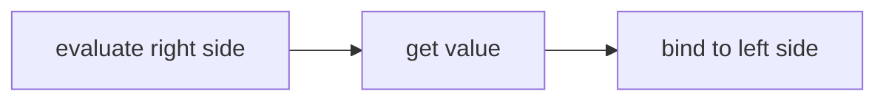
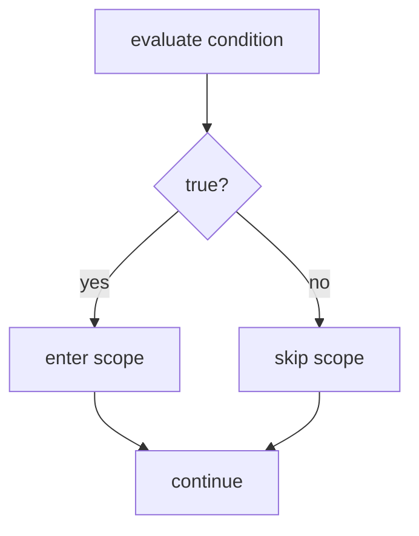
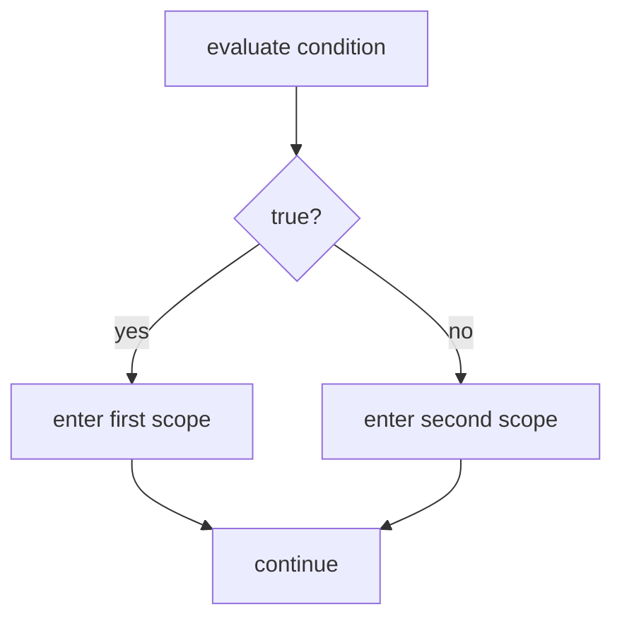
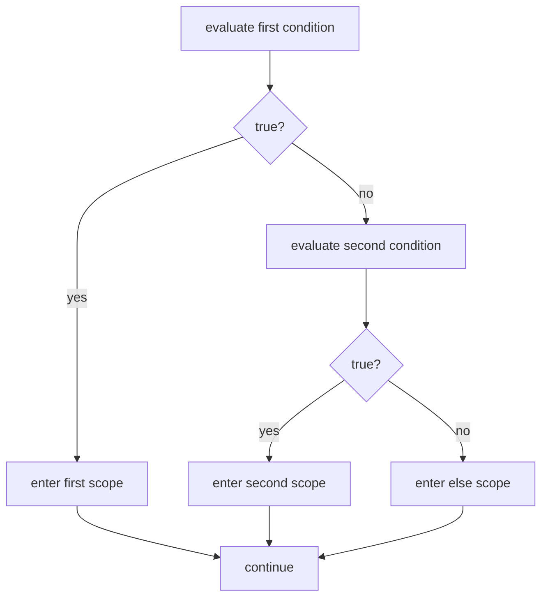
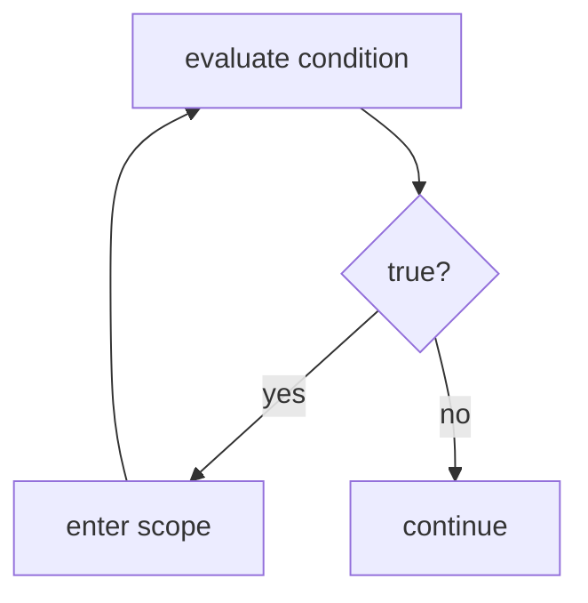

# Chapter 1: Booleans

This is your first chapter of real code. We start with the simplest type: the boolean.

Booleans represent true/false values, just two possible values and nothing else. This simplicity is deceptive. Many problems in computer science involve boolean logic at their core, and all data in computers is ultimately represented as sequences of binary values: zeros and ones. Booleans are both the simplest data type we will use and the foundation everything else is built on.

This chapter explores booleans through five sections:

- **Data and Memory:** What booleans are and how we store them
- **Computation:** How we transform boolean values
- **Control Flow:** How booleans determine which code runs
- **Functions:** How we create our own boolean computations
- **Structured Data:** How we group related booleans together

We begin with the fundamentals: what is a boolean, and how do we hold onto one?

---

## Data and Memory

Every chapter in this book starts here: with the data. Before we compute, we understand what we're working with. This section answers two questions: what is this type, and how do we store it?

### Types and Values

In Chapter 0, we described computations by the *kind* of data they use. We wrote things like `length: string → number` to say "length takes a string and produces a number." Now we make "kind" precise.

A **type** defines a group of data with a set of valid values.

A **value** is data that cannot be simplified further. Every value belongs to exactly one type.

These two concepts work together. Types describe categories. Values are the actual data that lives in those categories. The number 5 is a value. It belongs to the number type. The text "hello" is a value. It belongs to the string type.

Now let's meet our first type.

### Booleans

The simplest type is the boolean.

A **boolean** is a type with exactly two valid values: `true` and `false`.

No other values exist. There is no "maybe," no "unknown," only `true` and `false`.

Only two values might seem limiting, but this constraint is what makes booleans powerful. Because there are only two possibilities, we can reason about them completely. Later in this chapter, we'll build truth tables that list every possible input and output for boolean operations. No other type lets us enumerate all cases so easily.

When we wrote `is-negative: number → boolean` in Chapter 0, this is what boolean means. The function takes a number and produces one of two possible values: `true` or `false`.

Booleans answer yes/no questions. Is the user logged in? Is the file ready? Is the number positive? Each of these has a boolean answer.

### Variables and Binding

We have values. Now we need a way to store them so we can use them later.

A **variable** is a named location in memory that holds a value of a specific type.

When we store a value in a variable, we **bind** that value to that name.

Here is our first line of C# code:

```csharp
bool x = true;
```

This creates a boolean variable named x and binds the value true to it.

Let's break that translation down:
- "Create a boolean variable named x" — we're making a new storage location
- "and bind the value true to it" — we're storing true in that location

When we bind a value to a variable, that variable holds that value until we bind a different one, or until the variable leaves scope. (We'll define scope in the Control Flow section.)

---

**Try it yourself.**

Translate this code to English:

```csharp
bool flag = true;
```

Write your answer before revealing ours.

<details>
<summary>Reveal answer</summary>

"Create a boolean variable named flag and bind the value true to it."

</details>

If your answer differed, note what you missed before continuing.

---

### What Happens When Code Runs

Before we go deeper into variables, we need to understand how programs execute.

Programs run line by line, top to bottom. Each line completes before the next one starts. As lines execute, the program's **state** changes.

The program's **state** is the set of bindings at a given point of execution.

Consider this code:

```csharp
bool x = true;
bool y = false;
```

After line 1 runs, x is bound to true. That's the entire state: one variable, one binding.

After line 2 runs, x is still bound to true, and now y is bound to false. The state has grown: two variables, two bindings.

We can visualize state with a table:

| after line | x | y |
|------------|---|---|
| 1 | true | — |
| 2 | true | false |

Each row shows the state after that line executes. The dash means the variable doesn't exist yet.

State tables help us trace what a program does step by step. When your code doesn't behave as expected, and it won't always, tracing state is how you find the problem. You'll think "the variable should be true here" and the table will show you it's actually false. That's the bug. This skill, tracing state, will save you hours of confusion.

### The Mechanism: What `bool flag = true;` Actually Does

Let's look more carefully at what happens when we write `bool flag = true;`

Three discrete actions happen:

1. `bool` — reserve space in memory for a boolean value
2. `flag` — name that space "flag"
3. `= true;` — bind the value true to that name

This is what "create a variable and bind a value" means at a mechanical level. The computer finds room in memory, labels it with a name, and stores your value there.

---

**Try it yourself.**

Write C# code for this description:

"Create a boolean variable named example_var and bind the value false to it."

<details>
<summary>Reveal answer</summary>

```csharp
bool example_var = false;
```

</details>

If your answer differed, note what you missed before continuing.

---

### Rebinding Variables

Variables can be rebound to new values, which is why they're called *variables*.

```csharp
bool x = true;
x = false;
```

Line 1 creates x and binds true to it.

Line 2 rebinds x to false. The old value is gone.

Here's the state table:

| after line | x |
|------------|---|
| 1 | true |
| 2 | false |

The translation for `x = false;` is simply: "Bind the value false to x."

Notice there's no `bool` keyword in line 2. We don't write `bool x = false;` because x already exists. We're rebinding, not creating.

**Common mistake:** Writing `bool x = false;` when x already exists causes an error. The variable already has a name and a place in memory. You just want to change what's stored there, so you write `x = false;` without the type.

### Reading vs Writing

So far we've only bound values to variables. That's writing. What about reading?

Consider this code:

```csharp
bool copy_of_x = x;
```

The right side isn't a literal value like `true` or `false`. It's a variable name. What happens?

When we use a variable in an expression, we **evaluate** it. Evaluating means retrieving the value currently bound to that name.

So `bool copy_of_x = x;` does this:
1. Evaluate x (get the value bound to x)
2. Bind that value to copy_of_x

If x is bound to true, then evaluating x produces true. We then bind true to copy_of_x.

The translation: "Create a boolean variable named copy_of_x and bind the result of evaluating x to it."

This is more precise than saying "copy x into copy_of_x." We're not copying the variable. We're evaluating it to get a value, then binding that value to a new variable.

Let's trace this with a state table:

```csharp
bool x = true;
bool copy_of_x = x;
```

| after line | x | copy_of_x |
|------------|---|-----------|
| 1 | true | — |
| 2 | true | true |

Line 2 evaluates x (gets true), then binds true to copy_of_x. Both variables now hold true, but they're independent bindings.

---

**Try it yourself.**

Translate this code to English:

```csharp
bool done = finished;
```

<details>
<summary>Reveal answer</summary>

"Create a boolean variable named done and bind the result of evaluating finished to it."

</details>

If your answer differed, note what you missed before continuing.

---

### Two Operations, One Symbol

We've now seen two different operations on variables:

**Binding (writing):** Store a value in a variable.
- `x = true;` — bind true to x
- `x = false;` — bind false to x

**Evaluating (reading):** Retrieve the value currently bound.
- Using `x` on the right side of `=` evaluates it

The same variable name means different things depending on where it appears:

```csharp
x = y;
```

On the left of `=`, x is a target. We're binding to it.
On the right of `=`, y is evaluated. We're reading from it.

Let's break this down token by token:

1. `y` — evaluate y to get its current value
2. `x =` — bind that value to x

The order matters. We fully evaluate the right side first, then we store the result on the left:



This is a pattern you'll see everywhere in programming: the right side is evaluated completely before anything is stored on the left.

### Value Types

Now let's trace a longer example to see something important:

```csharp
bool x = true;
bool copy_of_x = x;
x = false;
```

State table:

| after line | x | copy_of_x |
|------------|---|-----------|
| 1 | true | — |
| 2 | true | true |
| 3 | false | true |

After line 2, both variables hold true.

After line 3, x holds false, but copy_of_x still holds true.

Why didn't copy_of_x change when we changed x?

Because when we wrote `bool copy_of_x = x;`, we evaluated x to get the value true, then bound that value to copy_of_x. The two variables are independent. Each has its own storage location. Changing one doesn't affect the other.

This behavior is called a **value type**. Booleans are value types. When you assign a value type variable to another variable, you copy the value itself. The two variables don't share anything after that.

Think of it like writing a number on two different pieces of paper. Erasing one paper and writing a new number doesn't change what's on the other paper. Each paper has its own independent copy.

### Observing Values

We can store booleans and track state on paper. But how do we see what's actually bound to a variable when the program runs?

We use Console.WriteLine.

```csharp
Console.WriteLine(x);
```

This displays the value bound to x in the console, the text output area where programs can print messages.

The translation: "Evaluate x and display the result to the console."

Notice the pattern: we evaluate first (get the value), then do something with it (display it).

Console.WriteLine has this type signature:

```
WriteLine: bool → void
```

What's `void`? It means "no value." WriteLine takes a boolean, displays it, and produces nothing in return. It performs an action but doesn't give back data we can bind to a variable.

We'll see void again when we write functions that do things without producing values.

---

**Try it yourself.**

Write code that creates a boolean variable named `active`, binds true to it, then displays its value to the console.

<details>
<summary>Reveal answer</summary>

```csharp
bool active = true;
Console.WriteLine(active);
```

Line 1: "Create a boolean variable named active and bind the value true to it."

Line 2: "Evaluate active and display the result to the console."

</details>

If your answer differed, note what you missed before continuing.

---

### Review

Before continuing, test yourself on what you've learned. Use the protocol from Chapter 0: attempt each exercise from memory, then search the chapter to check your answers, then note what you missed.

#### Part 1: Definitions

Write the definitions from memory, then find them in the chapter to check.

1. What is a **type**?
2. What is a **value**?
3. What is a **boolean**?
4. What is a **variable**?
5. What is **binding**?
6. What is **state**?

If any of your answers differed from the definitions in the chapter, note what you missed and write the corrected version.

#### Part 2: Translations

Translate each line of code to English, then check against the translation patterns shown earlier in this section.

1. `bool ready = false;`
2. `bool status = active;`
3. `done = true;`
4. `Console.WriteLine(finished);`

If any translations differed, note what you missed and write the corrected version.

#### Part 3: Writing Code

Write C# code for each description.

1. Create a boolean variable named `enabled` and bind the value true to it.
2. Bind the value false to an existing variable named `running`.
3. Create a boolean variable named `backup` and bind the result of evaluating `original` to it.

Check your code against the examples in this section. If any differed, note what you missed and write the corrected version.

#### Part 4: State Tables

Complete the state table for this code:

```csharp
bool a = true;
bool b = false;
bool c = a;
a = false;
b = c;
```

| after line | a | b | c |
|------------|---|---|---|
| 1 | | | |
| 2 | | | |
| 3 | | | |
| 4 | | | |
| 5 | | | |

Trace through each line using the rules you learned: creating binds a value, using a variable on the right side evaluates it, and reassignment rebinds without affecting other variables (value types are independent). If your table doesn't match what you expect when you trace through carefully, identify where your reasoning went wrong.

---

You now know how to define booleans, create variables, bind and evaluate values, and track program state. In the next section, we'll learn how to transform these values through computation.

## Computation

We can store booleans and track state. Now we want to transform state. What tools do we have to compute new values?

Every type has tools for computation. For numbers, we have arithmetic. For booleans, we have logical operators. This section covers the tools that come built-in for working with boolean values.

### Computation Transforms State

In the previous section, we bound values directly:

```csharp
bool x = true;
```

The value true came from us, typed literally into the code. But what if we want to compute a new value from existing bindings?

```csharp
bool a = true;
bool b = !a;
```

Line 1: bind true to a.

Line 2: evaluate a (get true), compute its negation (get false), bind false to b.

State table:

| after line | a | b |
|------------|---|---|
| 1 | true | — |
| 2 | true | false |

The `!` symbol is an operator that took a value and transformed it, and this transformation is computation.

Here's the key insight: computation reads state (evaluates bindings), transforms values, and the result can be bound to update state. The pattern is always the same: evaluate, transform, bind.

### Expressions

Before we explore operators, we need one more definition.

An **expression** is code that evaluates to a value.

We've already seen expressions without naming them. When we wrote `bool copy_of_x = x;`, the `x` on the right side is an expression. It evaluates to whatever value x holds. A variable by itself is an expression of its type, so if `x` is a boolean variable, then `x` is a boolean expression.

A literal value like `true` is also an expression. It evaluates to itself.

And when we write `!a`, that's an expression too. It evaluates a, applies the NOT operator, and produces a new value.

Expressions can be simple (a single variable or value) or compound (operators combining multiple parts), but they all share one thing: they evaluate to a value.

The right side of `=` is always an expression. We evaluate it completely, then bind the result.

### Logical NOT

Let's examine our first operator.

**NOT** (`!`) is a unary boolean operator with type signature `bool → bool`. It returns false when given true, and true when given false.

NOT takes a boolean and produces a boolean. It transforms true to false, and false to true. We call it negation.

Unary means "one," so NOT takes one input.

We can describe NOT's behavior completely with a truth table:

| x | !x |
|---|-----|
| true | false |
| false | true |

Two rows cover every possible input, and each produces a distinct output. This is the power of booleans: we can enumerate everything.

The translation: `!x` reads as "not x."

Let's see NOT in context:

```csharp
bool flag = true;
bool opposite = !flag;
```

Translation for line 2: "Create a boolean variable named opposite and bind the result of evaluating not flag to it."

State table:

| after line | flag | opposite |
|------------|------|----------|
| 1 | true | — |
| 2 | true | false |

Line 2 does three things:
1. Evaluate flag → true
2. Apply NOT to true → false
3. Bind false to opposite

---

**Try it yourself.**

Translate this code to English:

```csharp
bool result = !flag;
```

Write your answer before revealing ours.

<details>
<summary>Reveal answer</summary>

"Create a boolean variable named result and bind the result of evaluating not flag to it."

</details>

If your answer differed, note what you missed before continuing.

---

**Try it yourself.**

Write C# code for this description:

"Create a boolean variable named flipped and bind the negation of done to it."

<details>
<summary>Reveal answer</summary>

```csharp
bool flipped = !done;
```

</details>

If your answer differed, note what you missed before continuing.

---

### Logical AND

What if we want to check whether two things are both true?

**AND** (`&&`) is a binary boolean operator with type signature `(bool, bool) → bool`. It returns true only when both inputs are true. Otherwise, it returns false.

Binary means "two," so AND takes two inputs.

Truth table:

| a | b | a && b |
|---|---|--------|
| false | false | false |
| false | true | false |
| true | false | false |
| true | true | true |

Four combinations produce four outputs, and only the last row produces true.

The translation: `a && b` reads as "a and b."

Let's trace AND in action:

```csharp
bool left = true;
bool right = false;
bool both = left && right;
```

Translation for line 3: "Create a boolean variable named both and bind the result of evaluating left and right to it."

State table:

| after line | left | right | both |
|------------|------|-------|------|
| 1 | true | — | — |
| 2 | true | false | — |
| 3 | true | false | false |

Line 3 does four things:
1. Evaluate left → true
2. Evaluate right → false
3. Apply AND to true and false → false
4. Bind false to both

---

**Try it yourself.**

Translate this code to English:

```csharp
bool ready = loaded && valid;
```

<details>
<summary>Reveal answer</summary>

"Create a boolean variable named ready and bind the result of evaluating loaded and valid to it."

</details>

If your answer differed, note what you missed before continuing.

---

**Try it yourself.**

Write C# code for this description:

"Create a boolean variable named confirmed and bind the result of active and enabled to it."

<details>
<summary>Reveal answer</summary>

```csharp
bool confirmed = active && enabled;
```

</details>

If your answer differed, note what you missed before continuing.

---

### Logical OR

What if we want to check whether at least one of two things is true?

**OR** (`||`) is a binary boolean operator with type signature `(bool, bool) → bool`. It returns true when either input is true, or when both are true. It returns false only when both inputs are false.

Truth table:

| a | b | a \|\| b |
|---|---|----------|
| false | false | false |
| false | true | true |
| true | false | true |
| true | true | true |

Only the first row produces false. Any true input makes the whole expression true.

The translation: `a || b` reads as "a or b."

Let's trace OR:

```csharp
bool first = false;
bool second = true;
bool either = first || second;
```

State table:

| after line | first | second | either |
|------------|-------|--------|--------|
| 1 | false | — | — |
| 2 | false | true | — |
| 3 | false | true | true |

Line 3 does four things:
1. Evaluate first → false
2. Evaluate second → true
3. Apply OR to false and true → true
4. Bind true to either

---

**Try it yourself.**

Translate this code to English:

```csharp
bool allowed = admin || owner;
```

<details>
<summary>Reveal answer</summary>

"Create a boolean variable named allowed and bind the result of evaluating admin or owner to it."

</details>

If your answer differed, note what you missed before continuing.

---

**Try it yourself.**

Write C# code for this description:

"Create a boolean variable named canProceed and bind the result of ready or override to it."

<details>
<summary>Reveal answer</summary>

```csharp
bool canProceed = ready || override;
```

</details>

If your answer differed, note what you missed before continuing.

---

### Equality Operators

Sometimes we need to check whether two values are the same.

**Equals** (`==`) is a binary operator with type signature `(bool, bool) → bool`. It returns true when both inputs have the same value. Otherwise, it returns false.

**Not Equals** (`!=`) is a binary operator with type signature `(bool, bool) → bool`. It returns true when the inputs have different values. Otherwise, it returns false.

Truth table for `==`:

| a | b | a == b |
|---|---|--------|
| false | false | true |
| false | true | false |
| true | false | false |
| true | true | true |

Equal values produce true. Different values produce false.

Truth table for `!=`:

| a | b | a != b |
|---|---|--------|
| false | false | false |
| false | true | true |
| true | false | true |
| true | true | false |

This is the exact opposite of `==`. Different values produce true.

The translation: `a == b` reads as "a equals b." `a != b` reads as "a does not equal b."

Note: equality operators work for other types too, not just booleans. We'll revisit them in each chapter as we introduce new types.

---

**Try it yourself.**

Translate this code to English:

```csharp
bool same = x == y;
```

<details>
<summary>Reveal answer</summary>

"Create a boolean variable named same and bind the result of evaluating x equals y to it."

</details>

If your answer differed, note what you missed before continuing.

---

**Try it yourself.**

Write C# code for this description:

"Create a boolean variable named different and bind the result of comparing whether expected does not equal actual to it."

<details>
<summary>Reveal answer</summary>

```csharp
bool different = expected != actual;
```

</details>

If your answer differed, note what you missed before continuing.

---

### Compound Expressions

We can chain operators to build larger expressions.

Consider:

```csharp
bool result = true && false || true;
```

This expression has two operators. Which one applies first?

Like arithmetic has order of operations (multiplication before addition), boolean operators have precedence:

1. NOT (`!`) — highest priority, applies first
2. AND (`&&`) — middle priority
3. OR (`||`) — lowest priority, applies last

So `true && false || true` means:
1. First, apply AND: `true && false` → `false`
2. Then, apply OR: `false || true` → `true`

The result is `true`.

Let's trace a more complex expression:

```
!true || false && true
```

Step by step:
1. Apply NOT first: `!true` → `false`
2. Now we have: `false || false && true`
3. Apply AND next: `false && true` → `false`
4. Now we have: `false || false`
5. Apply OR last: `false || false` → `false`

The entire expression evaluates to `false`.

Parentheses override precedence. Whatever is inside parentheses evaluates first:

```
!(true || false) && true
```

Step by step:
1. Evaluate inside parentheses: `true || false` → `true`
2. Apply NOT: `!true` → `false`
3. Apply AND: `false && true` → `false`

Without parentheses, `!true || false && true` would evaluate differently (as we showed above). Parentheses let you control the order explicitly.

When in doubt, use parentheses. They make your intent clear to both the computer and anyone reading your code.

---

**Try it yourself.**

Evaluate this expression step by step:

```
true || false && false
```

<details>
<summary>Reveal answer</summary>

1. AND has higher precedence than OR, so: `false && false` → `false`
2. Now we have: `true || false`
3. Apply OR: `true || false` → `true`

Result: `true`

</details>

If your answer differed, note what you missed before continuing.

---

**Try it yourself.**

Evaluate this expression step by step:

```
!false && !true || false
```

<details>
<summary>Reveal answer</summary>

1. Apply NOT operators first: `!false` → `true`, `!true` → `false`
2. Now we have: `true && false || false`
3. Apply AND: `true && false` → `false`
4. Now we have: `false || false`
5. Apply OR: `false || false` → `false`

Result: `false`

</details>

If your answer differed, note what you missed before continuing.

---

### Short-Circuit Evaluation

What if evaluating part of an expression is expensive, or what if it could cause an error? C# has a feature that helps: it doesn't always evaluate both sides of AND and OR.

Consider:

```csharp
bool result = false && something;
```

AND returns true only when both sides are true. If the left side is false, the result is false no matter what the right side is. So C# doesn't bother evaluating the right side. It already knows the answer.

This is called short-circuit evaluation.

The rules:

- `false && anything` → `false` (right side never evaluated)
- `true || anything` → `true` (right side never evaluated)

For AND: if the left side is false, stop. The answer is false.

For OR: if the left side is true, stop. The answer is true.

Why does this matter? Later, when we learn about functions that have side effects, short-circuit evaluation becomes important for correctness, not just efficiency. We'll revisit this.

---

**Try it yourself.**

In the following expression, which parts actually get evaluated?

```csharp
bool result = true || (false && true);
```

<details>
<summary>Reveal answer</summary>

Only `true` on the left side of `||` gets evaluated.

Because the left side of OR is true, the entire OR expression is true. C# never evaluates `(false && true)`.

</details>

If your answer differed, note what you missed before continuing.

---

### Review

Before continuing, test yourself on what you've learned. Attempt each exercise from memory, then search the chapter to check your answers.

#### Part 1: Definitions

Write the definitions from memory, then find them in the section to check.

1. What is an **expression**?
2. What is **NOT** (`!`)? Include its type signature.
3. What is **AND** (`&&`)? Include its type signature.
4. What is **OR** (`||`)? Include its type signature.
5. What is **Equals** (`==`)? Include its type signature.

If any of your answers differed from the definitions in this section, note what you missed and write the corrected version.

#### Part 2: Truth Tables

Complete these truth tables from memory:

**NOT:**

| x | !x |
|---|-----|
| true | |
| false | |

**AND:**

| a | b | a && b |
|---|---|--------|
| false | false | |
| false | true | |
| true | false | |
| true | true | |

**OR:**

| a | b | a \|\| b |
|---|---|----------|
| false | false | |
| false | true | |
| true | false | |
| true | true | |

Check your tables against the ones in this section.

#### Part 3: Translations

Translate each line of code to English.

1. `bool inverted = !original;`
2. `bool both = first && second;`
3. `bool any = x || y || z;`
4. `bool match = input == expected;`

Check your translations against the patterns in this section.

#### Part 4: Evaluate Expressions

Evaluate each expression step by step. Show your work.

1. `!false || true`
2. `true && false || true && true`
3. `!(true && false) || false`
4. `false || !false && true`

Work through each one, then trace through using the precedence rules to verify.

#### Part 5: Short-Circuit

For each expression, identify which parts get evaluated.

1. `false && (true || false)`
2. `true || (false && true)`
3. `true && false || true`

Think carefully about when evaluation stops.

---

You now know how to transform boolean values through computation. You can negate, combine, compare, and build compound expressions. In the next section, we'll see how these boolean expressions control which code runs.

## Control Flow

We can store booleans and compute new ones. Every line of code we've written runs every time, top to bottom, no exceptions. But real programs need to make decisions. Should we show an error message? Only if something went wrong. Should we grant access? Only if the user is authorized.

What we need is a way for the program's state to determine which code runs. This is control flow: the path execution takes through our code. Until now, that path was a straight line. Now it branches. We'll visualize these branches with flowcharts throughout this section.

The pattern you'll see in this section repeats throughout programming: a boolean expression controls what happens next. Master it here with booleans, and you'll start to recognize it everywhere.

### Branching with if

Here's the simplest form of control flow:

```csharp
bool ready = true;

if (ready)
{
    Console.WriteLine("Go!");
}

Console.WriteLine("Done");
```

When this program runs, it displays:

```
Go!
Done
```

But if we change the first line to `bool ready = false;`, the output becomes just:

```
Done
```

The `if` statement checks a condition. If the condition evaluates to true, execution enters the code block inside the curly braces. If the condition evaluates to false, execution skips that block entirely.

The translation: "If ready evaluates to true, enter the scope."

Notice what's inside the parentheses: `ready`. This is a boolean expression. We evaluate it to get a value, either true or false. That value determines whether we enter the scope.

Any boolean expression works as a condition. We could write:

```csharp
if (active && enabled)
{
    Console.WriteLine("System running");
}
```

The translation: "If active and enabled evaluates to true, enter the scope."

The compound expression `active && enabled` evaluates to a single boolean value. That value controls the branch.

---

**Try it yourself.**

Translate this code to English:

```csharp
if (finished)
{
    Console.WriteLine("Complete!");
}
```

Write your answer before revealing ours.

<details>
<summary>Reveal answer</summary>

"If finished evaluates to true, enter the scope."

The scope contains: "Display the string 'Complete!' to the console."

</details>

If your answer differed, note what you missed before continuing.

---

### Scope

Look at this code:

```csharp
if (true)
{
    bool inside = true;
}

Console.WriteLine(inside);
```

This code fails. The compiler reports an error: `inside` does not exist.

But we just created it. What happened?

The curly braces create a boundary. Variables declared inside that boundary exist only within it. When execution leaves the closing `}`, those variables are gone. The binding disappears.

This region, bounded by `{` and `}`, is called a scope.

A **scope** is a region of code bounded by `{` and `}`. Variables declared inside a scope exist only within that scope.

Here's how to visualize it:

```
┌─────────────────────────────────────────┐
│ Outer scope                             │
│                                         │
│   if (true)                             │
│   ┌─────────────────────────────────┐   │
│   │ Inner scope                     │   │
│   │                                 │   │
│   │   bool inside = true;           │   │
│   │   ← inside exists here          │   │
│   │                                 │   │
│   └─────────────────────────────────┘   │
│                                         │
│   ← inside does NOT exist here          │
│                                         │
│   Console.WriteLine(inside); // Error!  │
│                                         │
└─────────────────────────────────────────┘
```

The variable `inside` is born when we enter the inner scope and dies when we leave it. Outside that scope, it doesn't exist.

How do we fix this? Declare the variable in the outer scope:

```csharp
bool inside = false;

if (true)
{
    inside = true;
}

Console.WriteLine(inside);
```

Now `inside` is declared in the outer scope. It exists before the if statement and continues to exist after. The code inside the if scope can see variables from the outer scope, so `inside = true;` works. It rebinds a variable that already exists.

This version displays `true`.

The rule: variables are visible in the scope where they're declared and in any scopes nested inside. They're not visible outside.

---

**Try it yourself.**

What does this code display?

```csharp
bool x = false;

if (true)
{
    x = true;
    bool y = true;
}

Console.WriteLine(x);
```

<details>
<summary>Reveal answer</summary>

It displays `true`.

The variable `x` is declared in the outer scope, so it's visible inside the if scope. The line `x = true;` rebinds it. After the if scope ends, `x` still exists and still holds true.

The variable `y` is declared inside the if scope. It exists only there. After the closing `}`, y is gone. We don't try to use y outside its scope, so no error occurs.

</details>

If your answer differed, note what you missed before continuing.

---

**Try it yourself.**

This code has an error. Find it and fix it.

```csharp
if (true)
{
    bool result = true;
}

if (result)
{
    Console.WriteLine("Success");
}
```

<details>
<summary>Reveal answer</summary>

The error: `result` is declared inside the first if scope, so it doesn't exist outside. The second if statement tries to use `result`, but it's gone.

The fix: declare `result` before the first if.

```csharp
bool result = false;

if (true)
{
    result = true;
}

if (result)
{
    Console.WriteLine("Success");
}
```

Now `result` is declared in the outer scope. Both if statements can see it.

</details>

If your answer differed, note what you missed before continuing.

---

### How if Executes

Now that you understand scope, let's look more carefully at how an if statement executes.

```csharp
bool ready = true;

if (ready)
{
    Console.WriteLine("Go!");
}

Console.WriteLine("Done");
```

Let's break down `if (ready) { ... }` token by token:

1. `if (ready)` — evaluate ready; if true, continue to the scope; if false, skip the scope
2. `{ ... }` — the scope to enter when the condition is true

Here's what happens with `ready = true`:

| step | action |
|------|--------|
| Line 1 | Bind true to ready |
| Line 3 | Evaluate ready → true |
| Line 3 | True: enter the scope |
| Line 5 | Display "Go!" |
| Line 8 | Display "Done" |

And with `ready = false`:

| step | action |
|------|--------|
| Line 1 | Bind false to ready |
| Line 3 | Evaluate ready → false |
| Line 3 | False: skip the scope |
| Line 8 | Display "Done" |

Here's the key insight: the condition is evaluated, not stored. We read the current state, make a decision, and move on. The if statement doesn't change state. It reads state to decide where to go.

Here's a flowchart showing the two possible paths:



Execution flows down. At the diamond, we check the condition. If true, we take the left path through the scope. If false, we take the right path around it. Both paths rejoin and continue.

---

**Try it yourself.**

Write C# code for this description:

"Create a boolean variable named active and bind true to it. If active evaluates to true, enter a scope that displays the string 'Running' to the console."

<details>
<summary>Reveal answer</summary>

```csharp
bool active = true;

if (active)
{
    Console.WriteLine("Running");
}
```

</details>

If your answer differed, note what you missed before continuing.

---

### if-else

What if we want to do one thing when true, and a different thing when false?

```csharp
bool loggedIn = false;

if (loggedIn)
{
    Console.WriteLine("Welcome back!");
}
else
{
    Console.WriteLine("Please log in.");
}
```

This displays: `Please log in.`

If we change `loggedIn` to true, it displays: `Welcome back!`

The `else` provides an alternative path. When the condition evaluates to false, instead of skipping to the code after the if, we enter the else scope.

The translation: "If loggedIn evaluates to true, enter the first scope. Otherwise, enter the second scope."

The word "otherwise" captures what else means: we take one path or the other, never both and never neither. Exactly one scope executes.

---

**Try it yourself.**

Translate this code to English:

```csharp
if (valid)
{
    Console.WriteLine("Accepted");
}
else
{
    Console.WriteLine("Rejected");
}
```

<details>
<summary>Reveal answer</summary>

"If valid evaluates to true, enter the first scope. Otherwise, enter the second scope."

First scope: "Display the string 'Accepted' to the console."

Second scope: "Display the string 'Rejected' to the console."

</details>

If your answer differed, note what you missed before continuing.

---

### How if-else Executes

Let's look more carefully at what happens when an if-else runs.

Let's break down `if (condition) { ... } else { ... }` token by token:

1. `if (condition)` — evaluate the condition; if true, enter the first scope; if false, skip to else
2. `{ ... }` — the first scope to enter when the condition is true
3. `else { ... }` — the second scope to enter when the condition is false

This is mutual exclusion. You enter one scope or the other, and the condition determines which.

Here's what happens with `loggedIn = false`:

| step | action |
|------|--------|
| Line 1 | Bind false to loggedIn |
| Line 3 | Evaluate loggedIn → false |
| Line 3 | False: skip first scope, go to else |
| Line 8 | Enter else scope |
| Line 9 | Display "Please log in." |

And with `loggedIn = true`:

| step | action |
|------|--------|
| Line 1 | Bind true to loggedIn |
| Line 3 | Evaluate loggedIn → true |
| Line 3 | True: enter first scope |
| Line 5 | Display "Welcome back!" |
| Line 8 | Skip else scope |



Two paths diverge based on a single condition, and you take exactly one. Both paths rejoin after their scope completes.

---

**Try it yourself.**

Write C# code for this description:

"If enabled evaluates to true, enter a scope that displays 'ON' to the console. Otherwise, enter a scope that displays 'OFF' to the console."

<details>
<summary>Reveal answer</summary>

```csharp
if (enabled)
{
    Console.WriteLine("ON");
}
else
{
    Console.WriteLine("OFF");
}
```

</details>

If your answer differed, note what you missed before continuing.

---

### if-else if-else

Sometimes there are more than two possibilities. We can chain conditions:

```csharp
bool isAdmin = false;
bool isMember = true;

if (isAdmin)
{
    Console.WriteLine("Full access");
}
else if (isMember)
{
    Console.WriteLine("Member access");
}
else
{
    Console.WriteLine("Guest access");
}
```

This displays: `Member access`

The conditions are checked in order. The first one that evaluates to true wins. Its scope executes, and we skip all remaining branches.

The translation: "If isAdmin evaluates to true, enter the first scope. Otherwise, if isMember evaluates to true, enter the second scope. Otherwise, enter the third scope."

---

**Try it yourself.**

Translate this code to English:

```csharp
if (priority)
{
    Console.WriteLine("Urgent");
}
else if (normal)
{
    Console.WriteLine("Standard");
}
else
{
    Console.WriteLine("Low");
}
```

<details>
<summary>Reveal answer</summary>

"If priority evaluates to true, enter the first scope. Otherwise, if normal evaluates to true, enter the second scope. Otherwise, enter the third scope."

First scope: "Display the string 'Urgent' to the console."

Second scope: "Display the string 'Standard' to the console."

Third scope: "Display the string 'Low' to the console."

</details>

If your answer differed, note what you missed before continuing.

---

### How if-else if-else Executes

Let's trace through different initial states to see how this chain works.

| isAdmin | isMember | Which scope? | Output |
|---------|----------|--------------|--------|
| true | true | First | "Full access" |
| true | false | First | "Full access" |
| false | true | Second | "Member access" |
| false | false | Third | "Guest access" |

Notice the first row: both conditions are true, but we only see "Full access." Once we find a true condition, we enter that scope and skip the rest. The second condition is never even checked.

The final `else` is a catch-all. If no condition is true, we enter the else scope. Without it, we might skip all branches entirely.



This is still mutual exclusion. Exactly one scope executes.

---

**Try it yourself.**

What does this code display?

```csharp
bool a = false;
bool b = false;
bool c = true;

if (a)
{
    Console.WriteLine("A");
}
else if (b)
{
    Console.WriteLine("B");
}
else if (c)
{
    Console.WriteLine("C");
}
else
{
    Console.WriteLine("None");
}
```

<details>
<summary>Reveal answer</summary>

It displays `C`.

We check a: false. Skip to else if.
We check b: false. Skip to else if.
We check c: true. Enter that scope. Display "C".
Skip the final else.

</details>

If your answer differed, note what you missed before continuing.

---

**Try it yourself.**

Write C# code for this description:

"If high evaluates to true, enter a scope that displays 'High' to the console. Otherwise, if medium evaluates to true, enter a scope that displays 'Medium' to the console. Otherwise, enter a scope that displays 'Low' to the console."

<details>
<summary>Reveal answer</summary>

```csharp
if (high)
{
    Console.WriteLine("High");
}
else if (medium)
{
    Console.WriteLine("Medium");
}
else
{
    Console.WriteLine("Low");
}
```

</details>

If your answer differed, note what you missed before continuing.

---

### Nested Conditionals

An if statement can contain another if statement. This is nesting.

```csharp
bool hasPermission = true;
bool hasQuota = false;

if (hasPermission)
{
    if (hasQuota)
    {
        Console.WriteLine("Access granted");
    }
    else
    {
        Console.WriteLine("Over quota");
    }
}
else
{
    Console.WriteLine("Access denied");
}
```

This displays: `Over quota`

Let's trace through to see why:

| step | action |
|------|--------|
| Line 1 | Bind true to hasPermission |
| Line 2 | Bind false to hasQuota |
| Line 4 | Evaluate hasPermission → true, enter outer scope |
| Line 6 | Evaluate hasQuota → false, skip to inner else |
| Line 11 | Enter inner else scope |
| Line 12 | Display "Over quota" |

Each if creates its own scope, and scopes can be nested inside other scopes. The inner if only runs if we entered the outer if first. This lets us check conditions in sequence: first hasPermission, then (only if that passed) hasQuota.

---

**Try it yourself.**

Translate this code to English:

```csharp
if (loggedIn)
{
    if (isAdmin)
    {
        Console.WriteLine("Admin panel");
    }
}
```

<details>
<summary>Reveal answer</summary>

"If loggedIn evaluates to true, enter the scope."

Inside that scope: "If isAdmin evaluates to true, enter the scope."

That inner scope: "Display the string 'Admin panel' to the console."

</details>

If your answer differed, note what you missed before continuing.

---

### Nesting vs Compound Conditions

When should you nest versus use compound conditions? Compare:

```csharp
// Nested version
if (hasKey)
{
    if (doorUnlocked)
    {
        Console.WriteLine("Enter");
    }
}

// Compound version
if (hasKey && doorUnlocked)
{
    Console.WriteLine("Enter");
}
```

For simple cases like this, the compound version is cleaner. Both require hasKey and doorUnlocked to be true.

But nesting gives you more control. The nested version lets you put different else branches at different levels:

```csharp
if (hasKey)
{
    if (doorUnlocked)
    {
        Console.WriteLine("Enter");
    }
    else
    {
        Console.WriteLine("Door is locked");
    }
}
else
{
    Console.WriteLine("You need a key");
}
```

The compound version can't express this structure. You'd need separate if statements.

Rule of thumb: use compound conditions when you just need everything to be true. Use nesting when different false cases need different responses.

---

**Try it yourself.**

Rewrite this nested conditional as a single if statement with a compound condition:

```csharp
if (loggedIn)
{
    if (verified)
    {
        Console.WriteLine("Welcome");
    }
}
```

<details>
<summary>Reveal answer</summary>

```csharp
if (loggedIn && verified)
{
    Console.WriteLine("Welcome");
}
```

Both versions display "Welcome" only when loggedIn and verified are both true. The compound version is simpler when you don't need separate else branches.

</details>

If your answer differed, note what you missed before continuing.

---

### User Input

Every program we've written has the same behavior every time it runs. The values are fixed in the code. What if we want the program to respond to what a user types?

In the Data and Memory section, we used `Console.WriteLine` to display boolean values. It works with strings too.

A quick note on strings: a **string** is text enclosed in double quotes. Strings get their own chapter later. For now, we need just two facts: strings are text in double quotes, and `==` checks if two strings match.

```csharp
Console.WriteLine("Hello!");
```

The translation: "Display the string 'Hello!' to the console."

Type signature: `WriteLine: string → void`

Same pattern we saw before. It takes a value, displays it, produces nothing in return.

Now for input:

```csharp
string answer = Console.ReadLine();
```

The translation: "Call ReadLine and bind the result to a string variable named answer."

Type signature: `ReadLine: () → string`

The `()` means ReadLine takes no input. It waits for the user to type something and press Enter. Then it produces that text as a string value. We bind that value to a variable.

---

**Try it yourself.**

Translate this code to English:

```csharp
Console.WriteLine("Enter your name:");
string name = Console.ReadLine();
```

<details>
<summary>Reveal answer</summary>

Line 1: "Display the string 'Enter your name:' to the console."

Line 2: "Call ReadLine and bind the result to a string variable named name."

</details>

If your answer differed, note what you missed before continuing.

---

### Branching on Input

Now we can branch based on what the user typed:

```csharp
Console.WriteLine("Continue? (yes/no)");
string answer = Console.ReadLine();

if (answer == "yes")
{
    Console.WriteLine("Continuing...");
}
else
{
    Console.WriteLine("Stopping.");
}
```

The expression `answer == "yes"` compares two strings. It evaluates to true if they match, false otherwise. This is a boolean expression, so we can use it as a condition.

The translation for `answer == "yes"`: "answer equals the string 'yes'"

This program's behavior depends on what the user types. If you type "yes" and press Enter, you'll see "Continuing..." If you type anything else, you'll see "Stopping."

---

**Try it yourself.**

Write a program that:
1. Displays "Enter password:" to the console
2. Reads input and binds it to a string variable named password
3. If password equals the string "secret", displays "Access granted"
4. Otherwise, displays "Access denied"

<details>
<summary>Reveal answer</summary>

```csharp
Console.WriteLine("Enter password:");
string password = Console.ReadLine();

if (password == "secret")
{
    Console.WriteLine("Access granted");
}
else
{
    Console.WriteLine("Access denied");
}
```

</details>

If your answer differed, note what you missed before continuing.

---

### Loops with while

What if the user types the wrong password? We could tell them to try again. But our program ends after one check.

We could add more if statements:

```csharp
Console.WriteLine("Enter password:");
string password = Console.ReadLine();

if (password != "secret")
{
    Console.WriteLine("Wrong password. Try again:");
    password = Console.ReadLine();
}

if (password != "secret")
{
    Console.WriteLine("Wrong password. Try again:");
    password = Console.ReadLine();
}

// How many times do we copy this?
```

This is tedious and limited. What if they get it wrong three times? Ten times? We'd need endless copies of the same code.

What we want is a way to say: keep asking until they get it right.

```csharp
Console.WriteLine("Enter password:");
string password = Console.ReadLine();

while (password != "secret")
{
    Console.WriteLine("Wrong password. Try again:");
    password = Console.ReadLine();
}

Console.WriteLine("Access granted");
```

The `while` statement has the same structure as if: a condition in parentheses and a scope in curly braces. The difference is in behavior. Instead of entering the scope once (or not at all), while enters repeatedly, as long as the condition remains true.

The translation: "While password != 'secret' evaluates to true, enter the scope."

---

**Try it yourself.**

Translate this code to English:

```csharp
while (waiting)
{
    Console.WriteLine("Still waiting...");
}
```

<details>
<summary>Reveal answer</summary>

"While waiting evaluates to true, enter the scope."

The scope contains: "Display the string 'Still waiting...' to the console."

</details>

If your answer differed, note what you missed before continuing.

---

### How while Executes

Let's look more carefully at what happens when a while loop runs.

Let's break down `while (condition) { ... }` token by token:

1. `while (condition)` — evaluate the condition; if true, enter the scope; if false, skip to after the loop
2. `{ ... }` — the scope to enter when the condition is true; after executing, check the condition again

The key difference from if is that after executing the scope, we check the condition again, repeating until it evaluates to false.

Let's trace through with specific input. The user types "wrong", then "also wrong", then "secret":

| step | password | condition | action |
|------|----------|-----------|--------|
| Line 1 | — | — | Display prompt |
| Line 2 | "wrong" | — | Read input, bind to password |
| Line 4 | "wrong" | "wrong" != "secret" → true | Enter scope |
| Line 6 | "wrong" | — | Display "Wrong password..." |
| Line 7 | "also wrong" | — | Read input, rebind password |
| Line 4 | "also wrong" | "also wrong" != "secret" → true | Enter scope |
| Line 6 | "also wrong" | — | Display "Wrong password..." |
| Line 7 | "secret" | — | Read input, rebind password |
| Line 4 | "secret" | "secret" != "secret" → false | Skip scope, exit loop |
| Line 10 | "secret" | — | Display "Access granted" |

The loop ran twice. Each time, we checked the condition, found it true, entered the scope, and came back to check again. On the third check, the condition was false, so we exited.



The arrow looping back is the key difference from if. We keep circling until the condition is false.

This structure, where we repeatedly enter a scope while a condition holds, is called a loop.

A **loop** is a control structure that repeatedly enters a scope while a condition evaluates to true.

---

**Try it yourself.**

Write C# code for this description:

"Create a string variable named command and bind an empty string to it. While command does not equal the string 'exit', enter a scope that displays 'Enter command:' to the console, then calls ReadLine and binds the result to command."

<details>
<summary>Reveal answer</summary>

```csharp
string command = "";

while (command != "exit")
{
    Console.WriteLine("Enter command:");
    command = Console.ReadLine();
}
```

</details>

If your answer differed, note what you missed before continuing.

---

### Infinite Loops

Look at the code from the earlier exercise:

```csharp
while (waiting)
{
    Console.WriteLine("Still waiting...");
}
```

What's wrong with it?

The variable `waiting` is never changed inside the loop. If it starts as true, it stays true. The condition never becomes false. The loop runs forever.

This is called an infinite loop. The program never stops.

Here's the key insight: something inside the loop must eventually change state to make the condition false. Otherwise, the loop never ends.

In our password example, the loop body reads new input and rebinds password. Eventually the user types "secret", the condition becomes false, and the loop exits.

Compare these two loops:

```csharp
// This loop terminates
string input = "";
while (input != "quit")
{
    Console.WriteLine("Enter command:");
    input = Console.ReadLine();  // State changes here
}

// This loop runs forever
string input = "";
while (input != "quit")
{
    Console.WriteLine("Enter command:");
    // Forgot to read new input! State never changes.
}
```

The second loop displays "Enter command:" endlessly. The variable input stays empty forever because we never rebind it.

When your program seems frozen, check your loops. Is there a case where the condition never becomes false?

---

**Try it yourself.**

This code has an infinite loop. Find and fix it.

```csharp
bool running = true;

while (running)
{
    Console.WriteLine("Working...");
}

Console.WriteLine("Done");
```

<details>
<summary>Reveal answer</summary>

The variable `running` is never changed inside the loop. It stays true forever.

One fix: add a way to stop. For example, check user input:

```csharp
bool running = true;

while (running)
{
    Console.WriteLine("Working... Type 'stop' to end:");
    string input = Console.ReadLine();
    
    if (input == "stop")
    {
        running = false;
    }
}

Console.WriteLine("Done");
```

Now the user can type "stop" to make running false, which ends the loop.

</details>

If your answer differed, note what you missed before continuing.

---

### Review

Before continuing to Functions, test yourself on what you've learned. Use the protocol from Chapter 0: attempt each exercise from memory, then search this section to check your answers, then note what you missed.

#### Part 1: Definitions

Write the definitions from memory, then find them in this section to check.

1. What is a **scope**?
2. What is a **loop**?
3. What is a **string**?

If any of your answers differed from the definitions in this section, note what you missed and write the corrected version.

#### Part 2: Translations

Translate each piece of code to English.

1. `if (ready) { Console.WriteLine("Go"); }`

2. `if (valid) { x = true; } else { x = false; }`

3. `while (active) { Console.WriteLine("Running"); }`

4. `string name = Console.ReadLine();`

5. `if (input == "yes") { confirmed = true; }`

Check your translations against the patterns shown in this section.

#### Part 3: Writing Code

Write C# code for each description.

1. If done evaluates to true, enter a scope that displays "Finished" to the console.

2. If authorized evaluates to true, enter a scope that displays "Welcome" to the console. Otherwise, enter a scope that displays "Access denied" to the console.

3. While running evaluates to true, enter a scope that displays "Processing..." to the console.

4. Call ReadLine and bind the result to a string variable named response.

Check your code against the examples in this section.

#### Part 4: Execution Traces

Trace the execution of this code. Show which lines run and in what order.

```csharp
bool x = true;
bool y = false;

if (x)
{
    Console.WriteLine("A");
    
    if (y)
    {
        Console.WriteLine("B");
    }
    else
    {
        Console.WriteLine("C");
    }
}
else
{
    Console.WriteLine("D");
}

Console.WriteLine("E");
```

What does it display? Trace the execution step by step, then check your trace against the nested conditionals example earlier in this section.

#### Part 5: Loop Traces

Trace the execution of this code. Assume the user types "no", then "no", then "yes".

```csharp
Console.WriteLine("Ready?");
string answer = Console.ReadLine();

while (answer != "yes")
{
    Console.WriteLine("Please type yes:");
    answer = Console.ReadLine();
}

Console.WriteLine("Starting!");
```

Create a table showing the value of answer and the output at each step. Check your trace against the password example in the "How while Executes" section.

#### Part 6: Complete Programs

Write complete programs for these specifications:

1. A program that asks "Play again? (yes/no)" and keeps asking until the user types "no". When they type "no", display "Goodbye!"

2. A program that asks for a username. If the username equals "admin", ask for a password. If the password equals "12345", display "Welcome, admin!" Otherwise display "Wrong password." If the username wasn't "admin", display "Unknown user."

Check your programs by tracing through them with different inputs.

---

You now know how to control which code runs based on state. You can branch with if, choose between alternatives with if-else, chain multiple conditions, and repeat code with while loops. In the next section, we'll learn how to package our own computations into reusable functions.
