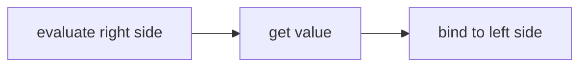

# Data and Memory

Every chapter in this book starts here: with the data. Before we compute, we understand what we're working with. This section answers two questions: what is this type, and how do we store it?

### Types and Values

In Chapter 0, we described computations by the *kind* of data they use. We wrote things like `length: string → number` to say "length takes a string and produces a number." Now we make "kind" precise.

A **type** defines a group of data with a set of valid values.

A **value** is data that cannot be simplified further. Every value belongs to exactly one type.

These two concepts work together. Types describe categories. Values are the actual data that lives in those categories. The number 5 is a value. It belongs to the number type. The text "hello" is a value. It belongs to the string type.

Now let's meet our first type.

### Booleans

The simplest type is the boolean.

A **boolean** is a type with exactly two valid values: `true` and `false`.

No other values exist. There is no "maybe," no "unknown," only `true` and `false`.

Only two values might seem limiting, but this constraint is what makes booleans powerful. Because there are only two possibilities, we can reason about them completely. Later in this chapter, we'll build truth tables that list every possible input and output for boolean operations. No other type lets us enumerate all cases so easily.

When we wrote `is-negative: number → boolean` in Chapter 0, this is what boolean means. The function takes a number and produces one of two possible values: `true` or `false`.

Booleans answer yes/no questions. Is the user logged in? Is the file ready? Is the number positive? Each of these has a boolean answer.

### Variables and Binding

We have values. Now we need a way to store them so we can use them later.

A **variable** is a named location in memory that holds a value of a specific type.

When we store a value in a variable, we **bind** that value to that name.

Here is our first line of C# code:

```csharp
bool x = true;
```

This creates a boolean variable named x and binds the value true to it.

Let's break that translation down:
- "Create a boolean variable named x" — we're making a new storage location
- "and bind the value true to it" — we're storing true in that location

When we bind a value to a variable, that variable holds that value until we bind a different one, or until the variable leaves scope. (We'll define scope in the Control Flow section.)

---

**Try it yourself.**

Translate this code to English:

```csharp
bool flag = true;
```

Write your answer before revealing ours.

<details>
<summary>Reveal answer</summary>

"Create a boolean variable named flag and bind the value true to it."

</details>

If your answer differed, note what you missed before continuing.

---

### What Happens When Code Runs

Before we go deeper into variables, we need to understand how programs execute.

Programs run line by line, top to bottom. Each line completes before the next one starts. As lines execute, the program's **state** changes.

The program's **state** is the set of bindings at a given point of execution.

Consider this code:

```csharp
bool x = true;
bool y = false;
```

After line 1 runs, x is bound to true. That's the entire state: one variable, one binding.

After line 2 runs, x is still bound to true, and now y is bound to false. The state has grown: two variables, two bindings.

We can visualize state with a table:

| after line | x | y |
|------------|---|---|
| 1 | true | — |
| 2 | true | false |

Each row shows the state after that line executes. The dash means the variable doesn't exist yet.

State tables help us trace what a program does step by step. When your code doesn't behave as expected, and it won't always, tracing state is how you find the problem. You'll think "the variable should be true here" and the table will show you it's actually false. That's the bug. This skill, tracing state, will save you hours of confusion.

### The Mechanism: What `bool flag = true;` Actually Does

Let's look more carefully at what happens when we write `bool flag = true;`

Three discrete actions happen:

1. `bool` — reserve space in memory for a boolean value
2. `flag` — name that space "flag"
3. `= true;` — bind the value true to that name

This is what "create a variable and bind a value" means at a mechanical level. The computer finds room in memory, labels it with a name, and stores your value there.

---

**Try it yourself.**

Write C# code for this description:

"Create a boolean variable named example_var and bind the value false to it."

<details>
<summary>Reveal answer</summary>

```csharp
bool example_var = false;
```

</details>

If your answer differed, note what you missed before continuing.

---

### Rebinding Variables

Variables can be rebound to new values, which is why they're called *variables*.

```csharp
bool x = true;
x = false;
```

Line 1 creates x and binds true to it.

Line 2 rebinds x to false. The old value is gone.

Here's the state table:

| after line | x |
|------------|---|
| 1 | true |
| 2 | false |

The translation for `x = false;` is simply: "Bind the value false to x."

Notice there's no `bool` keyword in line 2. We don't write `bool x = false;` because x already exists. We're rebinding, not creating.

**Common mistake:** Writing `bool x = false;` when x already exists causes an error. The variable already has a name and a place in memory. You just want to change what's stored there, so you write `x = false;` without the type.

### Reading vs Writing

So far we've only bound values to variables. That's writing. What about reading?

Consider this code:

```csharp
bool copy_of_x = x;
```

The right side isn't a literal value like `true` or `false`. It's a variable name. What happens?

When we use a variable in an expression, we **evaluate** it. Evaluating means retrieving the value currently bound to that name.

So `bool copy_of_x = x;` does this:
1. Evaluate x (get the value bound to x)
2. Bind that value to copy_of_x

If x is bound to true, then evaluating x produces true. We then bind true to copy_of_x.

The translation: "Create a boolean variable named copy_of_x and bind the result of evaluating x to it."

This is more precise than saying "copy x into copy_of_x." We're not copying the variable. We're evaluating it to get a value, then binding that value to a new variable.

Let's trace this with a state table:

```csharp
bool x = true;
bool copy_of_x = x;
```

| after line | x | copy_of_x |
|------------|---|-----------|
| 1 | true | — |
| 2 | true | true |

Line 2 evaluates x (gets true), then binds true to copy_of_x. Both variables now hold true, but they're independent bindings.

---

**Try it yourself.**

Translate this code to English:

```csharp
bool done = finished;
```

<details>
<summary>Reveal answer</summary>

"Create a boolean variable named done and bind the result of evaluating finished to it."

</details>

If your answer differed, note what you missed before continuing.

---

### Two Operations, One Symbol

We've now seen two different operations on variables:

**Binding (writing):** Store a value in a variable.
- `x = true;` — bind true to x
- `x = false;` — bind false to x

**Evaluating (reading):** Retrieve the value currently bound.
- Using `x` on the right side of `=` evaluates it

The same variable name means different things depending on where it appears:

```csharp
x = y;
```

On the left of `=`, x is a target. We're binding to it.
On the right of `=`, y is evaluated. We're reading from it.

Let's break this down token by token:

1. `y` — evaluate y to get its current value
2. `x =` — bind that value to x

The order matters. We fully evaluate the right side first, then we store the result on the left:



This is a pattern you'll see everywhere in programming: the right side is evaluated completely before anything is stored on the left.

### Value Types

Now let's trace a longer example to see something important:

```csharp
bool x = true;
bool copy_of_x = x;
x = false;
```

State table:

| after line | x | copy_of_x |
|------------|---|-----------|
| 1 | true | — |
| 2 | true | true |
| 3 | false | true |

After line 2, both variables hold true.

After line 3, x holds false, but copy_of_x still holds true.

Why didn't copy_of_x change when we changed x?

Because when we wrote `bool copy_of_x = x;`, we evaluated x to get the value true, then bound that value to copy_of_x. The two variables are independent. Each has its own storage location. Changing one doesn't affect the other.

This behavior is called a **value type**. Booleans are value types. When you assign a value type variable to another variable, you copy the value itself. The two variables don't share anything after that.

Think of it like writing a number on two different pieces of paper. Erasing one paper and writing a new number doesn't change what's on the other paper. Each paper has its own independent copy.

### Observing Values

We can store booleans and track state on paper. But how do we see what's actually bound to a variable when the program runs?

We use Console.WriteLine.

```csharp
Console.WriteLine(x);
```

This displays the value bound to x in the console, the text output area where programs can print messages.

The translation: "Evaluate x and display the result to the console."

Notice the pattern: we evaluate first (get the value), then do something with it (display it).

Console.WriteLine has this type signature:

```
WriteLine: bool → void
```

What's `void`? It means "no value." WriteLine takes a boolean, displays it, and produces nothing in return. It performs an action but doesn't give back data we can bind to a variable.

We'll see void again when we write functions that do things without producing values.

---

**Try it yourself.**

Write code that creates a boolean variable named `active`, binds true to it, then displays its value to the console.

<details>
<summary>Reveal answer</summary>

```csharp
bool active = true;
Console.WriteLine(active);
```

Line 1: "Create a boolean variable named active and bind the value true to it."

Line 2: "Evaluate active and display the result to the console."

</details>

If your answer differed, note what you missed before continuing.

---

### Review

Before continuing, test yourself on what you've learned. Use the protocol from Chapter 0: attempt each exercise from memory, then search the chapter to check your answers, then note what you missed.

#### Part 1: Definitions

Write the definitions from memory, then find them in the chapter to check.

1. What is a **type**?
2. What is a **value**?
3. What is a **boolean**?
4. What is a **variable**?
5. What is **binding**?
6. What is **state**?

If any of your answers differed from the definitions in the chapter, note what you missed and write the corrected version.

#### Part 2: Translations

Translate each line of code to English, then check against the translation patterns shown earlier in this section.

1. `bool ready = false;`
2. `bool status = active;`
3. `done = true;`
4. `Console.WriteLine(finished);`

If any translations differed, note what you missed and write the corrected version.

#### Part 3: Writing Code

Write C# code for each description.

1. Create a boolean variable named `enabled` and bind the value true to it.
2. Bind the value false to an existing variable named `running`.
3. Create a boolean variable named `backup` and bind the result of evaluating `original` to it.

Check your code against the examples in this section. If any differed, note what you missed and write the corrected version.

#### Part 4: State Tables

Complete the state table for this code:

```csharp
bool a = true;
bool b = false;
bool c = a;
a = false;
b = c;
```

| after line | a | b | c |
|------------|---|---|---|
| 1 | | | |
| 2 | | | |
| 3 | | | |
| 4 | | | |
| 5 | | | |

Trace through each line using the rules you learned: creating binds a value, using a variable on the right side evaluates it, and reassignment rebinds without affecting other variables (value types are independent). If your table doesn't match what you expect when you trace through carefully, identify where your reasoning went wrong.

---

You now know how to define booleans, create variables, bind and evaluate values, and track program state.

<div style="display: flex; justify-content: space-between; margin-top: 2rem;">
  <div style="text-align: left;">

**Previous:** [Chapter 1 Overview](index.md)
  </div>
  <div style="text-align: right;">

**Next:** [Section 2 - Computation](ch1-2.md)
  </div>
</div>

