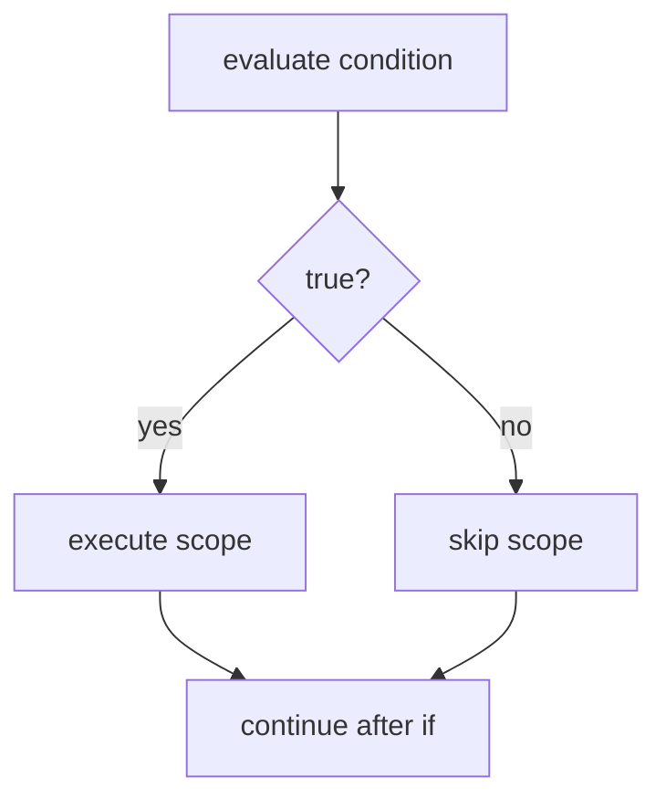
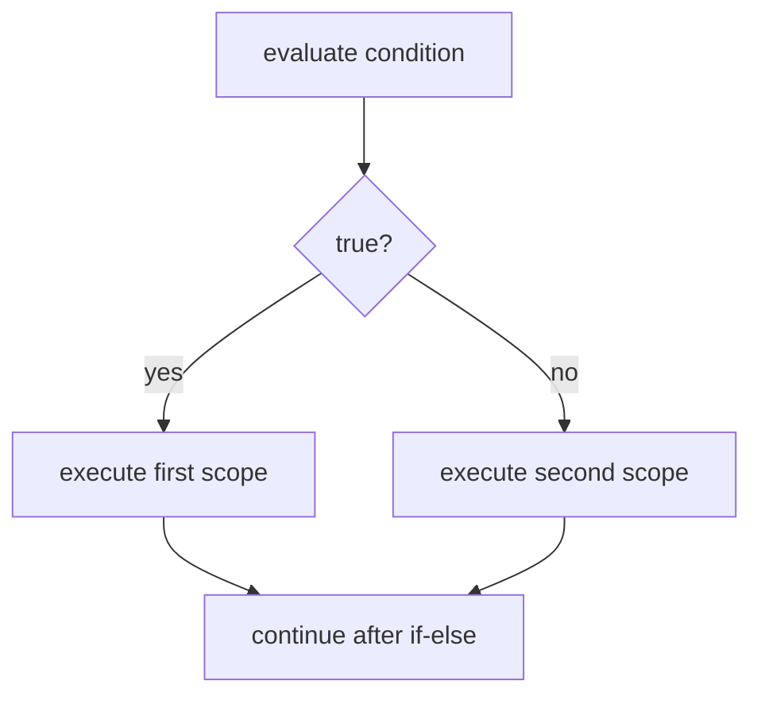
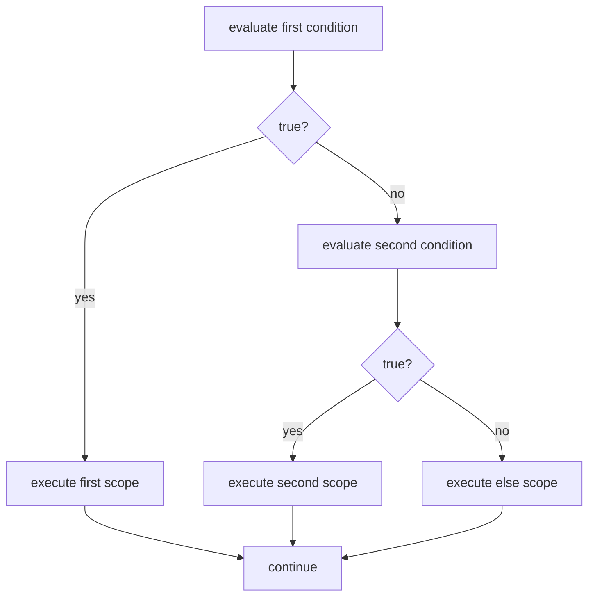
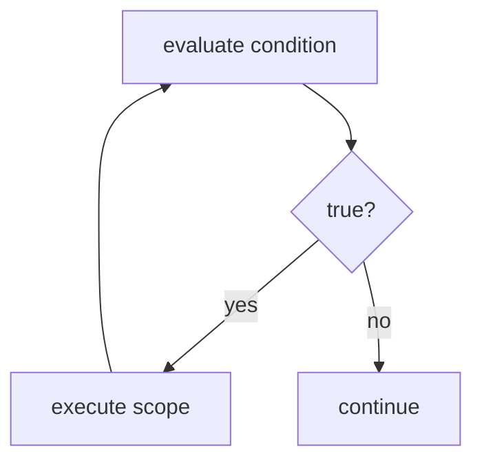

## How Do Booleans Control Program Behavior?

Programs need to make decisions. A login system grants access or denies it. A game checks if the player won. A thermostat turns heating on or off. These programs don't just run every line of code. They choose which code runs based on conditions.

Booleans make this possible. A boolean expression determines whether code runs or skips.

**Control flow** is the path execution takes through a program.

We'll explore two forms of control flow: branching with if statements, and repeating with loops.

### Branching with if

Here's the simplest form of control flow:

```csharp
bool ready = true;

if (ready)
{
    Console.WriteLine("Go!");
}

Console.WriteLine("Done");
```

When this program runs, it displays:

```
Go!
Done
```

But if we change the first line to `bool ready = false;`, the output becomes just:

```
Done
```

The `if` checks a boolean expression inside the parentheses. If the expression evaluates to true, the scope runs. If false, the scope is skipped.

The boolean expression that controls an if statement is called the **condition**.

A **condition** is a boolean expression that determines whether a scope executes.

An **if statement** is a control structure that executes a scope only when its condition evaluates to true.

The translation: "If ready evaluates to true, execute the scope."

The scope contains: "Display the string 'Go!' to the console."

Any boolean expression works as a condition:

```csharp
if (active && enabled)
{
    Console.WriteLine("System running");
}
```

The translation: "If active and enabled evaluates to true, execute the scope."

The scope contains: "Display the string 'System running' to the console."

The compound expression `active && enabled` evaluates to a single boolean value. That value determines whether the scope executes.

---

**Try it yourself.**

Translate this code to English:

```csharp
if (valid && complete)
{
    Console.WriteLine("Submitted");
}
```

Write your answer before revealing ours.

<details>
<summary>Reveal answer</summary>

"If valid and complete evaluates to true, execute the scope."

The scope contains: "Display the string 'Submitted' to the console."

</details>

If your answer differed, note what you missed before continuing.

---

**Try it yourself.**

Translate this code to English:

```csharp
if (finished)
{
    Console.WriteLine("Complete!");
}
```

Write your answer before revealing ours.

<details>
<summary>Reveal answer</summary>

"If finished evaluates to true, execute the scope."

The scope contains: "Display the string 'Complete!' to the console."

</details>

If your answer differed, note what you missed before continuing.

---

### Scope

Look at this code:

```csharp
if (true)
{
    bool inside = true;
}

Console.WriteLine(inside);
```

This code fails. The compiler reports an error: `inside` does not exist.

The variable was declared inside the curly braces. That boundary matters.

The curly braces create a boundary. Variables declared inside that boundary exist only within it. When execution leaves the closing `}`, those variables are gone. The binding disappears.

This region, bounded by `{` and `}`, is called a scope.

A **scope** is a region of code bounded by `{` and `}`. Variables declared inside a scope exist only within that scope.

When you see nested braces, picture them as boxes inside boxes. Variables live inside the box where they're declared. Here's what that looks like:

```
┌─────────────────────────────────────────┐
│ Outer scope                             │
│                                         │
│   if (true)                             │
│   ┌─────────────────────────────────┐   │
│   │ Inner scope                     │   │
│   │                                 │   │
│   │   bool inside = true;           │   │
│   │   ← inside exists here          │   │
│   │                                 │   │
│   └─────────────────────────────────┘   │
│                                         │
│   ← inside does NOT exist here          │
│                                         │
│   Console.WriteLine(inside); // Error!  │
│                                         │
└─────────────────────────────────────────┘
```

The variable `inside` is born when we enter the inner scope and dies when we leave it. Outside that scope, it doesn't exist.

How do we fix this? Declare the variable in the outer scope:

```csharp
bool inside = false;

if (true)
{
    inside = true;
}

Console.WriteLine(inside);
```

Now `inside` is declared in the outer scope. It exists before the if statement and continues to exist after. The code inside the if scope can see variables from the outer scope, so `inside = true;` works. It rebinds a variable that already exists.

This version displays `true`.

The rule: variables are visible in the scope where they're declared and in any scopes nested inside. They're not visible outside.

---

**Try it yourself.**

What does this code display?

```csharp
bool x = false;

if (true)
{
    x = true;
    bool y = true;
}

Console.WriteLine(x);
```

Write your answer before revealing ours.

<details>
<summary>Reveal answer</summary>

It displays `true`.

The variable `x` is declared in the outer scope, so it's visible inside the if scope. The line `x = true;` rebinds it. After the if scope ends, `x` still exists and still holds true.

The variable `y` is declared inside the if scope. It exists only there. After the closing `}`, y is gone. We don't try to use y outside its scope, so no error occurs.

</details>

If your answer differed, note what you missed before continuing.

---

**Try it yourself.**

This code has a scope error. Identify the problem and fix it.

```csharp
if (true)
{
    bool result = true;
}

if (result)
{
    Console.WriteLine("Success");
}
```

Write your fix before revealing ours.

<details>
<summary>Reveal answer</summary>

The problem: `result` is declared inside the first if scope, so it doesn't exist when the second if statement tries to use it.

The fix: Declare `result` in the outer scope before the first if statement.

```csharp
bool result = false;

if (true)
{
    result = true;
}

if (result)
{
    Console.WriteLine("Success");
}
```

Now `result` exists in the outer scope and is visible to both if statements.

</details>

Compare your answer and note what you missed.

---

### How if Executes

Now that you understand scope, let's look more carefully at how an if statement executes.

```csharp
bool ready = true;

if (ready)
{
    Console.WriteLine("Go!");
}

Console.WriteLine("Done");
```

Let's break down `if (ready) { ... }` token by token:

1. `if (ready)` — evaluate ready; if true, execute the scope; if false, skip the scope
2. `{ ... }` — the scope to execute when the condition is true

Let's trace through with a state table:

**With ready = true:**

| after line | ready |
|------------|-------|
| 1 | true |

Since ready is true, the condition evaluates to true. The scope executes and displays "Go!". Then the code after the if statement executes and displays "Done".

**With ready = false:**

| after line | ready |
|------------|-------|
| 1 | false |

Since ready is false, the condition evaluates to false. We skip the scope entirely. Only the code after the if statement executes, displaying "Done".

Here's a flowchart showing the two possible paths:



Execution flows down. At the diamond, we check the condition. If true, we take the left path and execute the scope. If false, we take the right path around it. Both paths rejoin and continue.

---

**Try it yourself.**

Write C# code for this description:

"Create a boolean variable named active and bind true to it. If active evaluates to true, execute a scope that displays the string 'Running' to the console."

Write your answer before revealing ours.

<details>
<summary>Reveal answer</summary>

```csharp
bool active = true;

if (active)
{
    Console.WriteLine("Running");
}
```

</details>

If different, note the corrections.

---

### if-else

What if we want to do one thing when true, and a different thing when false?

```csharp
bool loggedIn = false;

if (loggedIn)
{
    Console.WriteLine("Welcome back!");
}
else
{
    Console.WriteLine("Please log in.");
}
```

This displays: `Please log in.`

If we change `loggedIn` to true, it displays: `Welcome back!`

The `else` provides an alternative path. When the condition evaluates to false, instead of skipping to the code after the if, we execute the else scope.

The translation: "If loggedIn evaluates to true, execute the first scope. Otherwise, execute the second scope."

The first scope contains: "Display the string 'Welcome back!' to the console."

The second scope contains: "Display the string 'Please log in.' to the console."

We execute one scope or the other, never both and never neither. Exactly one scope executes.

---

**Try it yourself.**

Translate this code to English:

```csharp
if (valid)
{
    Console.WriteLine("Accepted");
}
else
{
    Console.WriteLine("Rejected");
}
```

Write your answer before revealing ours.

<details>
<summary>Reveal answer</summary>

"If valid evaluates to true, execute the first scope. Otherwise, execute the second scope."

The first scope contains: "Display the string 'Accepted' to the console."

The second scope contains: "Display the string 'Rejected' to the console."

</details>

Note what you missed before continuing.

---

### How if-else Executes

Now let's trace execution to see exactly what happens.

Let's break down `if (condition) { ... } else { ... }` token by token:

1. `if (condition)` — evaluate the condition; if true, execute the first scope; if false, skip to else
2. `{ ... }` — the first scope to execute when the condition is true
3. `else { ... }` — the second scope to execute when the condition is false

This is mutual exclusion. You execute one scope or the other, and the condition determines which.

**With loggedIn = false:**

| after line | loggedIn |
|------------|----------|
| 1 | false |

The condition is false, so we execute the else scope. It displays "Please log in."

**With loggedIn = true:**

| after line | loggedIn |
|------------|----------|
| 1 | true |

The condition is true, so we execute the first scope. It displays "Welcome back!" The else scope is skipped.

Exactly one branch executes. Never both.



Two paths diverge based on a single condition, and you execute exactly one. Both paths rejoin after the scope completes.

---

**Try it yourself.**

Write C# code for this description:

"If enabled evaluates to true, execute a scope that displays 'ON' to the console. Otherwise, execute a scope that displays 'OFF' to the console."

Write your answer before revealing ours.

<details>
<summary>Reveal answer</summary>

```csharp
if (enabled)
{
    Console.WriteLine("ON");
}
else
{
    Console.WriteLine("OFF");
}
```

</details>

Check your work and note any differences.

---

### if-else if-else

Sometimes there are more than two possibilities. We can chain conditions:

```csharp
bool isAdmin = false;
bool isMember = true;

if (isAdmin)
{
    Console.WriteLine("Full access");
}
else if (isMember)
{
    Console.WriteLine("Member access");
}
else
{
    Console.WriteLine("Guest access");
}
```

This displays: `Member access`

The conditions are checked in order. The first one that evaluates to true wins. Its scope executes, and we skip all remaining branches.

The translation: "If isAdmin evaluates to true, execute the first scope. Otherwise, if isMember evaluates to true, execute the second scope. Otherwise, execute the third scope."

The first scope contains: "Display the string 'Full access' to the console."

The second scope contains: "Display the string 'Member access' to the console."

The third scope contains: "Display the string 'Guest access' to the console."

---

**Try it yourself.**

Translate this code to English:

```csharp
if (priority)
{
    Console.WriteLine("Urgent");
}
else if (normal)
{
    Console.WriteLine("Standard");
}
else
{
    Console.WriteLine("Low");
}
```

Write your answer before revealing ours.

<details>
<summary>Reveal answer</summary>

"If priority evaluates to true, execute the first scope. Otherwise, if normal evaluates to true, execute the second scope. Otherwise, execute the third scope."

The first scope contains: "Display the string 'Urgent' to the console."

The second scope contains: "Display the string 'Standard' to the console."

The third scope contains: "Display the string 'Low' to the console."

</details>

Compare your answer to the model.

---

### How if-else if-else Executes

Let's trace through different initial states to see how this chain works.

| isAdmin | isMember |
|---------|----------|
| true | true |
| true | false |
| false | true |
| false | false |

Let's trace through each case:

**Cases 1-2: isAdmin is true**

(Regardless of isMember's value)
- Evaluate isAdmin → true
- Execute first scope, display "Full access"
- Skip remaining branches

When isAdmin is true, we never even check isMember. The first true condition wins.

**Case 3: isAdmin false, isMember true**
- Evaluate isAdmin → false, skip first scope
- Evaluate isMember → true
- Execute second scope, display "Member access"
- Skip else

**Case 4: both false**
- Evaluate isAdmin → false, skip first scope
- Evaluate isMember → false, skip second scope
- Execute else scope, display "Guest access"

The final `else` is a catch-all. If no condition is true, we execute the else scope. Without it, we might skip all branches entirely.



This is still mutual exclusion. Exactly one scope executes.

---

**Try it yourself.**

Write C# code for this description:

"If high evaluates to true, execute a scope that displays 'High priority' to the console. Otherwise, if medium evaluates to true, execute a scope that displays 'Medium priority' to the console. Otherwise, execute a scope that displays 'Low priority' to the console."

Write your answer before revealing ours.

<details>
<summary>Reveal answer</summary>

```csharp
if (high)
{
    Console.WriteLine("High priority");
}
else if (medium)
{
    Console.WriteLine("Medium priority");
}
else
{
    Console.WriteLine("Low priority");
}
```

</details>

Note any differences before continuing.

---

### Nested Conditionals

An if statement can contain another if statement. This is nesting.

```csharp
bool hasPermission = true;
bool hasQuota = false;

if (hasPermission)
{
    if (hasQuota)
    {
        Console.WriteLine("Access granted");
    }
    else
    {
        Console.WriteLine("Over quota");
    }
}
else
{
    Console.WriteLine("Access denied");
}
```

This displays: `Over quota`

Let's trace through to see why:

| step | action |
|------|--------|
| 1 | Bind true to hasPermission |
| 2 | Bind false to hasQuota |
| 3 | Evaluate hasPermission → true, enter outer scope |
| 4 | Evaluate hasQuota → false, take the inner else |
| 5 | Display "Over quota" |

Each if creates its own scope, and scopes can be nested inside other scopes. The inner if only runs if we entered the outer if first. This lets us check conditions in sequence: first hasPermission, then (only if that passed) hasQuota.

---

**Try it yourself.**

Translate this code to English:

```csharp
if (loggedIn)
{
    if (isAdmin)
    {
        Console.WriteLine("Admin panel");
    }
}
```

Write your answer before revealing ours.

<details>
<summary>Reveal answer</summary>

"If loggedIn evaluates to true, execute the scope."

The scope contains: "If isAdmin evaluates to true, execute the scope."

That inner scope contains: "Display the string 'Admin panel' to the console."

</details>

Note what you missed before continuing.

**Follow-up:** Under what conditions does "Admin panel" display?

<details>
<summary>Reveal answer</summary>

"Admin panel" displays only when BOTH loggedIn is true AND isAdmin is true. If either is false, nothing displays.

</details>

---

**Try it yourself.**

Write C# code for this description:

"If hasAccess evaluates to true, execute a scope that checks if hasPermission also evaluates to true. If both are true, display 'Granted' to the console."

Write your answer before revealing ours.

<details>
<summary>Reveal answer</summary>

```csharp
if (hasAccess)
{
    if (hasPermission)
    {
        Console.WriteLine("Granted");
    }
}
```

</details>

Check your work and note any differences.

---

### Nesting vs Compound Conditions

When should you nest versus use compound conditions? Compare:

```csharp
// Nested version
if (hasKey)
{
    if (doorUnlocked)
    {
        Console.WriteLine("Enter");
    }
}

// Compound version
if (hasKey && doorUnlocked)
{
    Console.WriteLine("Enter");
}
```

For simple cases, the compound version is cleaner. Both require hasKey and doorUnlocked to be true.

But nesting gives you more control. The nested version lets you put different else branches at different levels:

```csharp
if (hasKey)
{
    if (doorUnlocked)
    {
        Console.WriteLine("Enter");
    }
    else
    {
        Console.WriteLine("Door is locked");
    }
}
else
{
    Console.WriteLine("You need a key");
}
```

The compound version can't express this structure. You'd need separate if statements.

Rule of thumb: use compound conditions when you just need everything to be true. Use nesting when different false cases need different responses.

---

So far we've only branched on variables we created ourselves. Real programs respond to what users type. When someone enters a password or answers a question, that input arrives as text.

### Strings for User Input

When someone types at a keyboard, they produce text. We need to store that text.

A **string** is text in quotation marks.

Examples: `"hello"`, `"yes"`, `"42"`

You can create string variables:

```csharp
string message = "Hello";
```

And compare them:

```csharp
bool match = message == "Hello";  // true
```

That's all you need for now. In Chapter 4, we'll explore strings fully. For this section, strings let us work with user input and display messages.

### Displaying Messages

We've used Console.WriteLine to display values. It works with strings too:

```csharp
Console.WriteLine("Hello!");
```

The translation: "Display the string 'Hello!' to the console."

One useful signature to keep in mind is: `WriteLine: (string) → void`

Same pattern we saw before. It takes a string value, displays it, and produces nothing in return.

### Reading Input

Now for input:

```csharp
string answer = Console.ReadLine();
```

The translation: "Call ReadLine and bind the result to a string variable named answer."

One useful signature to keep in mind is: `ReadLine: () → string`

The `()` means ReadLine takes no input. It waits for the user to type something and press Enter. Then it produces that text as a string value. We bind that value to a variable.

---

**Try it yourself.**

Translate this code to English:

```csharp
Console.WriteLine("Enter your name:");
string name = Console.ReadLine();
```

Write your answer before revealing ours.

<details>
<summary>Reveal answer</summary>

First statement: "Display the string 'Enter your name:' to the console."

Second statement: "Call ReadLine and bind the result to a string variable named name."

</details>

Compare your answer to the model.

---

### Branching on Input

Now we can branch based on what the user typed:

```csharp
Console.WriteLine("Continue? (yes/no)");
string answer = Console.ReadLine();

if (answer == "yes")
{
    Console.WriteLine("Continuing...");
}
else
{
    Console.WriteLine("Stopping.");
}
```

The expression `answer == "yes"` compares two strings. It evaluates to true if they match, false otherwise. This is a boolean expression, so we can use it as a condition.

The translation for `answer == "yes"`: "answer equals the string 'yes'"

This program's behavior depends on what the user types. If you type "yes" and press Enter, you'll see "Continuing..." If you type anything else, you'll see "Stopping."

---

**Try it yourself.**

Write a program that:
1. Displays "Enter password:" to the console
2. Reads input and binds it to a string variable named password
3. If password equals the string "secret", displays "Access granted"
4. Otherwise, displays "Access denied"

Write your answer before revealing ours.

<details>
<summary>Reveal answer</summary>

```csharp
Console.WriteLine("Enter password:");
string password = Console.ReadLine();

if (password == "secret")
{
    Console.WriteLine("Access granted");
}
else
{
    Console.WriteLine("Access denied");
}
```

</details>

If your answer differed, make note of the corrections.

---

### Loops with while

What if the user types the wrong password? We could tell them to try again. But our program ends after one check.

We could add more if statements:

```csharp
Console.WriteLine("Enter password:");
string password = Console.ReadLine();

if (password != "secret")
{
    Console.WriteLine("Wrong password. Try again:");
    password = Console.ReadLine();
}

if (password != "secret")
{
    Console.WriteLine("Wrong password. Try again:");
    password = Console.ReadLine();
}

// How many times do we copy this?
```

This is tedious and limited. What if they get it wrong three times? Ten times? We'd need endless copies of the same code.

What we want is a way to say: keep asking until they get it right.

```csharp
Console.WriteLine("Enter password:");
string password = Console.ReadLine();

while (password != "secret")
{
    Console.WriteLine("Wrong password. Try again:");
    password = Console.ReadLine();
}

Console.WriteLine("Access granted");
```

The `while` statement has the same structure as if: a condition in parentheses and a scope in curly braces. The difference is in behavior. Instead of executing once (or not at all), while keeps executing as long as the condition is true.

The translation: "While password does not equal 'secret', execute the scope."

---

**Try it yourself.**

Translate this code to English:

```csharp
while (waiting)
{
    Console.WriteLine("Still waiting...");
}
```

Write your answer before revealing ours.

<details>
<summary>Reveal answer</summary>

"While waiting evaluates to true, execute the scope."

The scope contains: "Display the string 'Still waiting...' to the console."

</details>

If different, note the corrections.

---

### How while Executes

Let's look more carefully at what happens when a while loop runs.

Let's break down `while (condition) { ... }` token by token:

1. `while (condition)` — evaluate the condition; if true, execute the scope; if false, skip to after the loop
2. `{ ... }` — the scope to execute when the condition is true; after executing, check the condition again

The key difference from if is that after executing the scope, we check the condition again, repeating until it evaluates to false.

Like if statements, the curly braces in a while loop create a scope. Variables declared inside the loop exist only within that scope. They're created fresh each time the loop body executes and disappear when the body ends.

Let's trace through with specific input. The user types "wrong", then "also wrong", then "secret":

```csharp
Console.WriteLine("Enter password:");    // line 1
string password = Console.ReadLine();    // line 2

while (password != "secret")             // line 3
{
    Console.WriteLine("Wrong password. Try again:");  // line 4
    password = Console.ReadLine();       // line 5
}

Console.WriteLine("Access granted");     // line 6
```

| after line | password | condition result |
|------------|----------|------------------|
| 2 (user types "wrong") | "wrong" | — |
| 3 (check condition) | "wrong" | true, enter loop |
| 5 (user types "also wrong") | "also wrong" | — |
| 3 (check condition) | "also wrong" | true, enter loop |
| 5 (user types "secret") | "secret" | — |
| 3 (check condition) | "secret" | false, exit loop |
| 6 | "secret" | — |

Let's read this table row by row:

- Line 2: User types "wrong", we bind it to password
- Line 3: Check condition. Is "wrong" != "secret"? Yes, so the result is true. Enter the loop.
- Line 5: Display the error message, read new input. User types "also wrong", we bind it.
- Line 3: Check condition again. Is "also wrong" != "secret"? Yes, true. Enter the loop again.
- Line 5: Display the error message, read new input. User types "secret", we bind it.
- Line 3: Check condition. Is "secret" != "secret"? No, so the result is false. Exit the loop.
- Line 6: Display "Access granted"

The loop body ran twice. After each pass, we returned to line 3 to recheck the condition.



The arrow looping back is the key difference from if. We keep circling until the condition is false.

This structure, where we repeatedly execute a scope while a condition holds, is called a loop.

A **loop** is a control structure that repeatedly executes a scope while a condition evaluates to true.

---

**Try it yourself.**

Write C# code for this description:

"Create a string variable named command and bind an empty string to it. While command does not equal the string 'exit', execute a scope that displays 'Enter command:' to the console, then calls ReadLine and binds the result to command."

Write your answer before revealing ours.

<details>
<summary>Reveal answer</summary>

```csharp
string command = "";

while (command != "exit")
{
    Console.WriteLine("Enter command:");
    command = Console.ReadLine();
}
```

</details>

Note any differences before continuing.

---

### Loop-Until-Valid

The password example demonstrates a common pattern: **loop until valid input**.

The structure:
1. Read input before the loop
2. Loop while input is invalid (the condition stays true until input becomes valid)
3. Read new input in the loop body

When the loop exits, you're guaranteed to have valid input.

You'll use this pattern constantly:
- Asking for confirmation
- Menu systems that repeat until "quit"
- Validating user input
- Any situation where you need acceptable input before continuing

---

### What Makes a Loop Work?

The password loop works because of two key properties. Let's see what happens when we violate them.

**Try it yourself.**

What will happen when you run this code?

```csharp
bool running = true;

while (running)
{
    Console.WriteLine("Working...");
}

Console.WriteLine("Done");
```

Think about what will happen, then reveal the answer.

<details>
<summary>Reveal answer</summary>

The code never stops. It runs forever.

The variable `running` is never changed inside the loop. It stays true forever. The condition never becomes false. The program never reaches "Done".

The loop displays "Working..." endlessly until you force the program to stop.

</details>

Compare your answer and note what you missed.

---

### Loop Requirements

The problem above reveals what every working loop needs.

**Requirement 1: The condition must be able to become false.**

If the condition can never be false, the loop never exits. In our broken example, `running` is always true. The condition `while (running)` can never be false.

**Requirement 2: Something in the loop body must change state toward making the condition false.**

Even if the condition CAN be false in theory, if nothing in the loop changes the relevant variables, it won't become false in practice.

Compare these two loops:

```csharp
// This loop terminates
string input = "";
while (input != "quit")
{
    Console.WriteLine("Enter command:");
    input = Console.ReadLine();  // Changes state!
}

// This loop runs forever
string input = "";
while (input != "quit")
{
    Console.WriteLine("Enter command:");
    // Nothing changes input. State never changes.
}
```

The first loop reads new input each iteration. This changes `input`. Eventually the user types "quit", the condition becomes false, and the loop exits.

The second loop displays "Enter command:" forever. The variable `input` stays empty because we never rebind it. The condition stays true forever.

**The pattern:** A working loop has two parts:
1. A condition that depends on some variable(s)
2. Code in the body that can change those variable(s)

Without both parts, your loop either never runs or never stops.

When your program seems frozen, check your loops: Does something inside change the variables in the condition? Can the condition become false?

**Debugging frozen programs:**

When your program seems stuck, add a display statement inside the loop:

```csharp
while (running)
{
    Console.WriteLine(running);  // See what's happening
    Console.WriteLine("Working...");
}
```

If you see the same value over and over, the variable isn't changing. That's your problem.

---

### Review

Before continuing to Functions, test yourself on what you've learned. Use the protocol from Chapter 0: attempt each exercise from memory, then search this section to check your answers, then note what you missed.

#### Part 1: Definitions

Write the definitions from memory, then find them in this section to check.

1. What is **control flow**?
2. What is a **condition**?
3. What is an **if statement**?
4. What is a **scope**?
5. What is a **loop**?
6. What is a **string**?

If any of your answers differed from the definitions in this section, note what you missed and write the corrected version.

#### Part 2: Translations

Translate each piece of code to English.

1. `if (ready) { Console.WriteLine("Go"); }`

2. `if (valid) { x = true; } else { x = false; }`

3. `while (active) { Console.WriteLine("Running"); }`

4. `string name = Console.ReadLine();`

5. `if (input == "yes") { confirmed = true; }`

Check your translations against the patterns shown in this section.

#### Part 3: Writing Code

Write C# code for each description.

1. If done evaluates to true, execute a scope that displays "Finished" to the console.

2. If authorized evaluates to true, execute a scope that displays "Welcome" to the console. Otherwise, execute a scope that displays "Access denied" to the console.

3. While running evaluates to true, execute a scope that displays "Processing..." to the console.

4. Call ReadLine and bind the result to a string variable named response.

Check your code against the examples in this section.

#### Part 4: Branching Trace

What does this code display?

```csharp
bool x = true;
bool y = false;

if (x)
{
    Console.WriteLine("A");

    if (y)
    {
        Console.WriteLine("B");
    }
    else
    {
        Console.WriteLine("C");
    }
}
else
{
    Console.WriteLine("D");
}

Console.WriteLine("E");
```

Work through the code mentally: which conditions are true? Which branches execute?

Write only the output (what appears on screen), one line per line of output.

Then check your trace against the nested conditionals example earlier in this section.

#### Part 5: Loop Trace

How many times does the loop body execute? What does this code display?

```csharp
string input = "no";

while (input != "yes")
{
    Console.WriteLine("Try again");
    input = "yes";
}

Console.WriteLine("Done");
```

Write your answer, then trace through to verify.

<details>
<summary>Reveal answer</summary>

The loop body executes once.

Output:
```
Try again
Done
```

Trace:
- Initial state: input is "no"
- Check condition: "no" != "yes" is true, enter loop
- Display "Try again"
- Bind "yes" to input
- Check condition: "yes" != "yes" is false, exit loop
- Display "Done"

</details>

#### Part 6: Complete Programs

Write complete programs for these specifications:

1. A program that asks "Play again? (yes/no)" and keeps asking until the user types "no". When they type "no", display "Goodbye!"

2. A program that asks for a username. If the username equals "admin", ask for a password. If the password equals "12345", display "Welcome, admin!" Otherwise display "Wrong password." If the username wasn't "admin", display "Unknown user."

Check your programs by tracing through them with different inputs.

---

You now know how to control which code runs based on state. You can branch with if, choose between alternatives with if-else, chain multiple conditions, and repeat code with while loops. In the next section, we'll learn how to package our own computations into reusable functions.


<div style="display: flex; justify-content: space-between; margin-top: 2rem;">
  <div style="text-align: left;">

**Previous:** [Section 2 - Computation](ch1-2.md)
  </div>
  <div style="text-align: right;">

**Next:** [Section 4 - Functions](ch1-4.md)
  </div>
</div>