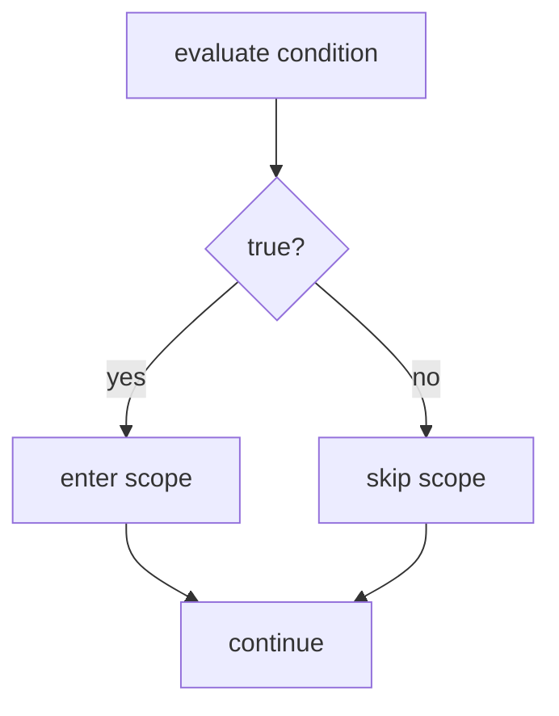
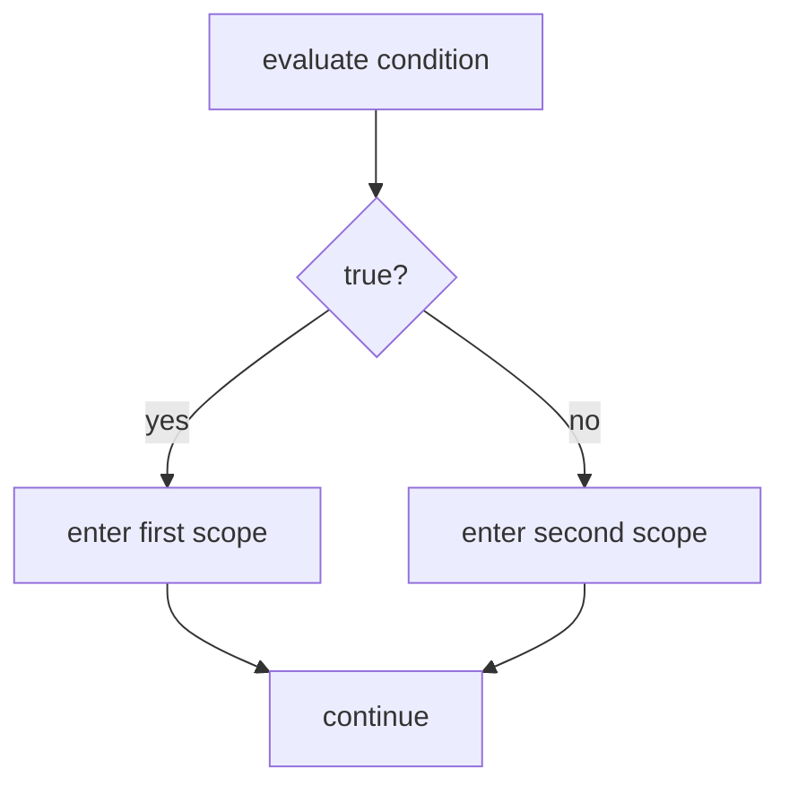
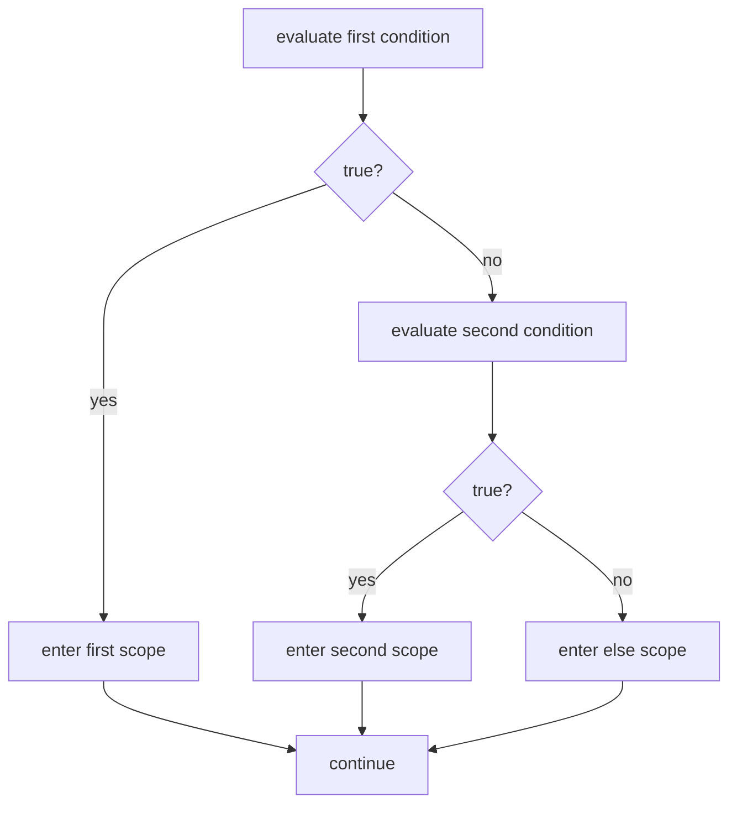
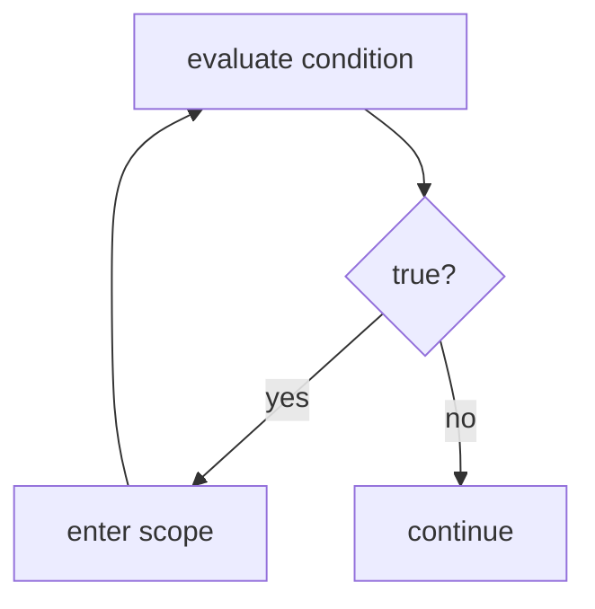

# Control Flow

We can store booleans and compute new ones. Every line of code we've written runs every time, top to bottom, no exceptions. But real programs need to make decisions. Should we show an error message? Only if something went wrong. Should we grant access? Only if the user is authorized.

What we need is a way for the program's state to determine which code runs. This is control flow: the path execution takes through our code. Until now, that path was a straight line. Now it branches. We'll visualize these branches with flowcharts throughout this section.

The pattern you'll see in this section repeats throughout programming: a boolean expression controls what happens next. Master it here with booleans, and you'll start to recognize it everywhere.

### Branching with if

Here's the simplest form of control flow:

```csharp
bool ready = true;

if (ready)
{
    Console.WriteLine("Go!");
}

Console.WriteLine("Done");
```

When this program runs, it displays:

```
Go!
Done
```

But if we change the first line to `bool ready = false;`, the output becomes just:

```
Done
```

The `if` statement checks a condition. If the condition evaluates to true, execution enters the code block inside the curly braces. If the condition evaluates to false, execution skips that block entirely.

The translation: "If ready evaluates to true, enter the scope."

Notice what's inside the parentheses: `ready`. This is a boolean expression. We evaluate it to get a value, either true or false. That value determines whether we enter the scope.

Any boolean expression works as a condition. We could write:

```csharp
if (active && enabled)
{
    Console.WriteLine("System running");
}
```

The translation: "If active and enabled evaluates to true, enter the scope."

The compound expression `active && enabled` evaluates to a single boolean value. That value controls the branch.

---

**Try it yourself.**

Translate this code to English:

```csharp
if (finished)
{
    Console.WriteLine("Complete!");
}
```

Write your answer before revealing ours.

<details>
<summary>Reveal answer</summary>

"If finished evaluates to true, enter the scope."

The scope contains: "Display the string 'Complete!' to the console."

</details>

If your answer differed, note what you missed before continuing.

---

### Scope

Look at this code:

```csharp
if (true)
{
    bool inside = true;
}

Console.WriteLine(inside);
```

This code fails. The compiler reports an error: `inside` does not exist.

But we just created it. What happened?

The curly braces create a boundary. Variables declared inside that boundary exist only within it. When execution leaves the closing `}`, those variables are gone. The binding disappears.

This region, bounded by `{` and `}`, is called a scope.

A **scope** is a region of code bounded by `{` and `}`. Variables declared inside a scope exist only within that scope.

Here's how to visualize it:

```
┌─────────────────────────────────────────┐
│ Outer scope                             │
│                                         │
│   if (true)                             │
│   ┌─────────────────────────────────┐   │
│   │ Inner scope                     │   │
│   │                                 │   │
│   │   bool inside = true;           │   │
│   │   ← inside exists here          │   │
│   │                                 │   │
│   └─────────────────────────────────┘   │
│                                         │
│   ← inside does NOT exist here          │
│                                         │
│   Console.WriteLine(inside); // Error!  │
│                                         │
└─────────────────────────────────────────┘
```

The variable `inside` is born when we enter the inner scope and dies when we leave it. Outside that scope, it doesn't exist.

How do we fix this? Declare the variable in the outer scope:

```csharp
bool inside = false;

if (true)
{
    inside = true;
}

Console.WriteLine(inside);
```

Now `inside` is declared in the outer scope. It exists before the if statement and continues to exist after. The code inside the if scope can see variables from the outer scope, so `inside = true;` works. It rebinds a variable that already exists.

This version displays `true`.

The rule: variables are visible in the scope where they're declared and in any scopes nested inside. They're not visible outside.

---

**Try it yourself.**

What does this code display?

```csharp
bool x = false;

if (true)
{
    x = true;
    bool y = true;
}

Console.WriteLine(x);
```

<details>
<summary>Reveal answer</summary>

It displays `true`.

The variable `x` is declared in the outer scope, so it's visible inside the if scope. The line `x = true;` rebinds it. After the if scope ends, `x` still exists and still holds true.

The variable `y` is declared inside the if scope. It exists only there. After the closing `}`, y is gone. We don't try to use y outside its scope, so no error occurs.

</details>

If your answer differed, note what you missed before continuing.

---

**Try it yourself.**

This code has an error. Find it and fix it.

```csharp
if (true)
{
    bool result = true;
}

if (result)
{
    Console.WriteLine("Success");
}
```

<details>
<summary>Reveal answer</summary>

The error: `result` is declared inside the first if scope, so it doesn't exist outside. The second if statement tries to use `result`, but it's gone.

The fix: declare `result` before the first if.

```csharp
bool result = false;

if (true)
{
    result = true;
}

if (result)
{
    Console.WriteLine("Success");
}
```

Now `result` is declared in the outer scope. Both if statements can see it.

</details>

If your answer differed, note what you missed before continuing.

---

### How if Executes

Now that you understand scope, let's look more carefully at how an if statement executes.

```csharp
bool ready = true;

if (ready)
{
    Console.WriteLine("Go!");
}

Console.WriteLine("Done");
```

Let's break down `if (ready) { ... }` token by token:

1. `if (ready)` — evaluate ready; if true, continue to the scope; if false, skip the scope
2. `{ ... }` — the scope to enter when the condition is true

Here's what happens with `ready = true`:

| step | action |
|------|--------|
| Line 1 | Bind true to ready |
| Line 3 | Evaluate ready → true |
| Line 3 | True: enter the scope |
| Line 5 | Display "Go!" |
| Line 8 | Display "Done" |

And with `ready = false`:

| step | action |
|------|--------|
| Line 1 | Bind false to ready |
| Line 3 | Evaluate ready → false |
| Line 3 | False: skip the scope |
| Line 8 | Display "Done" |

Here's the key insight: the condition is evaluated, not stored. We read the current state, make a decision, and move on. The if statement doesn't change state. It reads state to decide where to go.

Here's a flowchart showing the two possible paths:



Execution flows down. At the diamond, we check the condition. If true, we take the left path through the scope. If false, we take the right path around it. Both paths rejoin and continue.

---

**Try it yourself.**

Write C# code for this description:

"Create a boolean variable named active and bind true to it. If active evaluates to true, enter a scope that displays the string 'Running' to the console."

<details>
<summary>Reveal answer</summary>

```csharp
bool active = true;

if (active)
{
    Console.WriteLine("Running");
}
```

</details>

If your answer differed, note what you missed before continuing.

---

### if-else

What if we want to do one thing when true, and a different thing when false?

```csharp
bool loggedIn = false;

if (loggedIn)
{
    Console.WriteLine("Welcome back!");
}
else
{
    Console.WriteLine("Please log in.");
}
```

This displays: `Please log in.`

If we change `loggedIn` to true, it displays: `Welcome back!`

The `else` provides an alternative path. When the condition evaluates to false, instead of skipping to the code after the if, we enter the else scope.

The translation: "If loggedIn evaluates to true, enter the first scope. Otherwise, enter the second scope."

The word "otherwise" captures what else means: we take one path or the other, never both and never neither. Exactly one scope executes.

---

**Try it yourself.**

Translate this code to English:

```csharp
if (valid)
{
    Console.WriteLine("Accepted");
}
else
{
    Console.WriteLine("Rejected");
}
```

<details>
<summary>Reveal answer</summary>

"If valid evaluates to true, enter the first scope. Otherwise, enter the second scope."

First scope: "Display the string 'Accepted' to the console."

Second scope: "Display the string 'Rejected' to the console."

</details>

If your answer differed, note what you missed before continuing.

---

### How if-else Executes

Let's look more carefully at what happens when an if-else runs.

Let's break down `if (condition) { ... } else { ... }` token by token:

1. `if (condition)` — evaluate the condition; if true, enter the first scope; if false, skip to else
2. `{ ... }` — the first scope to enter when the condition is true
3. `else { ... }` — the second scope to enter when the condition is false

This is mutual exclusion. You enter one scope or the other, and the condition determines which.

Here's what happens with `loggedIn = false`:

| step | action |
|------|--------|
| Line 1 | Bind false to loggedIn |
| Line 3 | Evaluate loggedIn → false |
| Line 3 | False: skip first scope, go to else |
| Line 8 | Enter else scope |
| Line 9 | Display "Please log in." |

And with `loggedIn = true`:

| step | action |
|------|--------|
| Line 1 | Bind true to loggedIn |
| Line 3 | Evaluate loggedIn → true |
| Line 3 | True: enter first scope |
| Line 5 | Display "Welcome back!" |
| Line 8 | Skip else scope |



Two paths diverge based on a single condition, and you take exactly one. Both paths rejoin after their scope completes.

---

**Try it yourself.**

Write C# code for this description:

"If enabled evaluates to true, enter a scope that displays 'ON' to the console. Otherwise, enter a scope that displays 'OFF' to the console."

<details>
<summary>Reveal answer</summary>

```csharp
if (enabled)
{
    Console.WriteLine("ON");
}
else
{
    Console.WriteLine("OFF");
}
```

</details>

If your answer differed, note what you missed before continuing.

---

### if-else if-else

Sometimes there are more than two possibilities. We can chain conditions:

```csharp
bool isAdmin = false;
bool isMember = true;

if (isAdmin)
{
    Console.WriteLine("Full access");
}
else if (isMember)
{
    Console.WriteLine("Member access");
}
else
{
    Console.WriteLine("Guest access");
}
```

This displays: `Member access`

The conditions are checked in order. The first one that evaluates to true wins. Its scope executes, and we skip all remaining branches.

The translation: "If isAdmin evaluates to true, enter the first scope. Otherwise, if isMember evaluates to true, enter the second scope. Otherwise, enter the third scope."

---

**Try it yourself.**

Translate this code to English:

```csharp
if (priority)
{
    Console.WriteLine("Urgent");
}
else if (normal)
{
    Console.WriteLine("Standard");
}
else
{
    Console.WriteLine("Low");
}
```

<details>
<summary>Reveal answer</summary>

"If priority evaluates to true, enter the first scope. Otherwise, if normal evaluates to true, enter the second scope. Otherwise, enter the third scope."

First scope: "Display the string 'Urgent' to the console."

Second scope: "Display the string 'Standard' to the console."

Third scope: "Display the string 'Low' to the console."

</details>

If your answer differed, note what you missed before continuing.

---

### How if-else if-else Executes

Let's trace through different initial states to see how this chain works.

| isAdmin | isMember | Which scope? | Output |
|---------|----------|--------------|--------|
| true | true | First | "Full access" |
| true | false | First | "Full access" |
| false | true | Second | "Member access" |
| false | false | Third | "Guest access" |

Notice the first row: both conditions are true, but we only see "Full access." Once we find a true condition, we enter that scope and skip the rest. The second condition is never even checked.

The final `else` is a catch-all. If no condition is true, we enter the else scope. Without it, we might skip all branches entirely.



This is still mutual exclusion. Exactly one scope executes.

---

**Try it yourself.**

What does this code display?

```csharp
bool a = false;
bool b = false;
bool c = true;

if (a)
{
    Console.WriteLine("A");
}
else if (b)
{
    Console.WriteLine("B");
}
else if (c)
{
    Console.WriteLine("C");
}
else
{
    Console.WriteLine("None");
}
```

<details>
<summary>Reveal answer</summary>

It displays `C`.

We check a: false. Skip to else if.
We check b: false. Skip to else if.
We check c: true. Enter that scope. Display "C".
Skip the final else.

</details>

If your answer differed, note what you missed before continuing.

---

**Try it yourself.**

Write C# code for this description:

"If high evaluates to true, enter a scope that displays 'High' to the console. Otherwise, if medium evaluates to true, enter a scope that displays 'Medium' to the console. Otherwise, enter a scope that displays 'Low' to the console."

<details>
<summary>Reveal answer</summary>

```csharp
if (high)
{
    Console.WriteLine("High");
}
else if (medium)
{
    Console.WriteLine("Medium");
}
else
{
    Console.WriteLine("Low");
}
```

</details>

If your answer differed, note what you missed before continuing.

---

### Nested Conditionals

An if statement can contain another if statement. This is nesting.

```csharp
bool hasPermission = true;
bool hasQuota = false;

if (hasPermission)
{
    if (hasQuota)
    {
        Console.WriteLine("Access granted");
    }
    else
    {
        Console.WriteLine("Over quota");
    }
}
else
{
    Console.WriteLine("Access denied");
}
```

This displays: `Over quota`

Let's trace through to see why:

| step | action |
|------|--------|
| Line 1 | Bind true to hasPermission |
| Line 2 | Bind false to hasQuota |
| Line 4 | Evaluate hasPermission → true, enter outer scope |
| Line 6 | Evaluate hasQuota → false, skip to inner else |
| Line 11 | Enter inner else scope |
| Line 12 | Display "Over quota" |

Each if creates its own scope, and scopes can be nested inside other scopes. The inner if only runs if we entered the outer if first. This lets us check conditions in sequence: first hasPermission, then (only if that passed) hasQuota.

---

**Try it yourself.**

Translate this code to English:

```csharp
if (loggedIn)
{
    if (isAdmin)
    {
        Console.WriteLine("Admin panel");
    }
}
```

<details>
<summary>Reveal answer</summary>

"If loggedIn evaluates to true, enter the scope."

Inside that scope: "If isAdmin evaluates to true, enter the scope."

That inner scope: "Display the string 'Admin panel' to the console."

</details>

If your answer differed, note what you missed before continuing.

---

### Nesting vs Compound Conditions

When should you nest versus use compound conditions? Compare:

```csharp
// Nested version
if (hasKey)
{
    if (doorUnlocked)
    {
        Console.WriteLine("Enter");
    }
}

// Compound version
if (hasKey && doorUnlocked)
{
    Console.WriteLine("Enter");
}
```

For simple cases like this, the compound version is cleaner. Both require hasKey and doorUnlocked to be true.

But nesting gives you more control. The nested version lets you put different else branches at different levels:

```csharp
if (hasKey)
{
    if (doorUnlocked)
    {
        Console.WriteLine("Enter");
    }
    else
    {
        Console.WriteLine("Door is locked");
    }
}
else
{
    Console.WriteLine("You need a key");
}
```

The compound version can't express this structure. You'd need separate if statements.

Rule of thumb: use compound conditions when you just need everything to be true. Use nesting when different false cases need different responses.

---

**Try it yourself.**

Rewrite this nested conditional as a single if statement with a compound condition:

```csharp
if (loggedIn)
{
    if (verified)
    {
        Console.WriteLine("Welcome");
    }
}
```

<details>
<summary>Reveal answer</summary>

```csharp
if (loggedIn && verified)
{
    Console.WriteLine("Welcome");
}
```

Both versions display "Welcome" only when loggedIn and verified are both true. The compound version is simpler when you don't need separate else branches.

</details>

If your answer differed, note what you missed before continuing.

---

### User Input

Every program we've written has the same behavior every time it runs. The values are fixed in the code. What if we want the program to respond to what a user types?

In the Data and Memory section, we used `Console.WriteLine` to display boolean values. It works with strings too.

A quick note on strings: a **string** is text enclosed in double quotes. Strings get their own chapter later. For now, we need just two facts: strings are text in double quotes, and `==` checks if two strings match.

```csharp
Console.WriteLine("Hello!");
```

The translation: "Display the string 'Hello!' to the console."

Type signature: `WriteLine: string → void`

Same pattern we saw before. It takes a value, displays it, produces nothing in return.

Now for input:

```csharp
string answer = Console.ReadLine();
```

The translation: "Call ReadLine and bind the result to a string variable named answer."

Type signature: `ReadLine: () → string`

The `()` means ReadLine takes no input. It waits for the user to type something and press Enter. Then it produces that text as a string value. We bind that value to a variable.

---

**Try it yourself.**

Translate this code to English:

```csharp
Console.WriteLine("Enter your name:");
string name = Console.ReadLine();
```

<details>
<summary>Reveal answer</summary>

Line 1: "Display the string 'Enter your name:' to the console."

Line 2: "Call ReadLine and bind the result to a string variable named name."

</details>

If your answer differed, note what you missed before continuing.

---

### Branching on Input

Now we can branch based on what the user typed:

```csharp
Console.WriteLine("Continue? (yes/no)");
string answer = Console.ReadLine();

if (answer == "yes")
{
    Console.WriteLine("Continuing...");
}
else
{
    Console.WriteLine("Stopping.");
}
```

The expression `answer == "yes"` compares two strings. It evaluates to true if they match, false otherwise. This is a boolean expression, so we can use it as a condition.

The translation for `answer == "yes"`: "answer equals the string 'yes'"

This program's behavior depends on what the user types. If you type "yes" and press Enter, you'll see "Continuing..." If you type anything else, you'll see "Stopping."

---

**Try it yourself.**

Write a program that:
1. Displays "Enter password:" to the console
2. Reads input and binds it to a string variable named password
3. If password equals the string "secret", displays "Access granted"
4. Otherwise, displays "Access denied"

<details>
<summary>Reveal answer</summary>

```csharp
Console.WriteLine("Enter password:");
string password = Console.ReadLine();

if (password == "secret")
{
    Console.WriteLine("Access granted");
}
else
{
    Console.WriteLine("Access denied");
}
```

</details>

If your answer differed, note what you missed before continuing.

---

### Loops with while

What if the user types the wrong password? We could tell them to try again. But our program ends after one check.

We could add more if statements:

```csharp
Console.WriteLine("Enter password:");
string password = Console.ReadLine();

if (password != "secret")
{
    Console.WriteLine("Wrong password. Try again:");
    password = Console.ReadLine();
}

if (password != "secret")
{
    Console.WriteLine("Wrong password. Try again:");
    password = Console.ReadLine();
}

// How many times do we copy this?
```

This is tedious and limited. What if they get it wrong three times? Ten times? We'd need endless copies of the same code.

What we want is a way to say: keep asking until they get it right.

```csharp
Console.WriteLine("Enter password:");
string password = Console.ReadLine();

while (password != "secret")
{
    Console.WriteLine("Wrong password. Try again:");
    password = Console.ReadLine();
}

Console.WriteLine("Access granted");
```

The `while` statement has the same structure as if: a condition in parentheses and a scope in curly braces. The difference is in behavior. Instead of entering the scope once (or not at all), while enters repeatedly, as long as the condition remains true.

The translation: "While password != 'secret' evaluates to true, enter the scope."

---

**Try it yourself.**

Translate this code to English:

```csharp
while (waiting)
{
    Console.WriteLine("Still waiting...");
}
```

<details>
<summary>Reveal answer</summary>

"While waiting evaluates to true, enter the scope."

The scope contains: "Display the string 'Still waiting...' to the console."

</details>

If your answer differed, note what you missed before continuing.

---

### How while Executes

Let's look more carefully at what happens when a while loop runs.

Let's break down `while (condition) { ... }` token by token:

1. `while (condition)` — evaluate the condition; if true, enter the scope; if false, skip to after the loop
2. `{ ... }` — the scope to enter when the condition is true; after executing, check the condition again

The key difference from if is that after executing the scope, we check the condition again, repeating until it evaluates to false.

Let's trace through with specific input. The user types "wrong", then "also wrong", then "secret":

| step | password | condition | action |
|------|----------|-----------|--------|
| Line 1 | — | — | Display prompt |
| Line 2 | "wrong" | — | Read input, bind to password |
| Line 4 | "wrong" | "wrong" != "secret" → true | Enter scope |
| Line 6 | "wrong" | — | Display "Wrong password..." |
| Line 7 | "also wrong" | — | Read input, rebind password |
| Line 4 | "also wrong" | "also wrong" != "secret" → true | Enter scope |
| Line 6 | "also wrong" | — | Display "Wrong password..." |
| Line 7 | "secret" | — | Read input, rebind password |
| Line 4 | "secret" | "secret" != "secret" → false | Skip scope, exit loop |
| Line 10 | "secret" | — | Display "Access granted" |

The loop ran twice. Each time, we checked the condition, found it true, entered the scope, and came back to check again. On the third check, the condition was false, so we exited.



The arrow looping back is the key difference from if. We keep circling until the condition is false.

This structure, where we repeatedly enter a scope while a condition holds, is called a loop.

A **loop** is a control structure that repeatedly enters a scope while a condition evaluates to true.

---

**Try it yourself.**

Write C# code for this description:

"Create a string variable named command and bind an empty string to it. While command does not equal the string 'exit', enter a scope that displays 'Enter command:' to the console, then calls ReadLine and binds the result to command."

<details>
<summary>Reveal answer</summary>

```csharp
string command = "";

while (command != "exit")
{
    Console.WriteLine("Enter command:");
    command = Console.ReadLine();
}
```

</details>

If your answer differed, note what you missed before continuing.

---

### Infinite Loops

Look at the code from the earlier exercise:

```csharp
while (waiting)
{
    Console.WriteLine("Still waiting...");
}
```

What's wrong with it?

The variable `waiting` is never changed inside the loop. If it starts as true, it stays true. The condition never becomes false. The loop runs forever.

This is called an infinite loop. The program never stops.

Here's the key insight: something inside the loop must eventually change state to make the condition false. Otherwise, the loop never ends.

In our password example, the loop body reads new input and rebinds password. Eventually the user types "secret", the condition becomes false, and the loop exits.

Compare these two loops:

```csharp
// This loop terminates
string input = "";
while (input != "quit")
{
    Console.WriteLine("Enter command:");
    input = Console.ReadLine();  // State changes here
}

// This loop runs forever
string input = "";
while (input != "quit")
{
    Console.WriteLine("Enter command:");
    // Forgot to read new input! State never changes.
}
```

The second loop displays "Enter command:" endlessly. The variable input stays empty forever because we never rebind it.

When your program seems frozen, check your loops. Is there a case where the condition never becomes false?

---

**Try it yourself.**

This code has an infinite loop. Find and fix it.

```csharp
bool running = true;

while (running)
{
    Console.WriteLine("Working...");
}

Console.WriteLine("Done");
```

<details>
<summary>Reveal answer</summary>

The variable `running` is never changed inside the loop. It stays true forever.

One fix: add a way to stop. For example, check user input:

```csharp
bool running = true;

while (running)
{
    Console.WriteLine("Working... Type 'stop' to end:");
    string input = Console.ReadLine();
    
    if (input == "stop")
    {
        running = false;
    }
}

Console.WriteLine("Done");
```

Now the user can type "stop" to make running false, which ends the loop.

</details>

If your answer differed, note what you missed before continuing.

---

### Review

Before continuing to Functions, test yourself on what you've learned. Use the protocol from Chapter 0: attempt each exercise from memory, then search this section to check your answers, then note what you missed.

#### Part 1: Definitions

Write the definitions from memory, then find them in this section to check.

1. What is a **scope**?
2. What is a **loop**?
3. What is a **string**?

If any of your answers differed from the definitions in this section, note what you missed and write the corrected version.

#### Part 2: Translations

Translate each piece of code to English.

1. `if (ready) { Console.WriteLine("Go"); }`

2. `if (valid) { x = true; } else { x = false; }`

3. `while (active) { Console.WriteLine("Running"); }`

4. `string name = Console.ReadLine();`

5. `if (input == "yes") { confirmed = true; }`

Check your translations against the patterns shown in this section.

#### Part 3: Writing Code

Write C# code for each description.

1. If done evaluates to true, enter a scope that displays "Finished" to the console.

2. If authorized evaluates to true, enter a scope that displays "Welcome" to the console. Otherwise, enter a scope that displays "Access denied" to the console.

3. While running evaluates to true, enter a scope that displays "Processing..." to the console.

4. Call ReadLine and bind the result to a string variable named response.

Check your code against the examples in this section.

#### Part 4: Execution Traces

Trace the execution of this code. Show which lines run and in what order.

```csharp
bool x = true;
bool y = false;

if (x)
{
    Console.WriteLine("A");
    
    if (y)
    {
        Console.WriteLine("B");
    }
    else
    {
        Console.WriteLine("C");
    }
}
else
{
    Console.WriteLine("D");
}

Console.WriteLine("E");
```

What does it display? Trace the execution step by step, then check your trace against the nested conditionals example earlier in this section.

#### Part 5: Loop Traces

Trace the execution of this code. Assume the user types "no", then "no", then "yes".

```csharp
Console.WriteLine("Ready?");
string answer = Console.ReadLine();

while (answer != "yes")
{
    Console.WriteLine("Please type yes:");
    answer = Console.ReadLine();
}

Console.WriteLine("Starting!");
```

Create a table showing the value of answer and the output at each step. Check your trace against the password example in the "How while Executes" section.

#### Part 6: Complete Programs

Write complete programs for these specifications:

1. A program that asks "Play again? (yes/no)" and keeps asking until the user types "no". When they type "no", display "Goodbye!"

2. A program that asks for a username. If the username equals "admin", ask for a password. If the password equals "12345", display "Welcome, admin!" Otherwise display "Wrong password." If the username wasn't "admin", display "Unknown user."

Check your programs by tracing through them with different inputs.

---

You now know how to control which code runs based on state. You can branch with if, choose between alternatives with if-else, chain multiple conditions, and repeat code with while loops. In the next section, we'll learn how to package our own computations into reusable functions.
